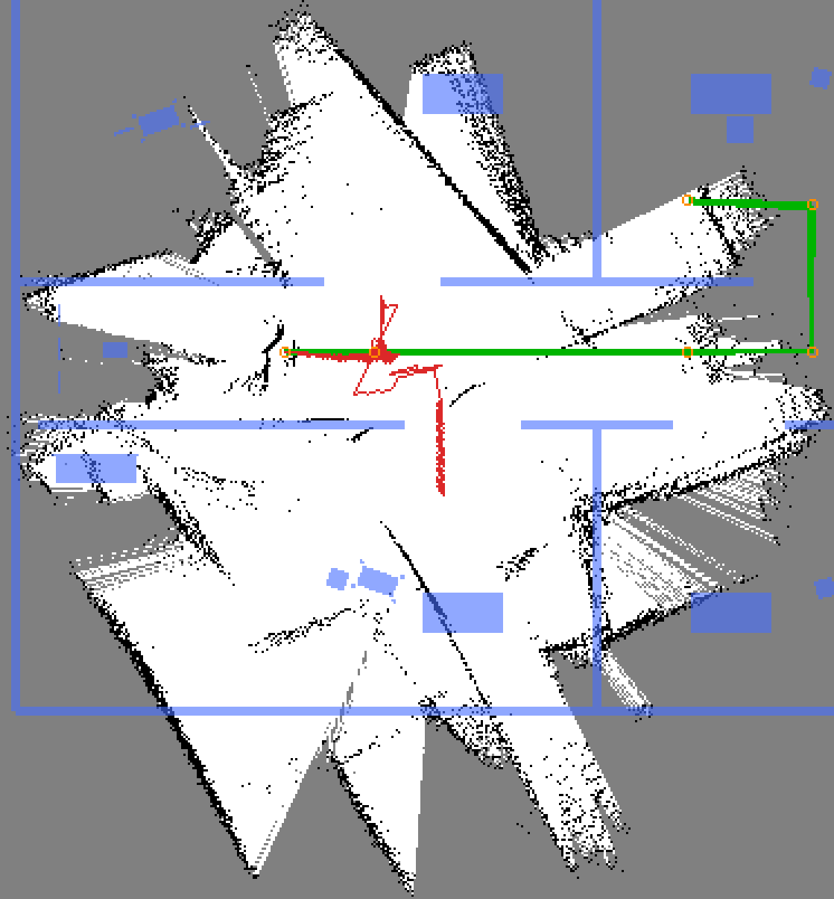
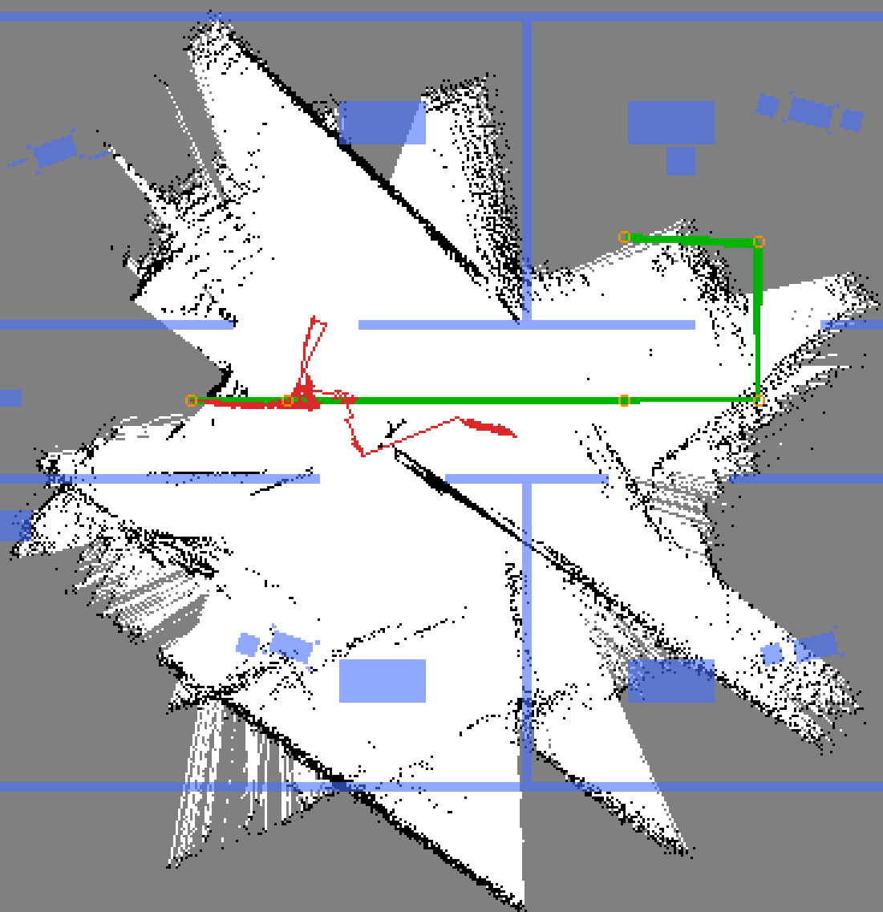
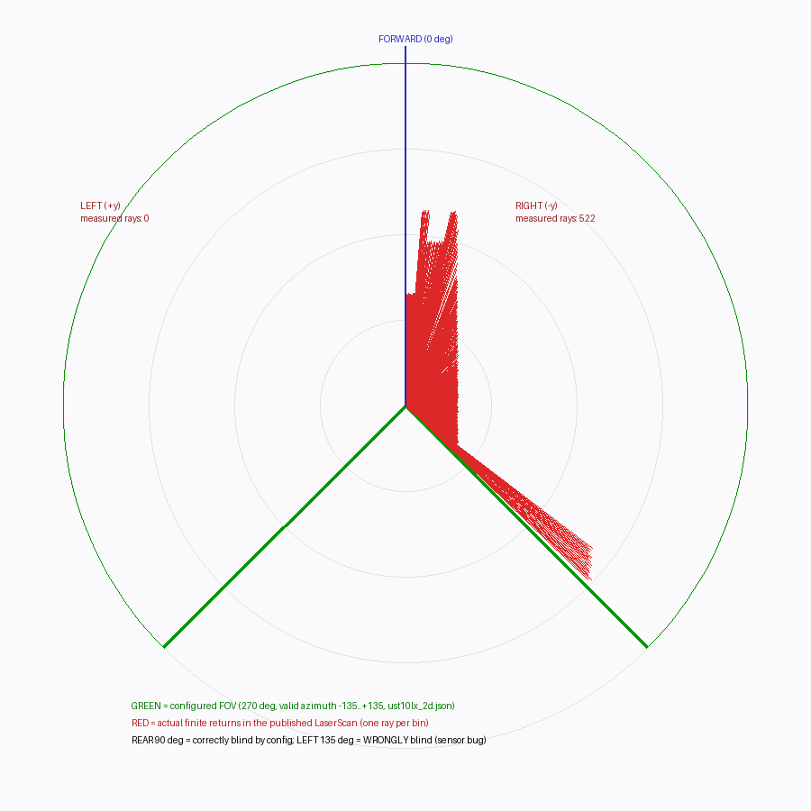
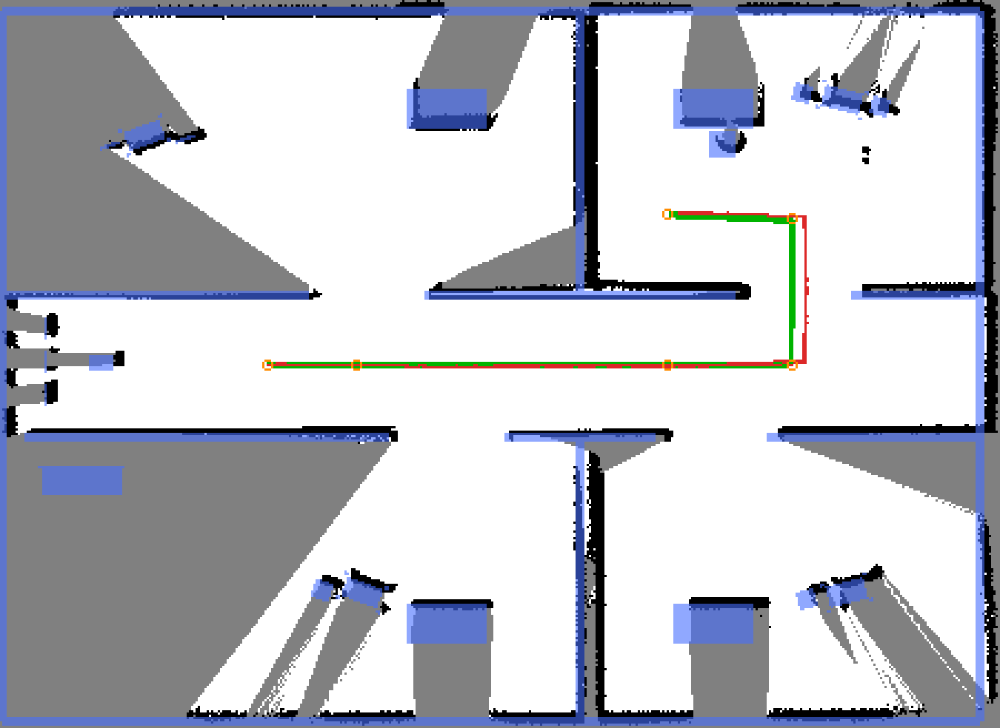
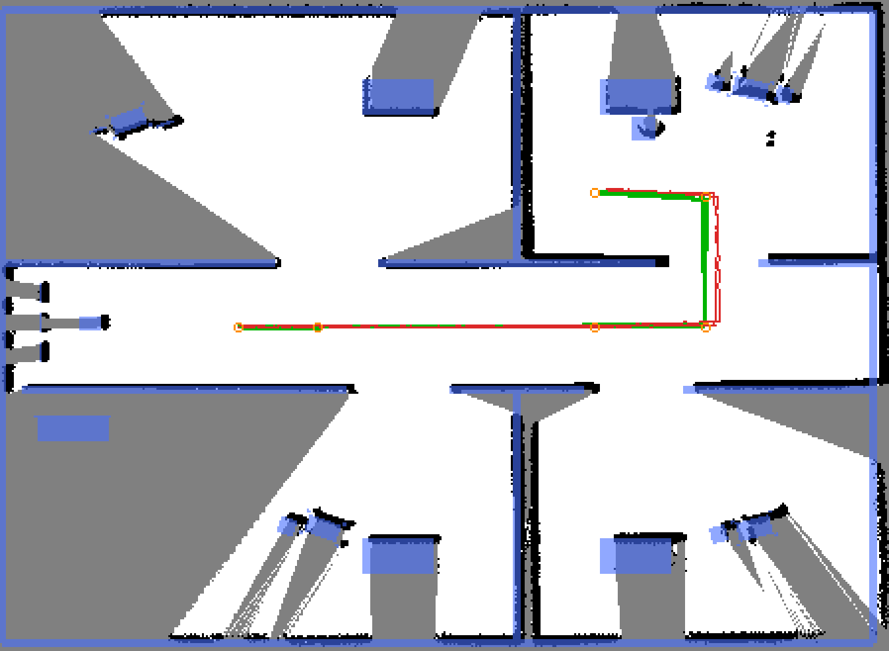
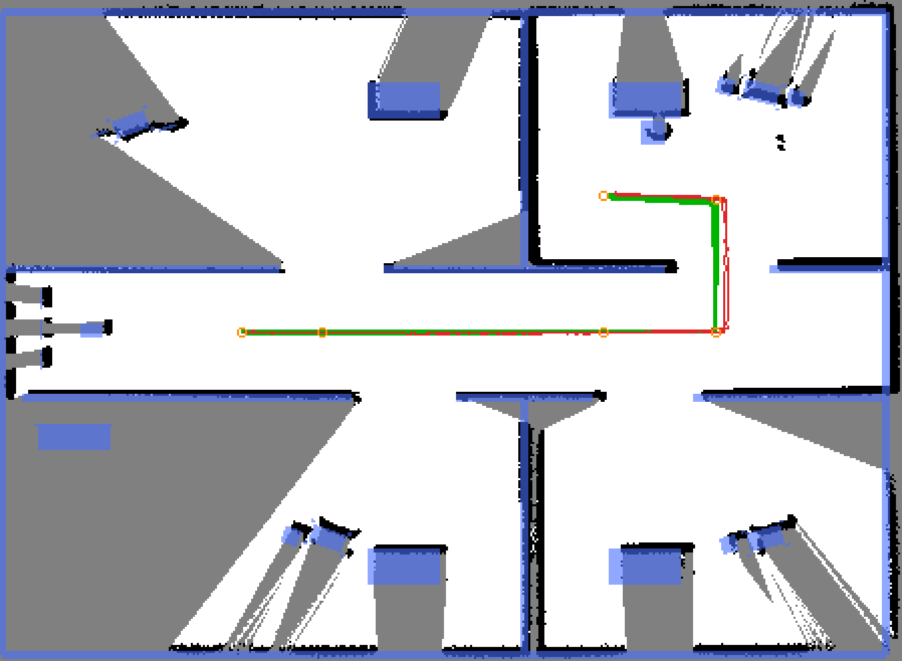
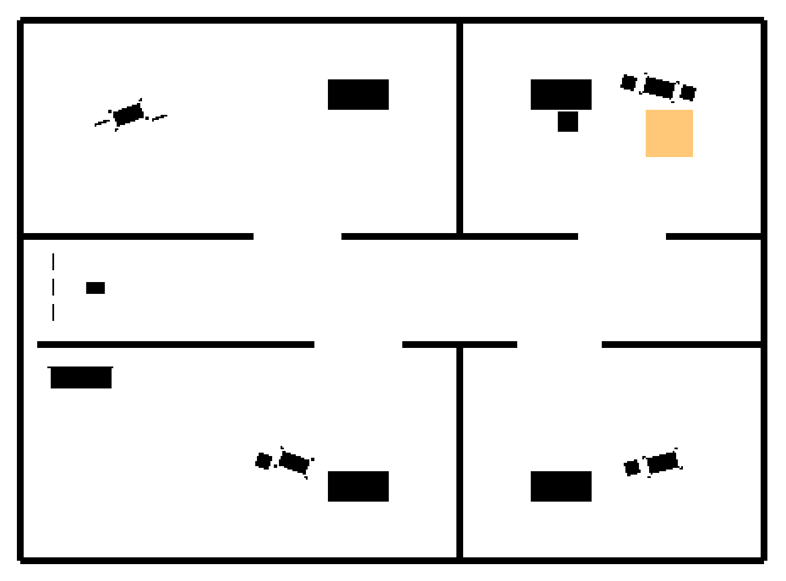
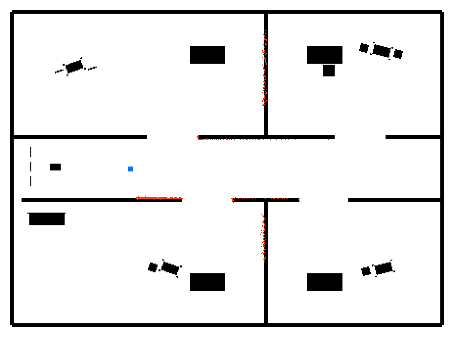

# SLAM Quality Investigation — Isaac 6.0 Port (2026-07-12)

Recorded dates: 2026-07-12, 2026-07-13

Tested revisions: unknown

Provenance: partial

This is dated evidence. Missing revisions or preserved worktree inputs limit
reproducibility; no new measurements were made during archive curation.

## Conclusion and later invalidation

The July 12–13, 2026 experiments investigated severe map damage under rotation
on Isaac 6.0.1. They motivated explicit scan assembly and callback handling.
Their reported coverage and mapping scores are not baselines for the later rig.
September mounting corrections changed the scan plane, and the September 17–18
qualification disproved the old clipped two-half-cloud aperture assumption.
See the [later aperture measurements](2026-09-17-isaac-lidar-qualification.md)
and [sensor-attachment investigation](port-history.md#lidars-detached-from-the-articulation-2026-09-11).

The historical implementation changes were `664936704cec043fb18b5d4e0befefacc846e1f6` (scan-from-cloud and
harness) and `e18624981aa3c6bd224f1235d5009dd68b3098b4` (attempted left-half restoration). Those commits are
change identifiers, not a complete reconstruction of every tested worktree.

## July 12 observations

The original report attributed angular distortion to the bridge writer's
360-degree mapping of a clipped rotary sensor, an incomplete per-tick cloud
window, and processing only one ROS callback per render frame. It tested a
two-half-cloud assembly and pair-consistent updates. Later qualification
invalidated the assumption that those configured halves supplied full coverage;
the early post-fix results below must be read with that limitation.

| | before | after |
|---|---|---|
| symptom | any rotation destroyed the map; loop closure never worked | 35.8 m closed loop maps clean |
| pose RMSE vs GT | 8.36 m | 0.19–0.23 m |
| end-at-start loop error | 1.15 m | 0.07–0.09 m |
| map IoU vs analytic GT | 0.10 | 0.54–0.55 |
| lidar FOV actually published | 135° (right half only) | true 270° |

The full-aperture claim in this table is the original July interpretation,
subsequently disproved; the numbers are preserved to explain the investigation.

## SLAM parameter controls

The following controls used the incomplete sensor. None isolates an intrinsic
SLAM-parameter effect on a correctly qualified lidar pipeline.

| run | config | RMSE | loop err | IoU | verdict |
|---|---|---|---|---|---|
| A2 | gz-era (0.0/0.0 travel, link 0.1) | 0.52 | 0.012 | 0.70 | jerky graph (204 corrections, 1.2 m max jump) |
| B2 | 0.2 m/10° gating, link 0.8 | 0.25 | 0.31 | 0.37 | map thins, at-rest estimate goes stale |
| B3 | 0.1 m/5° gating, link 0.8 | 3.10 | 6.59 | 0.24 | one bad closure snapped the graph 7.4 m (below) |
| B4 | 0.0/0.0, link 0.8 | 0.50 | 0.010 | 0.74 | best of the half-blind era (below) |

## Recorded final-loop comparison

| metric | B6 (headless) | WINDOWED3 (GUI load) |
|---|---|---|
| pose RMSE | 0.226 m | **0.195 m** (< 0.20 plan gate) |
| pose max | 0.376 m | — |
| loop error | 0.072 m | 0.090 m |
| map IoU | 0.54 | 0.55 |
| wall recall | 0.82 | 0.87 |
| max map→odom jump | 0.25 m | — |

The original report described a 35.8 m closed loop. The GUI and headless
results compare those particular runs, not display-mode performance generally.

## Retained visual evidence

Run A: baseline on the broken sensor — starburst map, estimate stuck near origin. Recorded on the July rig; later geometry and aperture corrections invalidate baseline reuse.

Run B: travel-gated slam params on the broken sensor — still destroyed. Recorded on the July rig; later geometry and aperture corrections invalidate baseline reuse.

Run C: zero odometry noise on the broken sensor — still destroyed. Recorded on the July rig; later geometry and aperture corrections invalidate baseline reuse.

FOV proof: configured 270° arc (green) vs measured returns (red) — left half empty. Recorded on the July rig; later geometry and aperture corrections invalidate baseline reuse.

Run B5: full FOV but seamed scans — whole map slightly offset from GT. Recorded on the July rig; later geometry and aperture corrections invalidate baseline reuse.

Run B6: pair-consistent scans — ship state. Recorded on the July rig; later geometry and aperture corrections invalidate baseline reuse.

Run B3: right half tracked cleanly, then one bad loop closure folded the graph 7.4 m. Recorded on the July rig; later geometry and aperture corrections invalidate baseline reuse.

Run B4: best half-blind-era map — note the west-end trajectory excursion. Recorded on the July rig; later geometry and aperture corrections invalidate baseline reuse.

WINDOWED3: final full-loop run on the fixed sensor — RMSE 0.195 m. Recorded on the July rig; later geometry and aperture corrections invalidate baseline reuse.

Analytic GT occupancy grid from mock_hospital.sdf. Recorded on the July rig; later geometry and aperture corrections invalidate baseline reuse.

Scan debug plot during bug 1: warped angular mapping. Recorded on the July rig; later geometry and aperture corrections invalidate baseline reuse.

## July 13 noise and workload follow-up

With corrected run hygiene, observed hospital coverage ranged 51–83%, so the
earlier approximately 40% plateau did not reproduce. One camera-off, isolated-
domain noise pair gave 61.9% coverage / 16 aborts without odometry noise and
51.3% / 35 with configured noise. Shared-host contention and large run variance
prevented a statistically controlled conclusion.

The yaw probe separated odom/EKF heading from SLAM's map-to-odom rotation.
A checked scan-assembler trace found no flap events across about 110,000 scans.
Rendering the camera unconditionally had reduced observed RTF to 0.33–0.45;
disabling it raised the observed range to 0.55–0.65. Another host user's
same-named ROS topics contaminated the earlier coverage observations.

## Evidence and limitations

The adjacent `assets/slam-quality/` directory preserves the original PNGs and
metrics JSON byte-for-byte. No new trials were run for this curation. The
recorded branches and implementation commits do not establish clean provenance
for every run. Original source narrative remains in Git history.
