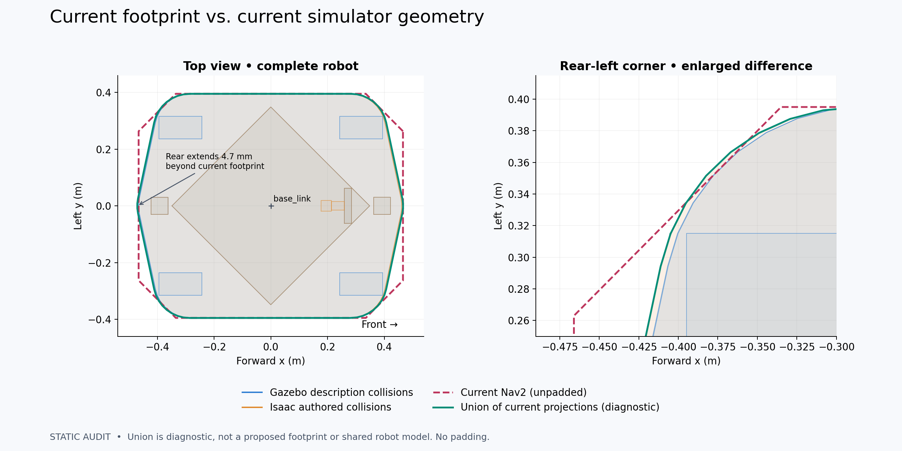
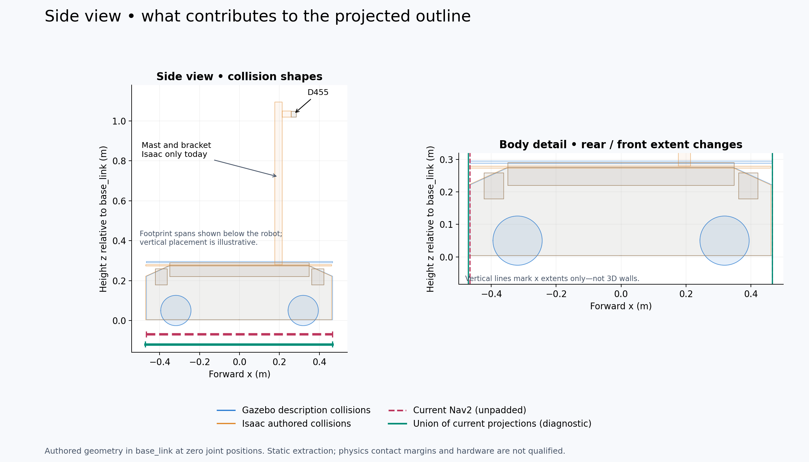

# Static collision-envelope audit

Recorded dates: 2026-09-18
Tested revisions: `2c8533f42e8fae403f4a641d2c6f0358f3db6a8a`
Provenance: partial

## Scope and decision

Retain the existing Isaac planar chassis drive for flat-floor navigation and
perception. Detailed roller simulation was deferred by the user; the O3dyn
follow-up reached asset inspection only, with no adapted robot or qualification
run. Geometry validation proceeds independently of wheel dynamics. The earlier
[physical-drive investigation](2026-09-18-mecanum-drive-investigation.md) retains
its own results and limitations.

This audit compared a freshly expanded shared Clearpath description, the
committed Isaac USD's enabled collision shapes, and the identical local/global
Nav2 source polygons, all in `base_link` at zero joint positions. It did not
measure hardware, inspect a running costmap, qualify Gazebo contact, regenerate
the production USD, or change Nav2 parameters.

## Top-down comparison



The unpadded Nav2 polygon did not fully contain either authored projection.
Its maximum signed edge violation was 4.663 mm for Isaac's rear chassis and
0.254 mm for the shared description's chassis. Runtime padding was not sampled,
so these are source-polygon findings, not demonstrated live clearance failures.
The green union merely exposes the disagreement; it is not a proposed repair.

## Side comparison



| Measured feature | Shared description | Isaac authored collisions |
|---|---|---|
| Chassis x bounds (m) | −0.466254 … +0.466254 | −0.470663 … +0.461846 |
| Chassis y bounds (m) | −0.394995 … +0.394995 | −0.395215 … +0.394814 |
| Deck top z (m) | 0.295000 | 0.280000 |
| D455 collision z (m) | 1.020 … 1.049 | 1.020 … 1.049 |
| Mast/bracket | Absent | Present; mast top z 1.095 |
| Wheel colliders | Four cylinders | Disabled |

The body extents differ by approximately a 4.4 mm longitudinal shift, with a
smaller lateral/asymmetry difference. The vendor deck is 15 mm lower than the
shared-description deck. The D455, both LiDAR boxes and riser collision bounds
agree to numerical precision. The mast/bracket fit within the chassis's XY
projection, so their absence can disappear in a top-down outline while remaining
a real 3D geometry discrepancy.

The differing wheel collision treatment is intentional for the fixed-height
Isaac drive. It does not justify divergent chassis or attachment geometry.
The old hand-plotted dimensional reference still needs reconciliation: its
rounded chassis height/width values are not substituted for this extraction.

## Reproduction and evidence

[Measurements and hashes](assets/collision-envelope-audit/measurements.json)
include per-part bounds and source files. The [input snapshot](assets/collision-envelope-audit/inputs.tar.gz)
contains the executed comparison script, expanded URDF, robot/Nav2 configuration
and dirty-tree patch. The script was subsequently formatted without AST changes.
Referenced USD layers and description meshes remain revisioned/source-hashed
inputs rather than bundled copies; no live runtime or hardware evidence is
included, hence partial provenance.

Reproduce with a sourced workspace and Isaac Python:

```bash
source install/setup.bash
mkdir -p artifacts/collision-envelope-validation/setup
cp clearpath/robot.yaml artifacts/collision-envelope-validation/setup/robot.yaml
ros2 run clearpath_generator_common generate_description \
  -s "$PWD/artifacts/collision-envelope-validation/setup/"
xacro artifacts/collision-envelope-validation/setup/robot.urdf.xacro \
  is_sim:=true > artifacts/collision-envelope-validation/robot.urdf
MPLCONFIGDIR=/tmp/ridgeback-mpl isaac_venv/bin/python \
  tools/isaac/compare_collision_envelopes.py \
  --urdf artifacts/collision-envelope-validation/robot.urdf \
  --output artifacts/collision-envelope-validation/review-new
```

## Remaining qualification

- Choose the shared chassis and attachment source; resolve the longitudinal and
  deck-height differences against declared dimensions and physical measurements.
- Put the mast/bracket in that source and regenerate both backend candidates.
- Compare top-down and side differences for review before any footprint change.
- Measure effective runtime padding/published footprints and live contacts in
  both simulators; retain the intentional wheel-physics distinction.
- Hardware clearance and affected benchmark reruns remain open. No benchmark
  performance or accuracy claim follows from this static audit.
