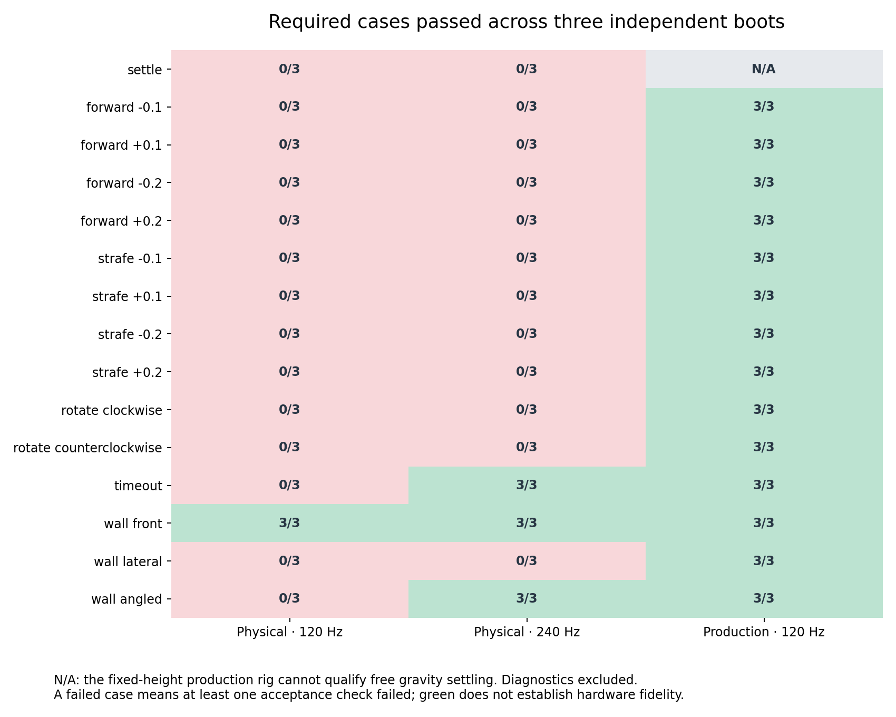
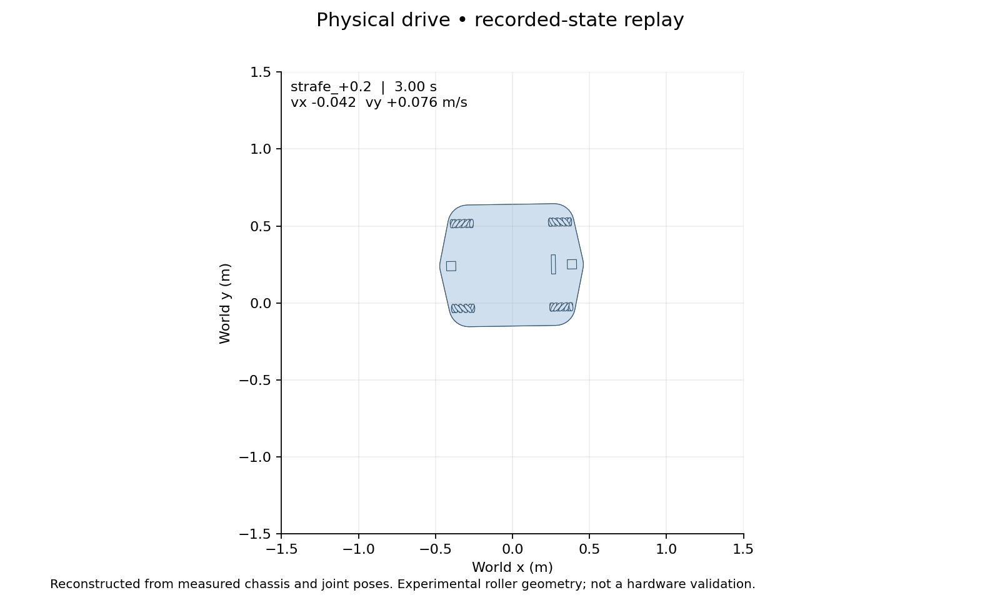
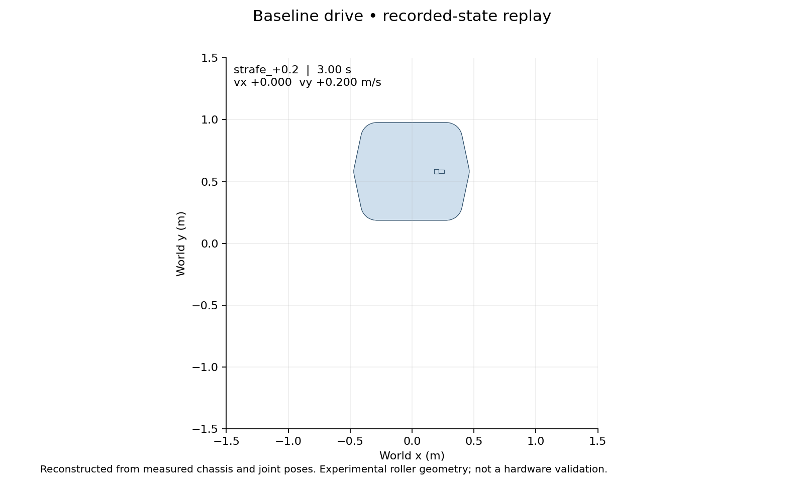
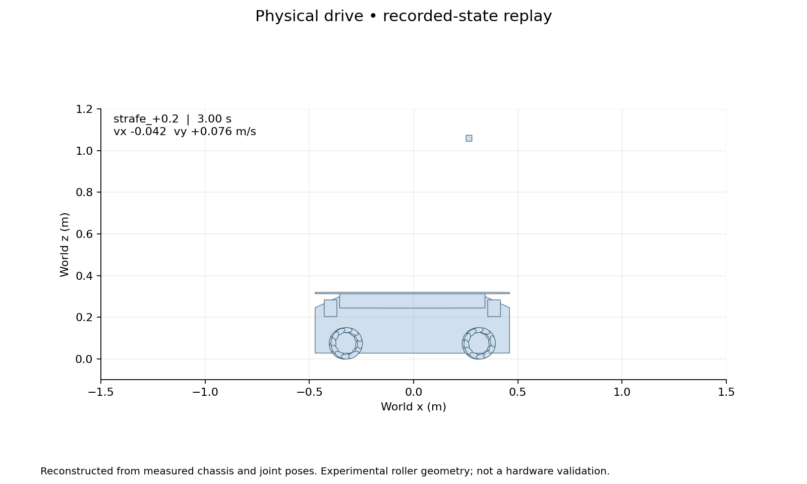
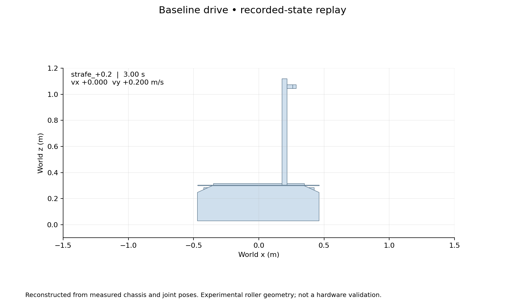

# Physical mecanum drive investigation

Recorded dates: 2026-09-18
Tested revisions: `09840529df62af6612deadfe4d4990c9d1011e5c`
Provenance: partial

## Question and boundaries

This investigation asked whether a wheel-contact Ridgeback prototype could
replace the fixed-height Isaac drive without changing the production robot or
Nav2 footprint. It tested a specific, uncalibrated roller model; failure does
not establish that a physical mecanum drive is impossible in Isaac.

The tested source was a dirty working tree over the revision above. Per-boot
implementation snapshots, source patches, input hashes and settings accompany
the evidence bundle. The local run directories under
`artifacts/mecanum-investigation/qualification-20260918/` retain full samples,
contact reports and console logs. Only condensed results and selected visuals
are promoted here; this archive is not a complete raw-trace distribution.
Hardware geometry, motor calibration and traction were not verified.

## Audit findings

| Inspected implementation | What moved the robot | Wheel/contact representation |
|---|---|---|
| Original NVIDIA Ridgeback asset from its Isaac 6.0 catalog | Two prismatic and one yaw joint, anchored to the world | Wheel cylinders attached to the base; no articulated wheel joints found |
| Repository's production model on Isaac 6.1 | The same class of planar chassis drive | Wheel collision APIs removed; chassis/attachments still collide |
| Pinned Clearpath Gazebo description | Four wheel joints with a mecanum controller | Cylinders with `mu=1`, `mu2=0`, diagonal friction direction and wheel-slip plugin |
| Experimental free-base model | Four hub velocity drives and 48 passive roller joints | Convex ellipsoidal rollers; isotropic friction; full gravity and six chassis degrees of freedom |

The original asset and its robot-schema sublayer were inspected together. The
remaining unresolved references were the decorative grid environment and an
MDL material. They do not hide a referenced wheel articulation. The audit
record distinguishes authored mass/inertia values from absent values; no
solver-computed mass was invented for the original vendor model.

This evidence weakens the suggestion that the repository's planar approach was
an arbitrary invention by a previous agent: the supplied NVIDIA Ridgeback used
the same architectural shortcut. It does not prove that the shortcut is the
best choice for physical fidelity.

The installed controller tests also referenced Fraunhofer O3dyn. Its inspected
Isaac 6.1 wheel module contained seven passive roller joints and 42 sphere
colliders, with compliant-contact settings. The collision geometry had an
outer radial bound of about 0.1553 m and width 0.1460 m; scaling that radial
bound to Ridgeback gives about 0.0714 m width, compared with its declared
0.079 m. The parent asset declared controller radius 0.129 m, and the roller
payload authored 0.25 m contact/rest offsets. These differences need a native
asset runtime check and a reviewed rescaling procedure before reuse. This
investigation inspected those modules but did not qualify or simulate the
complete O3dyn robot. It is a concrete next reuse candidate, not evidence that
the whole catalog lacks physical mecanum support.

The installed holonomic controller converted body twists to wheel targets.
It supplied no roller collision geometry. The experiment therefore used a
small collision-only URDF-to-USD converter, preserving source fixed-link poses
and full merged chassis inertia while constructing experimental wheel hubs
and passive rollers. It did not call the production importer's destructive
asset-regeneration path or reuse its planar-rig additions.

The importer contains two distinct categories of changes. Reauthoring dropped
mesh collisions/visuals addresses documented Isaac 6.0.1 import defects;
this investigation did not retest those defects in the installed 6.1 importer.
Choosing a real rigid body instead of the massless `base_link` and removing
conflicting articulation-root APIs makes the chosen planar chain work.
The world anchor, X/Y/yaw joints, zeroed wheel drives and removal of wheel
collision APIs are drive-model choices, not requirements of a physical import.
The source comments explain that fixed-height wheel/floor penetration had
produced sideways impulses. Production retains chassis and attachment contacts.

## Experimental assumptions and protocol

The expanded description supplied wheel centres at x ±0.319 m, y ±0.2755 m,
z 0.05 m, radius 0.0759 m and width 0.079 m. Each declared wheel retained its
2.5 kg total mass, split between a hub and twelve 0.08 kg rollers. The merged
fixed-link chassis mass was 188.111 kg. Roller profile, mass distribution and
contact friction were experimental assumptions, not measurements.

The candidate used the installed Isaac 6.1 holonomic controller, explicit
45-degree passive rollers, friction 0.8, zero restitution, 1 mm contact offset,
zero rest offset, wheel-drive damping 8 and maximum torque 20 N m. CPU PhysX
TGS used 16 position and four velocity iterations. Self-collision was disabled.
The root was free; no chassis velocity override or lateral force drove it.
Resets occurred only between cases.

Each condition used three fresh simulator processes. Physical-model conditions
used 120 and 240 Hz; the separately loaded production control used 120 Hz.
Commands were identical across conditions. Motion tests used 0.1/0.2 m/s in
both directions and axes, and ±0.3 rad/s yaw. The matrix also included gravity
settling, stationary hold, command expiry, three wall orientations with reverse
recovery, diagonal motion, and a 20 mm obstacle in a wheel path.

Required gates were fixed before the qualification sweep: speed error ≤10%,
cross-axis speed ≤0.02 m/s, rotation translation ≤20 mm, wall error ≤10 mm,
penetration ≤5 mm and recovered clearance ≥80 mm. Settling required reported
linear speed below 0.01 m/s by five seconds, followed by hold drift ≤5 mm and
0.5 degrees and floor penetration ≤2 mm. Sensor attachment tolerances were
1 mm and 0.1 degree. Diagnostic diagonal/obstacle cases were not migration gates.

The preliminary development run checked only planar velocity during settling;
that insufficient check was replaced with all three linear components before
the qualification sweep. Its initial settling pass is not qualification evidence.

## Results



| Condition | Required cases passed per boot | Real-time factor, boots 1 / 2 / 3 |
|---|---|---|
| Physical, 120 Hz | 1 / 15 in each boot | 1.57 / 1.58 / 1.59 |
| Physical, 240 Hz | 3 / 15 in each boot | 1.04 / 0.79 / 0.86 |
| Production, 120 Hz | 14 / 14 applicable cases in each boot | 2.40 / 2.42 / 2.63 |

All three boots of each condition produced identical gate outcomes and recorded
case metrics. Production settling is inapplicable because its root is constrained;
the harness deliberately does not report it as a physical qualification pass.
Each boot simulated about 186 seconds including unmeasured pre-case settling.
Median simulation cost rose by about 83% at 240 Hz versus physical 120 Hz.
These are indicative empty-world timings: processes were serial but the host
was not exclusive, and a brief plotting job overlapped a physical boot.
They are not exploration-stack benchmark results.

- **Settling:** poses became nearly stationary and ten-second hold drift and
  penetration passed, but reported vertical velocity remained about 0.0337 m/s
  at 120 Hz and 0.0169 m/s at 240 Hz. The combined settling case failed.
  Hold penetration was about 0.39 mm and 0.26 mm respectively; no explosive
  motion occurred.
- **Translation:** every linear-motion case failed at least one check at both
  rates. At a +0.2 m/s lateral command, mean steady lateral speed was 0.0884 m/s
  at 120 Hz and 0.0462 m/s at 240 Hz. Peak unwanted forward speed reached
  0.111 and 0.190 m/s respectively. A finer timestep did not fix strafing.
- **Rotation and stopping:** both yaw directions failed at both rates.
  After command expiry, the 120 Hz maximum residual planar speed was
  0.0207 m/s, exceeding the 0.01 m/s gate. The 240 Hz stop passed at
  0.000238 m/s. Wheel targets expired on time in both conditions.
- **Walls:** frontal contact and recovery passed at both rates. The lateral
  approach failed to reach the wall. Angled recovery reached only 60.6 mm
  clearance at 120 Hz, below the 80 mm gate; 240 Hz achieved 87.9 mm and passed.
- **Attachments:** the camera and both LiDAR relative-transform checks passed
  throughout all conditions. Merged rigid frames make this a limited structural
  check; rendered sensor output was not qualified.

### Diagnostic motion and obstacle

The diagonal command was (0.1, 0.1) m/s. Measured steady body speed was about
(0.0918, 0.0137) at 120 Hz and (0.0831, 0.0149) at 240 Hz: lateral motion was
strongly deficient. The production comparison tracked (0.1, 0.1).

At the 20 mm obstacle, physical chassis advance was about 0.340/0.341 m,
with 556/1073 recorded obstacle-contact events and peak pitch about
0.159/0.173 degrees at 120/240 Hz. It did not complete the traversal during
the seven-second observation. Production advanced 0.696 m, recorded no
obstacle contacts and essentially no pitch, consistent with its removed wheel
colliders and fixed height. Neither outcome validates hardware traversability.
Contact-event counts depend on timestep and are not comparable impact counts.

Wheel-derived odometry is saved separately from body ground truth. Its large
stationary drift and inconsistent joint velocity/position readouts prevent a
trustworthy slip estimate. The command-to-motion errors above demonstrate
poor tracking, but must not be mislabeled as measured tire slip. Raw contact
points, normals, separation and impulses are retained in the local traces.

### Top-down and side views

The stills compare the +0.2 m/s lateral case at three seconds. These are
collision-geometry reconstructions of recorded states, **not simulator camera
footage**, a proposed Nav2 outline, or an approved shared-geometry diff.
The candidate contains the URDF attachments but lacks the production-only
mast/bracket; it therefore shows the camera collider without a mast.

| View | Physical candidate, 120 Hz | Production control, 120 Hz |
|---|---|---|
| Top down |  |  |
| Side |  |  |

| Condition | Full top-down replay | Full side replay | Trajectories and velocities |
|---|---|---|---|
| Physical 120 Hz | [Video](assets/mecanum-drive/physical-120-topdown.mp4) | [Video](assets/mecanum-drive/physical-120-side.mp4) | [Plot](assets/mecanum-drive/physical-120-motion-summary.png) |
| Physical 240 Hz | [Video](assets/mecanum-drive/physical-240-topdown.mp4) | [Video](assets/mecanum-drive/physical-240-side.mp4) | [Plot](assets/mecanum-drive/physical-240-motion-summary.png) |
| Production 120 Hz | [Video](assets/mecanum-drive/baseline-120-topdown.mp4) | [Video](assets/mecanum-drive/baseline-120-side.mp4) | [Plot](assets/mecanum-drive/baseline-120-motion-summary.png) |

### Reproduction and preserved inputs

The active runtime was Isaac Sim 6.1.0.0 (6.1.0-rc.26), Python 3.12.3,
CPU PhysX, on an RTX PRO 6000 Blackwell 96 GB with driver 595.84.
The `isaac_venv` alias resolved to `isaac_venv_6_1`. Dependency revisions were:

- Clearpath common: `33e4b311dd9a2dcaa8e8d262ae75fab2c53e560b`.
- Clearpath config: `b2a64ba3b12d20bfeeb1127c3869accc7704e634`.
- Clearpath simulator: `590a45118c599c08abdf3bd3d02d5fa7a8af9a49`.

[Aggregated measurements](assets/mecanum-drive/aggregate.json),
[per-boot provenance bundle](assets/mecanum-drive/provenance.tar.gz) and
[asset checksums](assets/mecanum-drive/sha256.json) accompany this record.
The bundle includes each boot's source snapshot, dirty patch, description,
settings, stage, input hashes and summary, plus audit inventories. External
vendor assets and full samples/contact logs are not bundled. Candidate stages
are self-contained; the production stage may reference installed assets.
The source snapshots are authoritative for the tested code; later formatting
and reporting improvements are not claimed as simulator reruns.

From the tested workspace and pinned dependencies, reproduction used:

```bash
source install/setup.bash
OMNI_KIT_ACCEPT_EULA=YES MPLCONFIGDIR=/tmp/ridgeback-mpl \
  isaac_venv/bin/python tools/isaac/mecanum_experiment/sweep.py \
  --output artifacts/mecanum-investigation/qualification-new
MPLCONFIGDIR=/tmp/ridgeback-mpl isaac_venv/bin/python \
  tools/isaac/mecanum_experiment/aggregate.py \
  artifacts/mecanum-investigation/qualification-new \
  --output artifacts/mecanum-investigation/qualification-new/review
MPLCONFIGDIR=/tmp/ridgeback-mpl isaac_venv/bin/python \
  tools/isaac/mecanum_experiment/report.py \
  artifacts/mecanum-investigation/qualification-new/physical-120-boot1 \
  --output artifacts/mecanum-investigation/qualification-new/review-physical-120 \
  --videos
```

The same report command applies to the representative 240 Hz and production
boots. The complete matrix is required for aggregation; a partial run cannot
qualify migration.

## Interpretation and recommendation

A static-looking chassis pose is insufficient evidence of correct dynamics.
The 120 Hz data contained a nearly constant height while the solver reported
about 0.034 m/s vertical velocity. Likewise, reported wheel velocities did not
consistently agree with finite differences of joint positions. The experiment
retains both measurements; the velocity-based wheel odometry is not a validated
encoder surrogate. A controller-mapping check used joint names explicitly.
The remaining solver/readout discrepancy was not resolved by this investigation.

Do not promote this candidate while any required gate fails. Investigate roller
profile/contact continuity, actuator calibration and the position/velocity
readout discrepancy before blaming the feasibility of physical mecanum drive.
A timestep increase is a sensitivity test, not an architecture qualification.
Any future production migration needs a separately reviewed plan for spawn
height, odometry, sensors, contact handling and benchmark recertification.

Shared mast/bracket geometry, D435 cleanup, final cross-simulator collision
geometry and derived Nav2 footprint remain subsequent work. The earlier green
footprint draft enclosed the union of two different current models; it was not
an approved shared collision source or a migration artifact.
