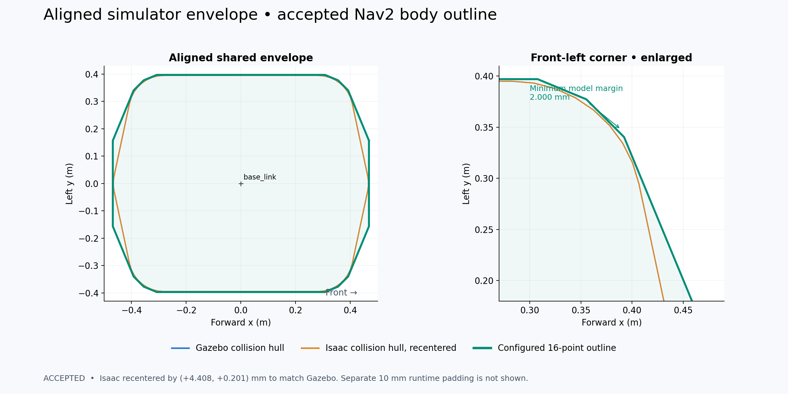
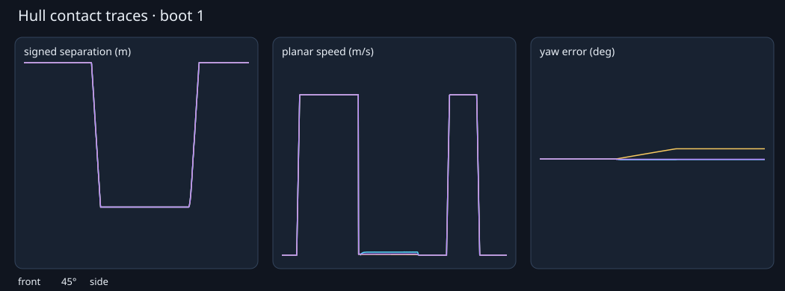
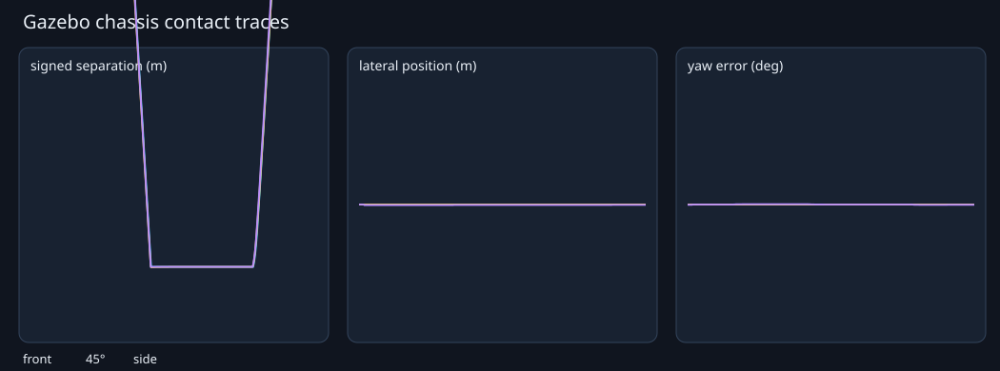

# Navigation footprint and simulator-contact qualification

Recorded dates: 2026-09-22
Tested revisions: `d9bf546cce046498622c6a466ed190e212ac5810`, `d0ee89a4182f4cee78afa0555250811553e3b8a3`
Provenance: partial

The run used the shared camera-support implementation at the tested revision and
the footprint/tool changes committed with this record. The ignored source
artifact retained the generated description, source patch, input hashes, raw
samples and simulator logs during the run; the interpretation-ready summaries
and traces are preserved beside this record. The untracked Gazebo validator was
not part of the artifact's Git patch, so provenance is partial.

## Initial decision

Keep the existing eight-vertex nominal Nav2 polygon and explicitly pin 10 mm of
costmap footprint padding. Treat the nominal polygon as the intended body
outline. Require the effective padded polygon to enclose each current simulator
collision projection by at least 5 mm. Costmap inflation is outside this
geometric margin.

## Accepted outline refinement

Later on September 22, the user accepted the 4.408 mm longitudinal and 0.201 mm
lateral Isaac translation as an equivalent backend origin difference. The
nominal outline was then refit around the recentered, symmetrized Gazebo/Isaac
envelope using 16 evenly spaced support directions and 2 mm model margin. This
reduced nominal area by 1.5% while removing the former octagon's excess corners.

The raw Isaac offset still places its rear edge 2.409 mm outside the nominal
outline. The unchanged 10 mm runtime padding contains both raw backend
projections with at least 7.591 mm clearance. The accepted policy therefore uses
the nominal outline for the aligned shared body model and the effective outline
for raw-backend containment. The retained
[refined measurements](assets/2026-09-22-footprint-qualification/static-measurements-16-point.json)
record both margins and the alignment vector.

The static extraction found the Isaac projection at most 4.663 mm outside the
nominal polygon and the generated Gazebo projection at most 0.254 mm outside it.
The 10 mm effective polygon encloses their union by 5.337 mm. The retained
[measurements](assets/2026-09-22-footprint-qualification/static-measurements.json)
include backend hulls, bounds, per-part distances and input hashes.

## Initial runtime footprint

Fresh Gazebo and Isaac launches each reported 10 mm for local and global
`footprint_padding` and published the same padded octagon. The collision monitor
subscribes to `local_costmap/published_footprint`. Its visualization is empty at
startup before command flow; during motion it publishes the full padded octagon
in `base_link`.

## Refined runtime handoff

A fresh Gazebo launch after the accepted refinement loaded the exact 16-point
nominal polygon and 10 mm padding in both costmaps. The local and global
costmaps each published 16 padded points in their working frames. After a zero
velocity command entered the normal command path, the collision monitor
republished those same 16 padded points in `base_link`. The retained
[runtime capture](assets/2026-09-22-footprint-qualification/runtime-16-point.json)
contains the configured nominal outline and the collision-monitor result.

The contact matrices were not repeated for this refinement: simulator collision
geometry, controllers and contact parameters did not change. Their physics
results remain evidence for the same backend geometry; the new live run checks
the changed Nav2 configuration and its collision-monitor handoff.

## Contact matrix

Both backends ran front, side and 45° wall approaches at 0.05, 0.10 and
0.20 m/s across three cold boots. Each case included driven contact, a two-second
hold, zero command, one-second reverse recovery and final settling. Common gates
were 10 mm stop-position error, 5 mm penetration, 5 mm hold oscillation and
tangent drift, 0.5° yaw drift, 0.02 m/s held speed, first 5 mm recovery within
0.25 s, and at least 80 mm reverse clearance.

Isaac also ran full-robot cases at 0.10 m/s and the retired AABB 45° control on
each boot. All 39 cases passed. Maximum penetration was 0.003 mm, tangent drift
2.762 mm, yaw drift 0.262°, held speed 0.00391 m/s, and first recovery 0.100 s.
Every case had zero cross-boot stop-position spread at recorded precision. The
[Isaac summary](assets/2026-09-22-footprint-qualification/isaac-summary.json)
contains the aggregate checks.

Gazebo drove the production mecanum controller and measured the model's Gazebo
world pose rather than controller odometry. All 27 cases passed. Maximum
penetration was 0.341 mm, hold oscillation 0.006 mm, tangent drift below
0.001 mm, yaw drift below 0.001°, first recovery 0.163 s, and cross-boot
stop-position spread below 0.001 mm. The
[Gazebo summary](assets/2026-09-22-footprint-qualification/gazebo-summary.json)
contains the per-case maxima.

## Limits

This qualifies the current simulator geometry, runtime Nav2 footprint and flat
wall contacts. It does not supply a measured physical outline, certify clearance
around the deployed robot, or transfer simulator stopping behavior to hardware.
Height-dependent obstacles can contact attachments that a planar footprint only
conservatively projects. Physical envelope and command-chain qualification remain
open in the project backlog.
