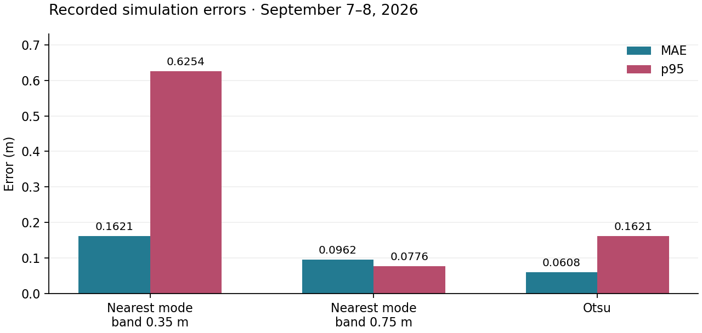

# Projective-ranging parameter experiment — September 7–8, 2026

Recorded dates: 2026-09-07, 2026-09-08

Tested revisions: unknown

Provenance: partial

This is dated evidence. Missing revisions or preserved worktree inputs limit
reproducibility; no new measurements were made during archive curation.

## Conclusion

The 15-configuration simulation sweep showed that the nearest-mode band,
bin width, and significance fraction could change which surface was selected.
It did not authorize a production-default change. A wider band improved the
recorded tail while Otsu retained lower aggregate MAE.

## Method and provenance

Evidence: `artifacts/benchmarks/20260907_211023_projective_parameters`, using
the 88-scene scenario set and `benchmark_sweep_projective_parameters.yaml`.
Each axis varied against the default baseline. Reported deltas used paired
trial joins restricted to outcomes available on both sides; aggregate values
and paired deltas therefore need not subtract to the same number.
The prior analysis inspected 45 run manifests, 31 projective result blocks,
and 35,641 status observations. The full tested worktree was not recorded.

Earlier apparent variation across runs was confounded by the August 31 D455
geometry correction, not evidence of a 31% random noise floor:

| Run | Revision | Date | Scored | MAE (m) | p95 (m) |
|---|---|---|---:|---:|---:|
| `20260828_152011_baseline` | `d96b2f0ed5a6ffe009457a74d017e7a7ae103b79` | 2026-08-28 | 108 | 0.1236 | 0.6211 |
| `20260902_202659_isolation` | `cb8061ac9fd8a58258ec9e8c4bde6bf044bfc1a6` | 2026-09-02 | 112 | 0.1621 | 0.7134 |
| `20260907_211023` `baseline_a` | `f6e7d238a399af7ba2b46fafb331d05428ab1e26` | 2026-09-07 | 112 | 0.1621 | 0.7134 |

## Band width

| `band_m` | MAE | Δ MAE | p95 | Δ p95 |
|---|---|---|---|---|
| 0.15 | 0.1742 | +0.0121 | 0.6251 | −0.0003 |
| 0.25 | 0.1729 | +0.0108 | 0.6255 | +0.0002 |
| **0.35 (shipped)** | **0.1621** | — | **0.6254** | — |
| 0.50 | 0.1606 | −0.0015 | 0.6266 | +0.0013 |
| **0.75** | **0.0962** | **−0.0550** | **0.0776** | **−0.5460** |

Errors are in metres. The failure scenes placed an IV pole about 0.62 m ahead
of the target. Bands below that gap could not include target depths after the
anchor selected the pole; 0.75 m crossed it. That setting was the first tested
value beyond the gap, not a derivation from target dimensions.

| trial | `band_m` 0.35 | `band_m` 0.75 |
|---|---|---|
| `interfere_infront_01` | 0.620 | 0.078 |
| `interfere_infront_02` | 0.623 | 0.068 |
| `interfere_infront_03` | 0.623 | 0.043 |
| `interfere_infront_04` | 0.625 | 0.061 |
| `interfere_multi_01` | 0.621 | 0.069 |
| `interfere_pair_01` | 0.615 | 0.061 |
| `interfere_pair_02` | 0.624 | 0.071 |
| `interfere_pair_03` | 0.613 | 0.060 |
| `interfere_pair_04` | 0.821 | 0.350 |

## Significance fraction

| `min_bin_fraction` | MAE | p95 | failure mode |
|---|---|---|---|
| 0.01 | 0.2447 (+0.0920) | 1.0353 (+0.4100) | thin near bins clear the floor; the anchor lands on slivers |
| **0.05 (shipped)** | **0.1621** | **0.6254** | — |
| 0.15 | 0.8605 (+0.7011) | 7.0328 (+6.4074) | only the wall clears the floor; the anchor lands on background |

At 0.15, diffuse target samples did not clear the per-bin significance floor,
while the concentrated wall did. The nearest-nonempty fallback did not help
because at least one bin was significant. Two recorded estimates changed to
11.930 m and 11.661 m, consistent with the far wall.

## Bin widths

| recipe | axis | MAE | p95 | max single-trial shift, 0.02 → 0.05 |
|---|---|---|---|---|
| `nearest_mode_histogram` (#3) | 0.02 | 0.2163 (+0.0514) | 0.6236 (−0.1973) | **9.5141 m** |
| | **0.05** | 0.1621 | 0.6254 | — |
| | 0.10 | 0.1634 (+0.0122) | 0.6257 (+0.0021) | — |
| `otsu` (#4) | 0.02 | 0.0608 | 0.1621 | **0.0043 m** |
| | **0.05** | 0.0608 | 0.1621 | — |
| | 0.10 | 0.0609 | 0.1630 | — |

On these samples the nearest-mode recipe could switch surfaces when bin edges
moved; Otsu's threshold moved little. Bin width and significance fraction were
coupled through per-bin sample counts. These observations did not establish
that Otsu bin width is generally irrelevant or that widening bins is always safe.

## Minimum sample count

| `min_valid_pixels` | scored | effect | implied range limit |
|---|---|---|---|
| **10 (shipped)** | 112 | never fires | ≈ 82 m |
| 100 | 112 | never fires; **all 135 estimates bit-identical** | ≈ 26 m |
| 1000 | 101 | rejects 10 trials; survivors bit-identical | ≈ 8 m |

The 1000-pixel setting rejected far scenes (mean true range 8.22 m versus
3.57 m for retained trials). The 82/26/8 m column was a geometric scaling
estimate for this target and camera, not measured sensor reach. The original
status was `ISOLATION_EMPTY`; its later replacement was
`TOO_FEW_AFTER_ISOLATION`. Surviving estimates did not change.

## Recipe comparison

| configuration | MAE | p95 |
|---|---|---|
| `nearest_mode_histogram`, band 0.35 (shipped) | 0.1621 | 0.6254 |
| `nearest_mode_histogram`, band 0.75 | 0.0962 | **0.0776** |
| `otsu` | **0.0608** | 0.1621 |

The plotted values reproduce the table from the September sweep; they are not
a rerun. Regenerate the figure with `python3
archive/engineering/assets/projective-parameters/render.py`; the script reads
this table. The wider band reduced the nearest-mode tail, while Otsu retained
lower MAE. Neither result alone selected a default.

## Limits of the evidence

- One simulator world and one occluder geometry; a wider band can admit
  background when the target is near a wall.
- Rendered stereo depth was noiseless. Physical D455 holes and noise can alter
  significance and bin-width sensitivity; hardware was not tested.
- Minimum-count gates were exercised, but the 0.9 monocular usable-range
  fraction was not reached in the 12 m room.
- The pointcloud row's 10 m planar cutoff was outside this projective sweep's
  scope. It was not evidence for deleting or validating that separate limit.
- The long GUI sweep crashed after about 6.4 hours and was resumed; it was not
  one uninterrupted simulator session.
