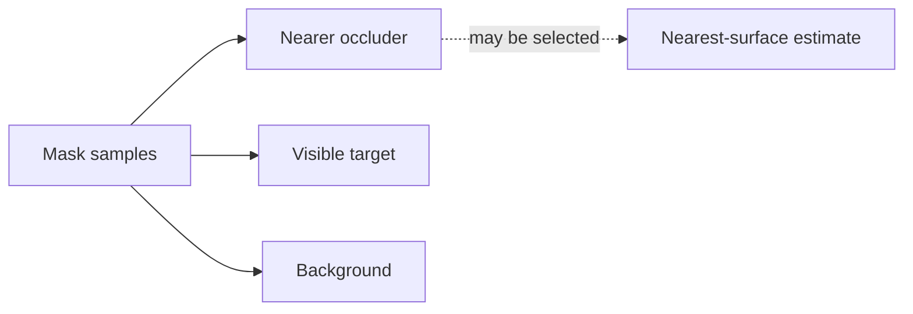
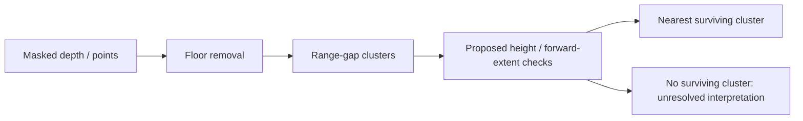

# Deferred occlusion-recovery candidates

**Status: unapproved and unimplemented.** These are candidate designs, not
measured improvements or instructions to begin implementation. The active work
is [occlusion characterization](../target_distance_benchmarking/BACKLOG.md#occlusion-characterization)
in the benchmarking backlog. Establish which current failure modes matter
before selecting a recovery algorithm or writing an implementation plan.

## Hypothesis to investigate

A mask can contain nearer occluder pixels, visible target pixels, and background.
A nearest-surface selector can then choose the occluder. A wrong-object tight
mask can also include the occluder while excluding the target. Neither mechanism
establishes the frequency or severity of failures under the current defaults.
Detection loss, box changes, missing depth/scan data, and association failures
must be separated from isolation failures in the baseline evidence.

Implemented contracts remain in [projective ranging](../target_localization/projective_ranging.md),
[Euclidean reconstruction](../target_localization/euclidean_reconstruction.md),
and [polar profiling](../target_localization/polar_profiling.md). The
[benchmark semantics](../target_distance_benchmarking/semantics.md) own association
and miss attribution. This candidate page does not override those contracts.

## Candidate: depth clusters with geometric plausibility checks

The proposed sequence is floor removal, one-dimensional range-gap clustering,
and a geometric filter, followed by selection of the nearest surviving cluster.
The original sketch suggested approximately 0.30 m cluster gaps, 0.8 m minimum
height, and 0.08 m minimum camera-forward depth extent. Those are unvalidated
starting hypotheses tailored to a standing G1 and the shipped obstacle models;
they are not current defaults or general target-recognition criteria.

Potential variants are a 3-D point selector and an image-domain selector using
intrinsics and the camera-to-floor transform. The latter must account for the
actual pose; a level-camera height approximation is not a general solution.
Both depend on the validity of the assumed floor geometry.

The motivation for camera-forward extent is that Euclidean range spread can
reflect lateral extent as well as object thickness. Selecting the largest
cluster also risks choosing background pixels. These motivations do not prove
that a nearest-plausible selector will recover the intended target.

## Other candidate checks

- **Polar width filter:** reject implausibly wide scan runs before selecting a
  near group. A planar scan cannot provide the height evidence used above.
- **Tight-mask plausibility guard:** inspect selected points for a wrong-object
  mask, recognizing that a valid partial target can also fail shape thresholds.
- **Explicit abstention:** investigate whether a specific occlusion outcome can
  be justified. No plausible cluster alone does not prove occlusion: geometry,
  depth, or segmentation may be wrong. `MissReason.OCCLUDED` was a proposed
  addition and is not present in the implemented enum.
- **Class-aware segmentation or temporal tracking:** alternative directions if
  baseline evidence identifies failures that geometric filtering cannot resolve.
  Neither is an adoption commitment; cost and suitability require measurement.

## Limitations to test before selection

- A nearer robot can satisfy the same geometric checks as the intended farther
  robot; nearest-plausible selection does not resolve target identity.
- Small depth separation can merge occluder and target into one cluster.
- Partial visibility can make a valid target fail minimum height/depth checks.
- Background geometry can pass those checks, especially if the target contributes
  little or no usable evidence.
- Floor-transform error can distort the height test. Device noise, viewpoint,
  target pose, and target shape can invalidate thresholds fitted to one asset.
- Excluding an occluder does not by itself prove an unbiased distance or target
  centre; visible-surface measurements still need comparison to the scoring truth.

## Evidence required before reconsideration

Complete the backlog characterization in a qualified execution environment,
using fixed inputs and current geometry. Preserve per-scene coverage, errors,
and failure attribution for `objpartial_*`, `objocc_*`, `interocc_*`, and clear
controls. Scenario-family labels are intended conditions; old visibility
certifications must not substitute for the current geometry audit.

Only then decide whether to select a cluster recipe, wrong-object guard,
abstention rule, another approach, or no change. Any selected design needs a
separate approved implementation plan with explicit scope, parameter provenance,
output/status semantics, and non-occluded regression criteria. Include the
limitations above in synthetic checks and paired benchmark comparisons.

Implemented contracts would belong in their estimator references and measured
results in the engineering archive. This deferred proposal must not become a
second owner of current behavior or an execution checklist.
