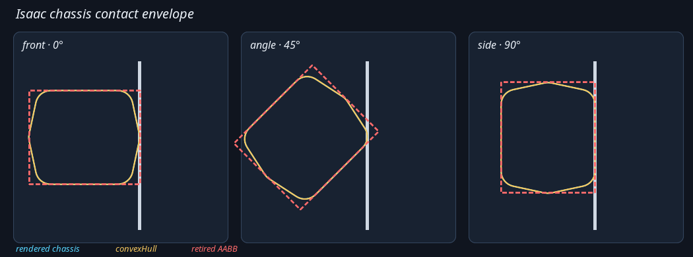
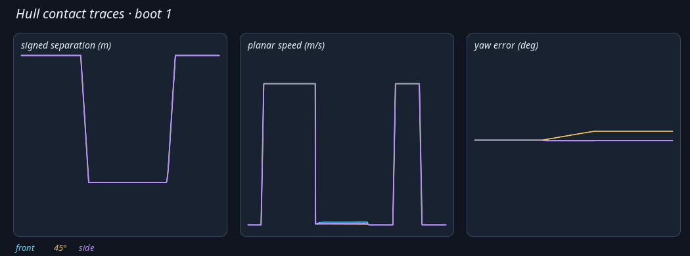

# Isaac hull-collider live validation

On 2026-09-17, the Ridgeback chassis `convexHull` passed a deterministic live
PhysX contact qualification in Isaac Sim 6.1. The accepted production
substrate was clean commit `dbf50bc0e5502b43d4dbad72abef1370b934b2a4`,
with robot-USD SHA-256
`f370c2986732b65651dae7370c29140b742458ab7668063b96ae7168d9163278`.

## Method

`tools/isaac/validate_chassis_contacts.py` built an in-memory floor-and-wall
stage and composed the production robot USD without changing it. Three fresh
Isaac boots each exercised:

- the isolated chassis hull at 0.05, 0.10, and 0.20 m/s, frontally, laterally,
  and at 45 degrees;
- the complete authored collider union at 0.10 m/s in all three orientations;
- the retired AABB at 45 degrees and 0.10 m/s as a discriminating control.

Each case settled, approached the wall, held inward for two seconds, stopped,
reversed for one second, and settled again. Expected contact planes came from
the composed USD geometry rather than copied dimensions. Contact reports,
poses, velocities, signed separation, geometry snapshots, raw samples, and
plots were retained under
`artifacts/isaac-collider-validation/20260917T220000Z_clean-dbf50bc0/`.

The yellow hull follows the rendered chassis closely at each orientation. The
dashed red AABB is similar at 0 and 90 degrees but visibly over-claims the
45-degree approach, which makes it a useful control for the live test.

## Acceptance gates

- stop error at most 10 mm and penetration at most 5 mm;
- held-contact oscillation and tangential drift at most 5 mm;
- yaw drift at most 0.5 degrees and planar speed at most 0.02 m/s;
- a contact event with its normal within 15 degrees of the expected normal;
- recovery beginning within 0.25 s and reaching at least 80 mm clearance;
- no non-finite state or per-step translation over 20 mm;
- stop-position spread at most 3 mm across the three boots;
- observed hull-versus-AABB stop delta within 10 mm of geometry prediction.

## Result

All 39/39 cases and every aggregate gate passed. The worst measurements were:

| measure | observed | gate |
|---|---:|---:|
| absolute stop error | 0.000335 mm | 10 mm |
| penetration | 0.002951 mm | 5 mm |
| held-contact oscillation | 0.000436 mm | 5 mm |
| tangential drift | 2.762 mm | 5 mm |
| yaw drift | 0.262 degrees | 0.5 degrees |
| held-contact planar speed | 0.00391 m/s | 0.02 m/s |
| recovery start | 0.100 s | 0.25 s |
| recovery clearance | 95.210 mm | 80 mm |
| largest step translation | 1.667 mm | 20 mm |
| cross-boot stop spread | 0 mm | 3 mm |
| AABB-control prediction error | 0.323 mm | 10 mm |

The traces show the approach, two-second held contact, zero-command interval,
and reverse recovery. Frontal and lateral curves overlap almost exactly; the
small 45-degree yaw response remains below the 0.5-degree gate.

The old AABB over-claimed the angled envelope by about 96 mm. Its independently
predicted and observed stop deltas agreed within 0.323 mm, so the near-zero hull
stop error was not produced by a harness that merely drove to a fixed pose.

Implementation verification also passed the package build, the focused
contract test at 7/7, and the full `ridgeback_autonomy` test suite at
1,016/1,016.

## Non-gating warnings

Isaac emitted its existing fallback-inertia warnings for imported
collider-free child links and the TGS velocity-iteration behavior warning.
There were no non-finite states, discontinuities, failed contacts, or gate
failures associated with them. A Matplotlib `Axes3D` import warning is also an
environment issue; the harness writes its evidence plots directly as SVG and
does not use 3D Matplotlib rendering.
