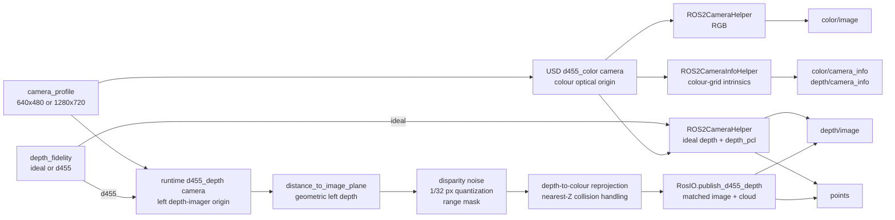

# Isaac Sim D455 camera and depth pipeline

Status: **implemented and live-qualified on Isaac Sim 6.1.0.0**.

This page owns the Isaac-specific image-formation and depth implementation.
The cross-backend mount, ROS topic contract, and downstream perception flow
remain canonical in [Camera stack](../target_localization/camera_stack.md).
The dated migration evidence remains in the archived evidence below.

## The system in one diagram



There are two deliberately different depth modes behind one ROS contract:

- `ideal` publishes clean renderer depth and a point cloud from the colour
  render product. It is the default and the simplest choice for debugging.
- `d455` renders geometric depth from the physical left-imager origin, applies
  a nominal D455 stereo measurement model, aligns the result into the colour
  grid, and publishes its own matched depth/cloud pair.

Neither mode changes downstream topic names, image dimensions, sample count,
timestamps, or the output optical frame. The point-cloud wire layout does
differ: the ideal bridge can flatten the samples to `1 x (width*height)`, while
the custom D455 publisher emits `height x width` directly. Consumers restore
the ideal cloud to the image grid only after an exact point-count check.

## Mental model: four camera products

Keep these products distinct when debugging:

| Product | What it represents | Coordinate/grid owner |
|---|---|---|
| RGB | Rendered colour image | colour camera |
| Left geometric depth | Ideal Z-depth before D455 artifacts | left depth imager |
| Aligned depth | Depth samples reprojected onto colour pixels | colour camera |
| Logical organized cloud | XYZ for every aligned colour pixel; ideal mode may be flattened on the wire | colour optical frame |

The left geometric image is internal to `d455` mode. Applications receive only
colour-aligned depth and the organized cloud. This mirrors the physical
RealSense deployment, where `align_depth.enable: true` exposes depth on the
colour grid.

## Frames and the 59 mm offset

The robot description owns the nominal D455 transform chain. The important
origins are:

- `camera_0_depth_frame`: nominal left stereo imager.
- `camera_0_color_frame`: colour imager, 59 mm to the right of the left imager.
- `camera_0_color_optical_frame`: application frame for RGB, aligned depth,
  camera information, and points.

ROS optical coordinates are:

- `+X`: image-right.
- `+Y`: image-down.
- `+Z`: forward through the image.

Expressing a left-imager point in the colour optical frame therefore applies:

```text
x_color = x_depth - 0.059 m
y_color = y_depth
z_color = z_depth
```

The sign is easy to get wrong. Do not infer it from a screen-space shift; use
the authored frame transform and the optical-axis convention. The exact robot
mount and nominal frame positions are tabulated in
[Camera stack](../target_localization/camera_stack.md#physical-declaration-and-pose).

## Nominal profiles

Gazebo and Isaac share the profiles defined in
`ridgeback_autonomy/common/camera_profiles.py`. They are deterministic
simulation profiles, not factory calibration for a physical camera.

| Profile | Colour/aligned grid | Colour `(fx, fy, cx, cy)` px | Depth HFoV | Minimum modelled depth | Rate |
|---|---:|---:|---:|---:|---:|
| `640x480` | 640 x 480 | `(384, 384, 320, 240)` | 75 deg | 0.32 m | 30 Hz |
| `1280x720` | 1280 x 720 | `(640, 640, 640, 360)` | 87 deg | 0.52 m | 30 Hz |

The colour and depth imagers intentionally use different focal lengths in
`d455` mode. Colour uses the shared profile's `focal_length_px`. The left depth
imager derives its focal length from the profile's depth horizontal FoV:

```text
f_depth = width / (2 * tan(depth_hfov / 2))
```

When a profile changes, the runtime updates resolution, tick rate, focal
length, and both USD aperture dimensions as one contract. Changing only render
resolution would stretch the image while publishing incorrect intrinsics.

## Why native Isaac 6.1 depth is not used

The migration did not assume that the new native sensor worked. It ran a
numerical decision probe against a fronto-parallel plane 3 m from the camera.

The acceptance requirement was:

- requested output dimensions;
- finite, non-zero native depth;
- at least 99% valid pixels in the unobstructed centre;
- median depth within 1% of the ideal geometric result;
- bounded, non-constant residuals when the D455 noise model was enabled.

Observed on the RTX PRO 6000 with Isaac Sim 6.1.0.0:

| Source | Result |
|---|---|
| RTX `distance_to_image_plane` | 100% valid, 3.000 m median |
| `SingleViewDepthCameraSensor` | finite but all-zero after 90 updates |
| NVIDIA-authored D455 asset | same split: geometric valid, native all-zero |

This ruled out the project camera prim as the cause. The production `d455`
mode consequently uses the supported geometric annotator and an explicit
stereo model. It does **not** import the experimental RTX sensor API.

`tools/isaac/depth_probe.py` preserves this decision gate. On the affected
runtime, its failure is expected evidence that selects the fallback; it is not
the normal production camera health check.

## The D455-like measurement model

The implementation lives in `_align_d455_depth()` in
`ridgeback_autonomy_isaac/sim/isaac/sensors.py`.

### 1. Select geometrically valid samples

The input must be a `height x width` float32 image. A sample begins valid when
it is finite and is no nearer than the active profile's minimum stereo depth.

### 2. Convert depth to disparity

For geometric depth `Z`, depth-imager focal length `f_depth`, and stereo
baseline `B = 0.095 m`:

```text
disparity = f_depth * B / Z
```

Noise is applied in disparity space, where stereo error naturally lives:

```text
noise ~ Normal(mean=0.25 px, sigma=0.25 px)
noisy_disparity = disparity + noise
```

The writer uses NumPy RNG seed `0`, making the sequence reproducible when the
same frames are produced in the same order.

### 3. Quantize and range-mask disparity

The D455 subpixel step is modelled as 1/32 pixel:

```text
quantized = round(noisy_disparity * 32) / 32
```

A sample remains valid only if disparity is positive and no greater than
`123 px`. Depth is then reconstructed:

```text
measured_Z = f_depth * B / quantized
```

Zero is reserved for an invalid depth-image pixel.

### 4. Deproject in the left optical frame

For source pixel `(u, v)` and depth principal point `(cx, cy)`:

```text
x_depth = (u - cx) * measured_Z / f_depth
y_depth = (v - cy) * measured_Z / f_depth
z_depth = measured_Z
```

### 5. Transform and project into the colour grid

After the 59 mm depth-to-colour translation, the point is projected with the
colour focal length:

```text
u_color = round(f_color * x_color / z_color + cx)
v_color = round(f_color * y_color / z_color + cy)
```

Samples outside the colour grid are invalid. Empty edge pixels are expected
because the two imagers have different origins and fields of view.

### 6. Resolve occlusions with a Z-buffer

Multiple left-depth samples can land on one colour pixel. The implementation
sorts by destination pixel and increasing `Z`, then keeps the first sample for
each destination. The nearest visible surface therefore wins.

This is a correctness requirement, not merely a performance detail. Keeping
the last arbitrary sample would leak a farther background surface through a
nearer foreground object.

## ROS publication contract

All topics are relative to the robot namespace, normally `/r100_0001`.

| Topic | Type/encoding | Dimensions | Frame | Invalid representation |
|---|---|---|---|---|
| `sensors/camera_0/color/image` | `sensor_msgs/Image`, RGB bridge output | active profile | `camera_0_color_optical_frame` | backend-defined image pixels |
| `sensors/camera_0/color/camera_info` | `sensor_msgs/CameraInfo` | active profile | `camera_0_color_optical_frame` | n/a |
| `sensors/camera_0/depth/image` | `sensor_msgs/Image`, `32FC1` metres | active profile | `camera_0_color_optical_frame` | `0.0` |
| `sensors/camera_0/depth/camera_info` | `sensor_msgs/CameraInfo` | active profile | `camera_0_color_optical_frame` | n/a |
| `sensors/camera_0/points` | `sensor_msgs/PointCloud2`, XYZ float32 | `d455`: `height x width`; `ideal`: may be `1 x (width*height)` | `camera_0_color_optical_frame` | XYZ = `NaN` for `d455`; bridge convention for `ideal` |

Both camera-info topics intentionally publish colour-grid intrinsics because
the public depth image is aligned to colour. Depth and cloud from `d455` mode
are created in the same callback with one simulation-time stamp. A mismatch in
their stamp, frame, width, height, or point count is therefore a bug.

The custom `d455` cloud layout is:

```text
height      = image height
width       = image width
fields      = x@0, y@4, z@8, all FLOAT32
point_step  = 12 bytes
row_step    = width * 12
is_dense    = false whenever any sample is invalid
```

## Timing and lifecycle

Isaac's deterministic simulation step defaults to 40 Hz, while the authored
camera rate is 30 Hz. The custom D455 writer schedules publication from
simulation time, not wall time, so GPU contention does not change message
timestamps or the intended cadence.

The D455 Replicator writer is retained by a depth handle for the lifetime of
the runner. Shutdown detaches it before rclpy teardown. This ordering prevents
a late render callback from publishing through a destroyed ROS node.

## Choosing a mode

| Need | Recommended setting | Reason |
|---|---|---|
| Basic integration, TF, or algorithm debugging | `depth_fidelity:=ideal` | cleanest and cheapest depth path |
| Evaluate sensitivity to stereo depth error | `depth_fidelity:=d455` | disparity noise, quantization, minimum range, offset, and occlusion handling |
| Lidar/navigation performance without perception | `camera:=false` | avoids camera render cost entirely |
| Physical-camera claims | neither simulation mode | use the hardware validation plan and live calibration |

`ideal` is deliberately the default for backward compatibility. A benchmark
claim must record `camera_profile` and `depth_fidelity`; changing either changes
the measured input and requires the benchmark to be rerun.

## Running the camera

Build and source the workspace first:

```bash
source /opt/ros/jazzy/setup.bash
colcon build --symlink-install --base-paths src \
  --packages-select ridgeback_autonomy ridgeback_autonomy_isaac
source install/setup.bash
```

Start the default 640 x 480 ideal camera:

```bash
bash cleanup.sh
ros2 launch ridgeback_autonomy ridgeback_exploration.launch.py \
  backend:=isaac world:=mock_hospital \
  camera:=true camera_profile:=640x480 depth_fidelity:=ideal
```

Start the D455-like path:

```bash
bash cleanup.sh
ros2 launch ridgeback_autonomy ridgeback_exploration.launch.py \
  backend:=isaac world:=mock_hospital sim_mode:=deterministic \
  camera:=true camera_profile:=640x480 depth_fidelity:=d455
```

Use the HD grid by changing only the profile:

```bash
ros2 launch ridgeback_autonomy ridgeback_exploration.launch.py \
  backend:=isaac world:=mock_hospital \
  camera_profile:=1280x720 depth_fidelity:=d455
```

Changing profile requires restarting Isaac; render-product dimensions are not
a live-tunable parameter.

## Verifying a live run

First capture the public contract:

```bash
tools/isaac/capture_contract.sh r100_0001 /tmp/isaac-camera-contract
```

Then check the individual streams:

```bash
ros2 topic hz /r100_0001/sensors/camera_0/color/image
ros2 topic hz /r100_0001/sensors/camera_0/depth/image
ros2 topic hz /r100_0001/sensors/camera_0/points

ros2 topic echo --once \
  /r100_0001/sensors/camera_0/depth/camera_info
ros2 topic info --verbose \
  /r100_0001/sensors/camera_0/depth/image
```

A complete numerical acceptance must confirm:

- exact selected width and height;
- depth encoding `32FC1` in metres;
- exactly `width*height` cloud samples; `d455` must publish `height x width`,
  while `ideal` may arrive flattened and must restore cleanly;
- identical depth/cloud stamps;
- frame `camera_0_color_optical_frame` on RGB, depth, information, and cloud;
- positive finite depth in visible in-range regions;
- zero depth and NaN points at the same invalid pixels;
- plausible scene distances;
- nearest-surface behavior at colour-projection occlusions;
- approximately 30 Hz in simulation time when the run sustains the required
  real-time factor.

The migration live-qualified both `ideal` and `d455` at 640 x 480 and
1280 x 720. Those checks proved message shape, values, frame IDs, stamps, and
cloud finiteness. They do not convert the nominal model into physical-camera
calibration.

## Automated checks

The focused implementation checks do not require Isaac or a GPU:

```bash
source /opt/ros/jazzy/setup.bash
pytest -q \
  src/ridgeback_autonomy/test/test_camera_profiles.py \
  src/ridgeback_autonomy/test/test_isaac_camera_spec.py \
  src/ridgeback_autonomy/test/test_launch_layout.py
```

They cover:

- profile intrinsics and supported choices;
- USD camera metadata and frame ownership;
- launch forwarding only to the Isaac backend;
- geometric fallback selection;
- disparity quantization and bounded non-constant noise;
- depth-to-colour alignment;
- nearest-surface collision behavior.

Run `tools/isaac/depth_probe.py` only when reconsidering native Isaac depth:

```bash
OMNI_KIT_ACCEPT_EULA=YES isaac_venv/bin/python3 \
  tools/isaac/depth_probe.py
```

Do not remove the fallback merely because an API exists. Remove it only after
the numerical native-depth gate passes on the supported runtime and hardware.

## Troubleshooting by symptom

### No camera topics

- Confirm the launch says `camera:=true`.
- Look for `camera attached:` in the Isaac runner log.
- If the runner reports missing `d455_color` or `camera_0_depth_frame`, the
  committed robot USD predates the sensor contract; regenerate it with
  `tools/isaac/import_ridgeback_urdf.py`.
- Confirm the selected namespace before assuming the topic is absent.

### RGB exists but D455 depth does not

- Confirm `depth_fidelity:=d455` reached the Isaac launch.
- Look for exceptions from the Replicator writer or
  `publish_d455_depth()`.
- Confirm the hidden left-depth render product was created.
- Check that the source geometric image has exactly the active profile shape.

### Native probe returns all zeros

That is the recorded Isaac 6.1 failure that caused the fallback selection.
Production `d455` mode does not consume `depth_sensor_distance`; verify
`distance_to_image_plane` instead.

### Aligned depth has empty edges

Some holes are expected. The depth imager and colour imager have different
origins and fields of view, and reprojection can leave colour pixels without a
source sample. A completely empty centre is not expected.

### Depth and cloud disagree

Treat this as a contract failure. They must have the same stamp, frame and
grid. Positive depth must equal cloud `Z`; invalid depth must map to NaN XYZ.

### Geometry looks stretched after changing resolution

Restart Isaac with a supported `camera_profile`. Do not mutate only the render
product size. Resolution, aperture and published intrinsics must change
together.

### Camera makes navigation miss its RTF target

Use `camera:=false` for lidar-only navigation qualification. Use `ideal` for
the cheaper camera path. Record the selected mode instead of silently changing
it within a benchmark.

### Perception reports an extrinsic TF miss

Verify `camera_0_color_optical_frame` exists in namespaced TF and that
`robot_state_publisher` expanded the simulation camera frames. Do not add a
second ad-hoc optical transform; the robot description owns this chain.

## What the model does not claim

Even `d455` mode is a controlled nominal approximation. It does not model:

- factory-specific intrinsics or distortion;
- active-IR projector texture and interference;
- material-dependent stereo failure;
- full temporal correlation or thermal drift;
- automatic exposure, rolling effects, or RGB sensor noise;
- physical camera-to-LiDAR calibration error.

Hardware deployment must consume live `CameraInfo` and pass
the D455 procedure in
[PHYSICAL — Robot measurements and stationary sensor validation](../plans/PHYSICAL_robot_measurements_and_validation.md#d455-camera-validation).
Never copy the simulation intrinsics into a physical-camera configuration.

## Source and test map

| Responsibility | Source |
|---|---|
| Shared profile definitions | `src/ridgeback_common/ridgeback_common/camera_profiles.py` |
| Robot camera/TF generation | `tools/isaac/import_ridgeback_urdf.py` |
| Colour helpers and D455 model | `src/ridgeback_autonomy_isaac/sim/isaac/sensors.py` |
| Custom ROS depth/cloud publisher | `src/ridgeback_autonomy_isaac/sim/isaac/ros_io.py` |
| Writer ownership and shutdown | `src/ridgeback_autonomy_isaac/sim/isaac/isaac_runner.py` |
| Isaac launch arguments | `src/ridgeback_autonomy_isaac/launch/backend.launch.py` |
| Native-depth decision probe | `tools/isaac/depth_probe.py` |
| Contract capture | `tools/isaac/capture_contract.sh` |
| Profile and model tests | `src/ridgeback_autonomy/test/test_isaac_camera_spec.py` |
| Cross-backend launch tests | `src/ridgeback_autonomy/test/test_launch_layout.py` |

## Change discipline

When modifying the camera:

1. Decide whether the change belongs to the shared camera contract or only to
   the Isaac adapter.
2. Keep resolution, aperture, intrinsics, and `CameraInfo` consistent.
3. Keep left-depth geometry separate from colour-aligned public output.
4. Preserve matched depth/cloud timestamps and invalid-value conventions.
5. Run focused unit tests before a live GPU check.
6. Live-check both profiles and both depth modes if common camera code changed.
7. Rerun every benchmark whose input or measured behavior changed.
8. Update this page and the cross-backend reference without duplicating a new
   canonical contract elsewhere.

## Archived evidence

- [Isaac Sim 6.1 migration](../../archive/engineering/2026-09-13-isaac-6.1-migration.md)
