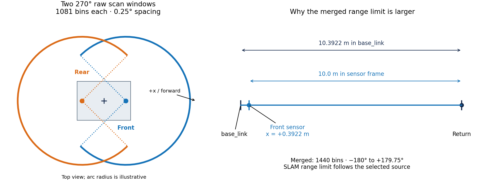
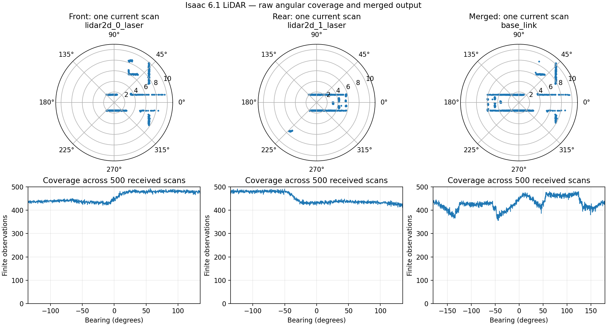
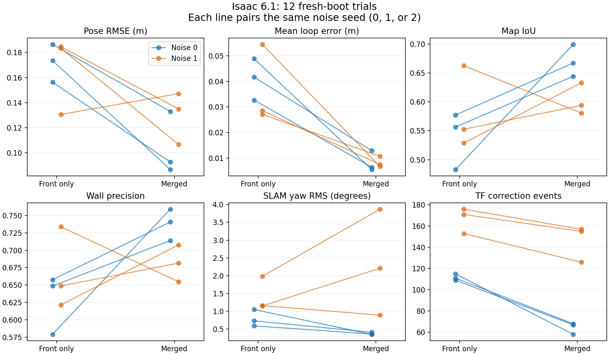
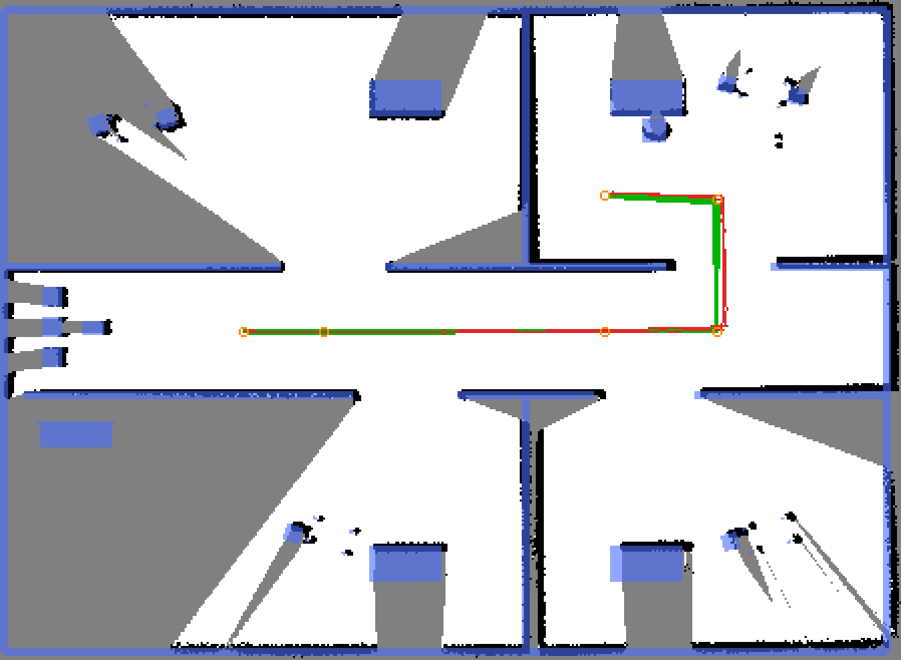
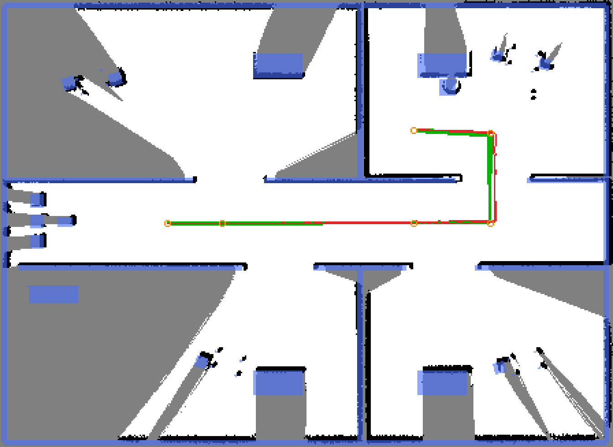

# Isaac 6.1 LiDAR pipeline

The two UST-10LX scans remain independent navigation inputs. `slam_source`
selects SLAM input only: `front_only` (the public default) uses the front scan;
`merged` explicitly enables a front/rear scan in `base_link`.

```text
front RTX cloud ── 270° assembler ── front scan ──┬── navigation
                                               ├── front_only SLAM
                                               └──┐
                                                  ├── merger ── merged SLAM
rear RTX cloud ─── 270° assembler ── rear scan ──┬──┘
                                               └── navigation
```

## Current contracts



Each raw window is centered on its sensor's forward axis; the rear sensor
faces backward. The sensor origins are ±0.3922 m from `base_link`. The right
panel shows why a valid 10 m raw return requires a 10.3922 m merged limit.
Arc radii on the left illustrate angular coverage, not maximum range.
Regenerate with `python3 tools/isaac/lidar_qualification.py contract-plot
--out docs/isaac/assets/lidar/scan-contract.png`.

Topic names below are relative to `r100_0001`.

| Topic | Frame | Geometry | Declared range |
|---|---|---|---|
| `sensors/lidar2d_0/scan` | `lidar2d_0_laser` | 1081 bins, -135° through +135°, 0.25° | 0.06–10.0 m |
| `sensors/lidar2d_1/scan` | `lidar2d_1_laser` | same | 0.06–10.0 m |
| `sensors/scan_slam_merged` | `base_link` | 1440 bins, -180° through +179.75°, 0.25° | 0.06–10.3922 m |

Raw scans have a 0.025 s scan period. In deterministic qualification they
publish at 40 Hz in simulation time. A bin with no valid current return is
positive infinity; the assembler does not interpolate or retain old rays.
Nearest valid returns win when multiple points occupy a bin.

One `OmniLidar` prim per physical sensor produces a complete 360° Cartesian
cloud. `ros_io.LidarScanAssembler` clips it to the public 270° contract. The
internal rotary tick/scan rates are both 40 Hz and the firing rate is 57600 Hz,
giving 0.25° spacing. This avoids the missing sectors observed with the
previous clipped-rotary/two-half-cloud configuration on Isaac 6.1. The robot
importer reads `ust10lx_2d.json`; runtime uses the baked robot USD. Changing
the JSON alone does not change the runtime asset.

The raw scan contract applies after assembly; diagnostic `points` topics
contain full-circle renderer output and are not navigation scan inputs.

## Merger and range limits

The front scan supplies the output timestamp. Static sensor poses are
front `(0.3922, 0, 0)` and rear `(-0.3922, 0, pi)` relative to `base_link`.
For equal stamps the rear points need only the static transform. For skewed
stamps within the 20 ms tolerance, they use:

```text
rear sensor at t_rear
   → base_link at t_rear → odom → base_link at t_front → merged angular bins
```

The motion transform uses `odom → base_link`, never SLAM's own map correction.
Both `/tf` and `/tf_static` are remapped to namespaced topics. An unavailable
odom transform drops the rear contribution and increments TF-miss/rear-drop
counters; it is not counted as a successful pair.

Front callbacks wait up to twice the pairing tolerance from local receipt
for a rear callback. This receipt deadline avoids mistaking queued startup
messages for a missing rear sensor. A steady-clock timer resolves expired
entries even when no further scans arrive.

A 10 m forward ray from the front sensor is 10.3922 m from `base_link`.
Accordingly, SLAM's `max_laser_range` is rewritten to 10.0 for `front_only`
and 10.3922 for `merged`. `scan_buffer_maximum_scan_distance` is unchanged:
it is not a ray-range limit. Transformed points outside the declared output
limits are excluded before nearest-return reduction.

The merger logs distinct counts for equal-stamp pairs, compensated pairs,
front-only publishes, rear drops, and TF misses. Equal simulator timestamps
can bypass compensation; only observed deltas and counters establish whether
that happens in a particular run.

## Qualification procedure



The measured scan view shows both raw windows and the merged output. The
lower panels count finite returns per bearing while the robot rotates;
empty sectors would expose missing angular coverage. This run-specific
figure is owned by the [dated qualification record](../history/2026-09-17-isaac-lidar-qualification.md),
which records the source capture and regeneration procedure. It establishes
LiDAR coverage; the closed-loop SLAM comparison is separate below.



The fresh twelve-run baseline shows lower median pose/loop errors with merged
scans, but mixed noisy-seed map and yaw results. Each line is a seed pair;
none is selected as a representative best run. The dated record owns the full
minimum/median/maximum tables, exclusions, and regeneration command.
`front_only` remains the public default; this is not an exploration/P5 result.

| Configured noise, seed 0: front only | Configured noise, seed 0: merged |
|---|---|
|  |  |

Blue marks ground-truth occupied cells; black is the SLAM occupied map,
gray is unknown, green is the ground-truth path, and red is the SLAM path.
This fixed seed pair illustrates the noisy exception, not a best-run claim:
front-only has higher IoU here despite merged's better median across seeds.
The [evidence record](../history/2026-09-17-isaac-lidar-qualification.md#interpretation)
owns the exact source paths and limitations.

The [dated qualification record](../history/2026-09-17-isaac-lidar-qualification.md)
records the completed gates and limitations. For repeat qualification, follow
the procedure below. Keep raw evidence under ignored
`artifacts/isaac-lidar-qualification/`; do not substitute the
[invalidated July investigation](../history/2026-07-12-isaac-slam-investigation.md)
for current measurements.

- Stabilize geometry, regenerate analytic `mock_hospital` GT, verify dependencies,
  rebuild affected packages, and inspect installed copied executables.
- Use a dedicated, empty ROS domain and fresh headless deterministic boots at
  `rtf:=1.0`. Disable camera, target localization, RViz, coverage overlay, and
  autonomous frontier motion. Start with `odom_noise:=0.0 noise_seed:=0`.
- Run `tools/isaac/lidar_qualification.py capture --pairs 500` during controlled
  rotation. Inspect every-message geometry, all 45° sectors, independent
  sensor contributions, finite-range validity, exact deltas, and cumulative
  counters from boot. Record all launch arguments with repeated `--launch-arg`.
- Use `windows` for consecutive internal RTX clouds (`--legacy-halves` only
  when diagnosing the old two-cloud configuration). Receipt of a cloud alone
  does not establish angular coverage.
- On a separate empty domain, run `skew`: namespaced TF only, scans 10 ms
  apart, rotating odometry, rear contribution, and a real transformed 10 m
  ray. Require compensated pairs and zero TF misses.
- Run the scan-versus-GT geometry check and preserve plots and logs.
- Run `matrix --gt-grid <grid.npz> --out <new-directory>` for fresh simulator
  and SLAM state per trial: noises 0 then 1; seeds 0, 1, 2; front then merged
  at each seed. It stops at the first failed trial and retains its artifacts.
  Diagnose failures before rerunning with `--condition noise/seed/source`.
  Use `--start-at noise/seed/source` to resume the remaining ordered sequence
  in a new artifact directory. The runner refuses an occupied GPU and stops
  if a second GPU process appears; the summarizer rejects such trials.
- Use `summarize '<repo-relative-glob>/*_metrics.json'` only on the 12 accepted
  trial files. Require 3/3 complete runs per condition and finite metrics.
  Report min/median/max and seed-paired merged-minus-front deltas. Preserve
  rejected attempts with the reason; do not silently select favorable runs.

`noise_seed=N` seeds Isaac odometry with N and IMU noise with N+1; seed 0
preserves the original streams. The argument is not forwarded to Gazebo or
hardware. Public invocation details are owned by the [README](../../README.md).
