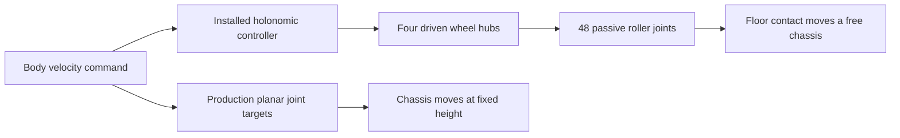

# Experimental wheel-contact drive

The production Isaac backend uses the planar chassis rig described in the
[robot model](robot-model.md#the-drive-rig). A separate experiment tests whether
wheel–ground contact can support a replacement. Its results do not change the
production robot, public launches, ROS contract, or navigation footprint.

## Status and reopening criterion

Physical-wheel development is deferred. The production planar drive remains the
chosen abstraction for flat-floor navigation and perception; its
[rationale and limits](robot-model.md#why-this-abstraction-fits-the-current-work)
are authoritative. The O3dyn modules were inspected but no Ridgeback adaptation
or O3dyn-based qualification was completed. Resume this harness only when a
traction, terrain, traversal, or wheel-control requirement needs it. Shared
collision geometry and Nav2 outline validation proceed independently.

## What the experiment compares



The physical candidate converts the expanded Clearpath URDF into an isolated
USD. Fixed-link transforms and inertias are merged into one chassis body;
continuous wheel joints remain actuated. Unexpected movable joints fail the
conversion. Boxes and meshes are imported as collision geometry, with convex
hulls for mesh contacts. The D455 and both LiDAR attachment frames remain
relative to the chassis. This is a collision-model experiment, not a textured
visual-model replacement or a running perception stack.

The NVIDIA Ridgeback asset referenced by the production importer also uses
virtual planar chassis joints; its wheel-shaped colliders are not articulated
mecanum rollers. Gazebo instead uses wheel cylinders with directional friction
and a wheel-slip plugin. Neither model establishes hardware traction fidelity.
The installed controller examples also include O3dyn, whose passive-roller
modules are a possible reuse source. Their dimensions and contact settings
have not been qualified for Ridgeback; the current experimental model does
not claim to reproduce them. The [collision reference](../robot/collision_model.md) distinguishes physical,
simulator, and navigation envelopes.

## Explicit prototype assumptions

- Wheel centre positions, radius, width, and total wheel masses come from the
  generated description. All four wheel axes point along positive Y.
- Each wheel contains 12 passive, convex ellipsoidal rollers at 45 degrees.
  Roller count, profile, and mass (0.08 kg each) are unmeasured assumptions.
  The sampled roller geometry fits within the declared cylindrical envelope.
  Hub mass is the remaining declared wheel mass; inertias are analytical
  approximations for these experimental hub/roller shapes.
- The installed holonomic controller uses roller angles 45/135/135/45 degrees
  for front-left/front-right/rear-left/rear-right, with joint-name mapping
  verified before applying targets. It computes commands, not contact physics.
- Static and dynamic friction are 0.8; restitution is zero; contact offset is
  1 mm and rest offset is zero. Wheel drives use damping 8, stiffness zero,
  and maximum torque 20 N m. These settings are experimental, not motor data.
- The CPU PhysX TGS solver uses 16 position and four velocity iterations for
  the candidate articulation. Self-collision is disabled. The chassis is free
  in all six degrees of freedom and spawns with 10 mm wheel-envelope clearance.
- The mast and bracket are absent from the shared description and therefore
  absent from this candidate. Sharing and measuring them remains backlog work.

Root pose and joint state setters are used only between cases to reset the
experiment. During each measured case, only wheel velocity targets drive the
candidate. The production comparison uses its unchanged planar rig instead.

## Running a qualification

From a sourced workspace with the active Isaac environment and GPU available:

```bash
source install/setup.bash
tools/check_dependencies --profile all
OMNI_KIT_ACCEPT_EULA=YES isaac_venv/bin/python \
  tools/isaac/mecanum_experiment/sweep.py \
  --output artifacts/mecanum-investigation/qualification-new
```

The output directory must be new and under `artifacts/`. The sweep runs three
independent physical-model boots at 120 Hz, three at 240 Hz, and three
production-model boots at 120 Hz, serially. The higher rate is a timestep
sensitivity comparison, not an automatic fix. No production asset is written.
A harness failure stops the sweep; failed physics gates remain recorded and do
not stop later conditions.

For one diagnostic case, use `run.py --output <fresh-directory> --only settle`.
Such a run is marked as an incomplete matrix and cannot qualify migration.
Use `--model baseline` for the production comparison.

Each boot preserves the generated URDF, candidate and effective stages,
implementation snapshot, Git revision/status/patch, source hashes, model and
controller settings, per-sample body/joint states, wheel-derived odometry,
contact reports, and per-case results. The wheel-derived odometry is a
kinematic estimate from solver-reported wheel speeds, separate from chassis
ground truth. Compare those speeds with finite differences of joint positions
before treating them as encoder measurements; the experiment does not certify
the simulator readout as an encoder model. Production wheels do not drive that model, so their derived odometry
is only a diagnostic control.

## Acceptance and interpretation

The matrix includes settling, ten-second hold, both signs of forward and
lateral motion at 0.1/0.2 m/s, both rotations at 0.3 rad/s, command timeout,
frontal/lateral/angled wall contact and reverse recovery. Diagonal motion and a
20 mm obstacle in a wheel path are diagnostics, not traversal qualifications.

- Settle within five seconds; reported linear speed below 0.01 m/s during the
  last second; subsequent drift at most 5 mm and 0.5 degrees over ten seconds.
  Floor contact penetration must stay within 2 mm during the hold.
- Steady commanded-axis speed error at most 10%; peak cross-axis speed at most
  0.02 m/s after the first two seconds. Rotation error is at most 10%, with
  at most 20 mm translation during five seconds.
- The timeout waveform stops refreshing commands at two seconds and expires
  at 2.5 seconds. Targets must be zero afterward and chassis planar speed must
  be below 0.01 m/s from 3.5 seconds onward. This does not qualify ROS/network
  command-chain behavior.
- Wall contact error at most 10 mm, penetration at most 5 mm, and at least
  80 mm recovered clearance at the end of reverse motion. Contact reports
  must confirm wall contact; merely approaching a wall cannot pass.
- Sensor attachment motion at most 1 mm translation and 0.1 degree rotation
  relative to the chassis, allowing numerical fixed-joint tolerance. These
  checks do not qualify image generation, LiDAR returns, or self-occlusion.

Record both pose changes and reported velocities: a stable-looking pose can
coexist with solver-reported residual velocity. Do not hide that discrepancy
by declaring a static image a settling pass. Passing requires every required
case in all three boots; an incomplete or failed run cannot qualify migration.
The fixed-height baseline cannot pass the free gravity-settling requirement.

Aggregate a complete sweep (missing or mismatched boots fail):

```bash
MPLCONFIGDIR=/tmp/ridgeback-mpl isaac_venv/bin/python \
  tools/isaac/mecanum_experiment/aggregate.py \
  artifacts/mecanum-investigation/qualification-new \
  --output artifacts/mecanum-investigation/qualification-new/review
```

Render traces and optional top-down/side videos from a completed run:

```bash
MPLCONFIGDIR=/tmp/ridgeback-mpl isaac_venv/bin/python \
  tools/isaac/mecanum_experiment/report.py \
  artifacts/mecanum-investigation/qualification-new/physical-120-boot1 \
  --output artifacts/mecanum-investigation/review --videos
```

Videos reconstruct collision geometry from recorded chassis and joint poses;
they are **state replays, not camera footage**. The renderer does not rerun
physics. The numerical contacts and qualification checks remain authoritative.
Offline checks run with:

```bash
isaac_venv/bin/python -m pytest -q tools/isaac/mecanum_experiment/test_experiment.py
```

## Archived evidence

- [September 18 wheel-contact investigation](../../archive/engineering/2026-09-18-mecanum-drive-investigation.md)
