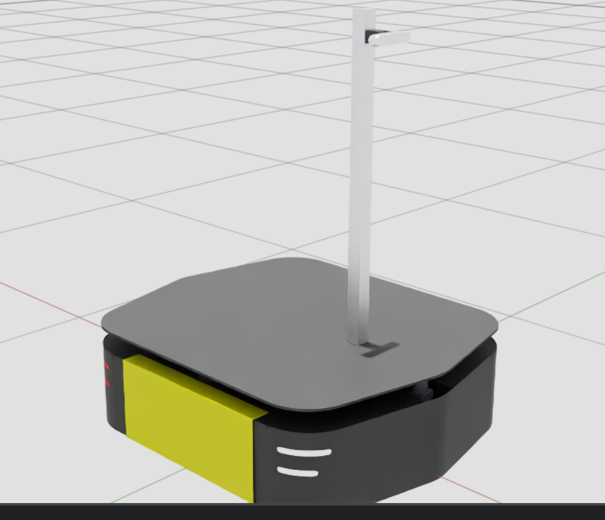

# The Ridgeback robot model: URDF → USD → meshes → sensors

How the robot gets from the Clearpath description into Isaac, what the
geometry actually is, and which parts are hand-authored rather than imported.

This is the canonical source for robot geometry. `port-plan.md` covers the
phase plan, `open-issues.md` what is currently broken.



Dimensioned drawing: [`assets/robot-geometry.svg`](assets/robot-geometry.svg).
It is **hand-plotted and does not self-correct** — check it after any mounting
change.

---

## The pipeline

`tools/isaac/import_ridgeback_urdf.py` runs the whole thing. Trigger it when
`clearpath/robot.yaml` changes, not per launch (~165 s):

```bash
OMNI_KIT_ACCEPT_EULA=YES isaac_venv/bin/python3 tools/isaac/import_ridgeback_urdf.py
```

1. `generate_description` renders `clearpath/robot.urdf.xacro` from
   `clearpath/robot.yaml` (repo-local `setup_path`, no `~/clearpath` mirror)
2. `xacro` flattens it to plain URDF, then `_sanitize_urdf` makes it digestible:
   names anonymous materials (the importer's usdex pass crashes on the unnamed
   default it fabricates) and strips `<gazebo>` elements (their namespaced
   attributes become invalid USD attribute names)
3. Isaac's URDF importer converts to USD with `merge_fixed_joints=False`, so
   every sensor frame the topic contract names still exists as a prim
4. `add_planar_rig` appends the drive chain
5. `add_sensor_prims` bakes the lidar/camera prims
6. `attach_visual_meshes` re-attaches the geometry the importer dropped
7. the staging directory is flattened into the committed layout
8. `graft_vendor_chassis` swaps in Clearpath's authored chassis

Output: `src/ridgeback_autonomy_isaac/sim/isaac/usd/robots/ridgeback_r100/` —
`ridgeback_r100.usda` (entry) plus `payloads/{base,robot,materials}.usda`,
`payloads/Physics/{physics,physx,mujoco}.usda`, and `payloads/meshes/`.
Committed artefact; regeneration is deliberate and reviewed in git.

> `clearpath/robot.urdf.xacro` is **generated** and gitignored. Edit
> `robot.yaml`, never the xacro.

---

## Geometry, as built

All values in metres relative to `base_link`, which sits **0.02617 above the
floor**. Measured from the wheel mesh: all four bottom at −0.02617 in
`base_link`, bbox height 0.15234, so the radius is 0.07617. The
axle 0.050 − radius 0.0759 derivation quoted here previously gives 0.0259 and
is 0.27 mm off — below map resolution, but prefer the measured value.

| | x | y | z |
|---|---|---|---|
| chassis hull | −0.4706 … +0.4618 | ±0.3966 | +0.0037 … +0.2800 |
| top deck plate | −0.4702 … +0.4614 | ±0.3950 | +0.2737 … +0.2800 |
| `default_mount` | 0 | 0 | +0.2950 |
| `lidar2d_0_laser` (front) | **+0.3922** | 0 | **+0.2264** |
| `lidar2d_1_laser` (rear, yaw 180°) | **−0.3922** | 0 | **+0.2264** |
| D455 body | +0.2590 … +0.2850 | ±0.0620 | +1.0200 … +1.0490 |
| camera mast (37.5 mm sq) | +0.1955 | 0 | +0.2800 … +1.0950 |
| standoff bracket | +0.2142 … +0.2590 | ±0.015 | centred 1.0345 |

Hull is 0.9325 × 0.7932 — the width matches the official Ridgeback spec
(793 mm) to 0.2 mm, which is the check that says the model is trustworthy.

### Sensors are never where the obvious surface suggests

Both sensor mounts were wrong in the same way, and both cost time:

- **The 2D lidars read as deck-mounted. They are not.** They sit recessed in a
  diamond notch under the top plate. Mounting them on `default_mount` put them
  **11.6 cm too high**, so every coverage number taken before 2026-09-10 was
  scanning above obstacles it should have hit.
- **The camera reads as mast-top. It is not.** It is bracketed to the mast's
  **front face** with a ~45 mm standoff. Modelling it on top left it 12.5 cm
  high with a mast ending under it.

**Measure the mounting face, and ask how it attaches, before authoring an
offset.** `hokuyo_ust.stl` spans z 0.0000–0.0700, so its origin is the unit's
**base** — the surface a tape measures to, not the glass band.

### Camera render and TF contract

The measured mount belongs only in `clearpath/robot.yaml`. From that one pose,
the patched Clearpath D455 description establishes two mutually exclusive TF
owners:

- simulation expands with `is_sim:=true`; `robot_state_publisher` owns the
  nominal `camera_0_link → camera_0_color_frame →
  camera_0_color_optical_frame` chain;
- hardware omits those internal frames, leaving the RealSense driver to
  publish its device calibration.

Gazebo's RGB-D sensor renders from `camera_0_color_frame` at 640×480 and 30 Hz.
Isaac's importer also expands the simulation description, then creates
`d455_color` at the exact same colour-frame origin. The prim carries only the
USD-to-ROS camera-axis rotation—there is no copied D435 translation—and
`OmniSensorAPI` authors the 30 Hz cadence. Its backend-specific 1280×720,
631 px focal-length input lives in
`src/ridgeback_autonomy_isaac/sim/isaac/d455_camera.json`; the generated
USD bakes that contract. Runtime perception never reads this file or a FoV
constant: both simulator backends publish `CameraInfo`, which is the
application input; hardware gets the same input from the RealSense driver.

The merged runtime was checked live on 2026-09-12. Isaac published 1280×720
`rgb8` colour and `32FC1` depth, both labelled
`camera_0_color_optical_frame`; `CameraInfo` reported
`fx=fy=631.0000005`, `cx=640`, `cy=360`, and advanced at exactly 30.0 Hz in
simulation time. The namespaced TF tree resolved `base_link →
camera_0_color_optical_frame` to `[0.280, -0.011, 1.034]` with the expected
optical rotation.

Isaac Sim 6's `depth_pcl` helper serializes the image-row-major cloud as
`921600×1`, not `1280×720`. A matched live depth/cloud pair proved one point
per pixel and exact optical-Z/depth agreement across 417,280 valid pixels.
The pointcloud consumer therefore restores the 720×1280 grid only when the
flat point count exactly matches the live colour dimensions; arbitrary flat
clouds remain rejected.

### The riser diamond

`riser_link` carries a `Cube` scaled 0.493 × 0.493 × 0.07, rotated **45°**,
spanning z 0.220–0.290. That is the notch that makes the 270° window work: its
corners reach 0.3486 along ±x and ±y while the lidars sit at ±0.3922, so a ray
leaving a lidar at exactly ±135° runs **parallel** to a diamond face, 30.8 mm
outside it. Invisible in any photo, load-bearing in the geometry.

Careful with which prim you measure, though: both `riser_link` Cubes are
**invisible / `guide` purpose**, so the RTX lidar never rays against them. The
notch surface it actually sees is the vendor chassis *visual* mesh, whose
plane-slice diamond has its vertex at +0.3432, putting the tangent face
**34.6 mm** from the emitter. Same mechanism, slightly different number — use
34.6 mm for anything about what the sensor perceives.

Verified in `src/ridgeback_autonomy_isaac/sim/isaac/usd/worlds/empty.usda` — floor slab, nothing else, so
any finite return is necessarily the robot seeing itself: **0/1081 finite bins
on both lidars** across the full ±135°. A static ray-cast of the sliced USD
agrees: 0/1081 (`tools/isaac/self_occlusion_check.py`).

⚠️ Both of those are **static** results, and they were read as "the robot can
never see itself". That is only true while the sensor and the chassis move
together. From `a33111c2` to 2026-09-11 they did not (see "The drive rig"), and
the robot saw its own notch every time it turned. A zero here does not license
skipping the moving case.

Gazebo's live proof was repeated after the shared config explicitly supplied
the physical ±135° UST window. Without it, Clearpath's generic parser expanded
the Gazebo sensor to 360° and both units produced 140 false near bins down to
5.05 cm. With it, each sensor published 540/540 finite bins at 40 Hz and zero
returns below 0.8 m while stationary. During a commanded turn the robot yaw
changed by 0.390 rad and both scans again had 540/540 finite bins, zero below
0.8 m; the nearest obstacle was 1.19 m. The camera simultaneously published
640×480 `CameraInfo` at 30.3 Hz with `fx=fy=443.53` and
`camera_0_color_optical_frame`.

That closes raw-sensor compatibility for the physically accurate mounts. The
full `collision_monitor` and SLAM consumer path remains an integration gate in
`docs/BACKLOG.md`. Do not move the shared physical mounts to hide a downstream
backend issue; any remaining correction belongs in Gazebo-only consumer
configuration.

---

## The chassis comes from NVIDIA, not the importer

The URDF import produced a coarse shell: open gaps under the deck, **no rear
end panel at all**, flat untextured materials. NVIDIA ships an authored
Ridgeback in the Isaac asset catalog —
`/Isaac/Robots/Clearpath/RidgebackUr/ridgeback_ur5.usd`, BSD-3-Clause,
Clearpath Robotics, from `ridgeback_manipulation`.

> The port plan long claimed *"No Ridgeback USD in the 6.0 catalog"*. That was
> wrong, and it is why URDF import became the primary robot source.

`tools/isaac/extract_vendor_chassis.py` pulls the chassis out; the importer
references it and hides the 12 imported prims it replaces.

**Taken:** body, both end covers (including the rear panel the import never
had), both side covers, lights, rockers, centre rail, top deck, plus the
chassis `convexHull` collider and the deck plate.

**Not taken:** the wheels — the vendor drives its base as one rigid body with
static wheels, while our rig keeps articulated wheel links that spin, so
taking theirs would double them. Also dropped: the UR5, its mount plate, the
dummy joint chain and the vendor `physicsScene` (a second articulation root
would fight ours).

It grafts cleanly because **both models bottom out at z = −0.0262** (the wheel
contact plane) and agree in y to 1.4 mm. The vendor root *is* our `base_link`,
so no sensor offset needed re-referencing.

The vendored asset and its licence live in `payloads/meshes/` and are
**stashed and restored** across regeneration — the flatten step `rmtree`s the
whole robot directory.

---

## Hand-authored parts

Not everything comes from the description. These are authored in the importer
and will not appear in the URDF:

| part | why |
|---|---|
| camera mast + standoff | not in the Clearpath description at all; the URDF leaves the camera floating in mid-air |
| `mast_aluminium`, `bracket_black`, `camera_silver`, `sensor_dark_grey` materials | the converter binds a flat white `DefaultMaterial` to any mesh whose source carried none |
| chassis collider | see below |

The standoff's length is **derived from the live camera mesh**, not hardcoded.
That is deliberate: switching D435 → D455 changed the body from 90×25×25 to
124×26×29, and the bracket refit itself (44.8 → 44.7 mm, centre 1.0325 →
1.0345). Hardcoded, it would have been 0.1 mm long and 2 mm low with nothing
to flag it.

### Colliders

Four in total: the chassis `convexHull`, the deck plate, the riser diamond,
and the camera box. Wheel cylinders come from the vendor set.

`convexHull` was chosen over `convexDecomposition` on measurement:

| collider | volume | over-claim |
|---|---|---|
| true mesh | 0.15968 m³ | — |
| **convexHull** | 0.17064 m³ | **+6.9%** |
| AABB `Cube` (replaced) | 0.20018 m³ | +25.4% |

The hull keeps 119 verts / 234 facets against the source's 972 / 324. What it
over-claims is the underside cavity between the wheels, which the wheel
cylinders already occupy and nothing else reaches. Compare them yourself:

```bash
OMNI_KIT_ACCEPT_EULA=YES isaac_venv/bin/python3 \
    tools/isaac/inspect_robot.py --compare-colliders
```

⚠️ Physics with the hull is **unvalidated** — nothing has driven the robot
into a wall to confirm it stops where it should (`open-issues.md` §5).

---

## The drive rig

`world → prismatic-X → prismatic-Y → revolute-Z → chassis_link`, velocity
drives (stiffness 0, high damping). Per step the runner reads θ, rotates the
body twist to world, and sets three velocity targets. Wheels are free visuals;
colliders keep PhysX contacts real.

Structurally the same pattern NVIDIA uses (`world → dummy_base_x →
dummy_base_y → base_link`).

> 🔴 **The chain ends at `chassis_link`, NOT `base_link`.** This doc said
> `base_link` until 2026-09-11 and that error cost a week of debugging.
> `base_link` is a bare `Xform` with **no `RigidBodyAPI` and no joint** — it
> is only a naming parent. PhysX drives `chassis_link`, writes its transform
> back, and leaves `base_link` at its authored pose.
>
> **Consequence: anything parented to `base_link` does not move with the
> robot.** `a33111c2` parented the 2D lidars there, which silently made them
> orphan rigid bodies — the scan stopped rotating with the body
> (`d(bearing)/d(yaw)` measured −0.0025 where −1 is correct) and the chassis
> swept under a stationary emitter, faking close returns off its own notch.
> That was the `collision_monitor` stall. Verify with
> `tools/isaac/diag_rig.py --spin-transforms`: `lidar-chassis` must stay 0.
>
> Mount sensors on `chassis_link` or a descendant. The two links are
> coincident (identity local transform), so offsets carry over unchanged and
> published TF does not move.

**There is no vertical joint**, so `base_link` z is fixed at `--spawn-z` and
the robot cannot settle onto a floor. That is why it floats 49.8 mm on stock
worlds — see `open-issues.md` §2.

---

## Importer defects you will hit

All 6.0.1. Several are candidates to delete on 6.1 (`port-plan.md` §P9).

- **Visual meshes are silently dropped.** `attach_visual_meshes` converts each
  source mesh and references it back. It attaches on a **child** prim, never
  the slot itself: a direct arc beats an ancestral one, so referencing on the
  slot lets the mesh file's identity xform override the importer's
  visual-origin ops.
- **Mesh `<collision>` elements are dropped too** — the chassis collider is
  authored from the same STL the URDF points at.
- **STL-derived visual slots are marked instanceable**, and USD refuses to
  author into an instance proxy. Masked for months by the D435's DAE; the
  D455's bare STL exposed it as an outright `IMPORT FAILED`.
- **The flatten step `rmtree`s the committed robot directory**, taking any
  vendored asset with it.
- **Kit runs `--/app/fastShutdown=True`**, so `app.close()` hard-exits.
  Anything appended after `import_urdf_to_usd()` returns never runs, while the
  script still prints `IMPORT OK` and exits 0.
- **Payload layers churn six lines per regen** — the importer stamps its
  `/tmp` staging paths into `doc` metadata. Cosmetic.

---

## Inspecting the result

```bash
# full Isaac UI — isaac_runner boots a minimal experience whose inspection
# menus are absent, which is why they look "disabled" in a runner window
OMNI_KIT_ACCEPT_EULA=YES isaac_venv/bin/python3 tools/isaac/inspect_robot.py

# self-occlusion check: nothing in the scene, so any finite return is the
# robot seeing itself
isaac_venv/bin/python3 src/ridgeback_autonomy_isaac/sim/isaac/isaac_runner.py \
    --world empty --headless false --camera false
```
