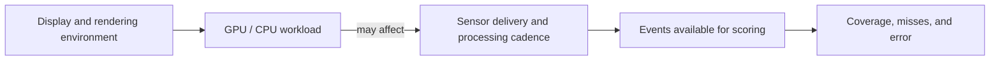

# BENCHMARKING — Execution-environment qualification

Status: **pending protocol freeze and matched runs.** The
[benchmarking backlog](../target_distance_benchmarking/BACKLOG.md#benchmark-execution-environment-qualification)
owns the prerequisite for parameter tuning and benchmark claims. This plan
establishes which execution environments can support comparable measurements.

## Question and scope

Do Gazebo benchmark runs using a remote desktop's OpenGL/GLX path and the
machine's physical-seat path produce practically equivalent measurement results?
Identify the actual display server, GPU, and renderer; an SSH connection or a
`DISPLAY` value alone does not establish the rendering path. Discover the
physical session rather than assuming it is always `:0`.

The comparison qualifies the tested Gazebo GLX conditions only. Isaac, server-only
EGL, hardware, other camera profiles, and untested workloads need their own
qualification. A physical seat is a comparison condition, not automatic ground
truth. Both environments must satisfy the declared stream and application
requirements; two equally degraded runs do not establish a usable environment.

## Freeze the comparison before collecting results

- Use one clean, committed experimental checkout and matching installed files.
  Record code/dependency/model revisions and hashes of the scenario and sweep.
- Freeze camera profile, robot geometry, estimator recipes, detector settings,
  scoring, transport, warm-up, capture duration, and scene repetitions. Record
  effective values, including defaults. Do not tune parameters during this test.
- Record host/GPU/driver, ROS domain and RMW, display-server identity and start
  time, rendering environment variables, simulator logs, and renderer provenance
  from `sweep.json`. Run `tools/gpu-run glxinfo -B` from each workload environment
  and corroborate the selected path with simulator evidence. Missing or conflicting
  renderer evidence leaves the condition unqualified.
- Use the repository's `tools/gpu-run` consistently in both conditions. Verify
  its effect rather than assuming it is harmless or a no-op on either session.
- Predeclare metric-specific practical equivalence margins, stream/application
  requirements, warm-up exclusions, uncertainty method/confidence level, and rules
  for invalid or interrupted runs. Choose margins from the differences that would
  change a tuning decision or invalidate a claim, before seeing the results.
- Keep host load, GPU warm-up, video, RViz, simulator GUI, window sizes, and
  external sampling comparable. Start with recording disabled; qualify recording
  or other display settings separately before using those results interchangeably.
- Confirm the physical session is available and inspect process ownership before
  cleanup. Do not take over another user's session, terminate unrelated work, or
  change the display manager as part of the comparison.

## Matched light and heavy workloads

Use the same estimator pair, `projective_ranging,euclidean_reconstruction`,
in both cells. The detector and simulator still run in the light cell.

| Cell | Mask gate | Depth source | Mask-worker model work |
|---|---|---|---|
| A: light | `box` | `stereoscopic` | neither model |
| D: heavy | `silhouette` | `monocular` | SlimSAM and Depth Anything |

Prepare a valid, pinned sweep YAML using the
[current sweep schema](../../src/ridgeback_autonomy/ridgeback_autonomy/benchmarking/sweep.py).
Use the same scenario bytes and settings for both environments. Reuse the A/D
settings from the [combined-model sweep](../../src/ridgeback_autonomy/config/benchmark_sweep_model_concurrency.yaml)
where appropriate, explicitly recording diagnostics and display overrides.
Validate with `target_benchmark_sweep <yaml> --dry-run` before launching.

Collect at least three independent run replications per environment and cell
(at least twelve cell runs). Scene repeats within one process are not independent
run replications. Use a pinned A/D pair sweep for each environment replication;
each pair owns one persistent simulator and restarts its per-cell measurement
process. Across replication blocks alternate which environment runs first, and
counterbalance A/D order using predeclared paired sweep files that differ only
in order. Record the schedule and file hashes; never change settings in response
to interim outcomes.

Run environments sequentially on the shared host. Never run `cleanup.sh` between
cells of a persistent sweep. Record cold startup separately and apply identical
warm-up exclusions. Preserve failed or skipped runs and their reasons; replace
runs only under the predeclared invalid-run policy. Three replications are a
minimum screening design, not a guarantee of enough precision for equivalence.

## Compare delivery, processing, and scored outcomes

| Evidence | Report per environment, cell, and replication |
|---|---|
| Sensor streams | Colour/depth rates in wall and simulation time, stamp continuity, exact matching, receive gaps, and missing frames |
| Detection and measurement | Achieved cadence, completion ratio, pending replacements, worker latency, dequeue/publication age, and cold/warm separation |
| Scored results | Per-scene scored counts, detector/gate/no-value outcomes, reason histograms, MAE/median/P95 error, and skipped trials |
| Host and simulator | Renderer evidence, RTF, wall time, GPU/CPU load, memory, temperature, and recording/display settings |
| Display | RViz/GUI responsiveness or frame rate, kept separate from sensor and measurement metrics |

Use the existing diagnostics and QoS-compatible bounded observers; preserve the
same instrumentation in both conditions and record observer overhead. RTF or
GPU utilization alone cannot establish healthy camera delivery.

Compare within-environment repeatability and paired between-environment
differences. Treat runs as the replication unit; do not count every frame as an
independent repeat. Report uncertainty against the predeclared margins for every
primary metric and both cells. Inspect per-scene outcomes so aggregate error
cannot improve merely because difficult instances stopped being scored.

Live accuracy need not be bit-identical: timing can change the events sampled.
A small point difference, overlapping spreads, or failure to detect a difference
is insufficient to establish equivalence. If uncertainty crosses an acceptance
boundary, retain an inconclusive result and plan additional evidence explicitly.

## Decision and completion

- **Equivalent within tested conditions:** both environments satisfy requirements,
  and primary metric differences are contained within the predeclared equivalence
  margins with the declared uncertainty method. Record the exact qualified scope.
- **Equivalent measurements with a display limitation:** the same measurement
  gates pass; only display behavior differs. Record which display settings and
  claims are covered, and which are excluded.
- **Measurement difference or inconclusive:** keep tuning and benchmark-claim
  use blocked until an execution environment is independently qualified or the
  unresolved difference is explained and retested. Do not automatically promote
  the physical seat or declare all remote execution invalid.

Preserve the protocol, provenance, commands, schedule, run/artifact hashes,
per-run results, paired comparison plots, uncertainty, exclusions, and decision
in a dated engineering record. Update maintained run guidance with the qualified
conditions and close the owning backlog gate only when its criteria are met.
A material change to renderer, driver, workload, camera grid, or display/capture
settings requires reviewing whether that qualification still applies.

Detector-recall investigations, ground-truth definition changes, CUDA barrier
experiments, and model-concurrency redesign have separate scope. They are not
additional phases of this environment comparison.

## Archived evidence

- [Software-rendering incident](../../archive/engineering/operational_incidents.md#camera-software-rendering-collapse--measured-2026-09-05)
