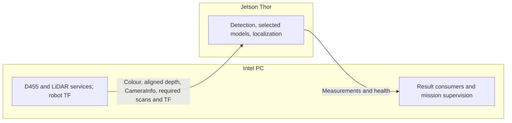

# PHYSICAL — Intel–Thor deployment and transport qualification

Status: **network inventory and preliminary transport experiments recorded;
distributed localization and robot acceptance pending.**
Owner: people and agents working at the robot. The
[project backlog](../BACKLOG.md#physical-stationary-integration) owns the
stationary milestone. The [package split](PHYSICAL_package_split.md) supplies
shared code and interfaces; the
[measurement plan](PHYSICAL_robot_measurements_and_validation.md) supplies
sensor-mount checks and stationary alignment evidence. The tested workstation
handoff is available; deployment acceptance requires its matching installation
on both hosts.

## Progress and next evidence

This checkpoint distinguishes committed tools and reported experiments from a
verified installed deployment. The
[transport reference](../physical/intel_thor_transport.md) owns the discovered
topology, selected configuration, known limits, and dated evidence links.

| Workstream | Recorded progress | Remaining acceptance evidence |
|---|---|---|
| Host and network inventory | Intel/Thor identities, Ethernet interfaces and 1 Gb/s link, ROS Jazzy middleware versions, and existing service ownership are partly recorded. | Complete OS, USB, GPU software, model and installed-package inventory on both hosts. |
| DDS transport | Interface restrictions, receive-buffer configuration, link probe, middleware comparison, and service-switch tooling are implemented; preliminary synthetic tests are recorded. | Verify effective settings and persistence on the actual deployment, then validate live colour/depth/CameraInfo/scan/TF delivery. |
| Shared application deployment | Package split, separate compute/consumer roles, and workstation failure tests are available in the handoff. | Matching installed revision, actual Thor GPU execution, and repeatable stationary startup/shutdown. |
| Timing and performance | Network timing and a raw-HD bandwidth limit have been identified. | Bounded clock alignment and all four live model-mode measurements, including resource/thermal behavior and matched replay. |
| Failure and joint acceptance | Supervision is tested locally with a fake navigation server. | Cross-host interruption/stall/recovery evidence and shared G1/person runs with the measurement team. |

The September 18 transport experiments name revision
`a01a4532a170fcb85df1a5aaffb8c28bf1601f96` plus uncommitted probe/configuration
files, with partial provenance. They do not establish acceptance of the newer
package-split handoff. Do not carry their performance numbers forward as a
measurement of the deployed localization pipeline.

## Initial topology and operating boundary

Both computers use the same repository revision. Keep the D455 connected to
Intel initially. Intel owns existing platform/sensor services and supervision;
Thor owns the full localization pipeline, including detector, selected models,
and estimators. Navigation remains disabled for the physical tests.

Use explicit per-host start/stop commands first. Preserve existing robot
services and configuration; do not copy the repository's robot setup over the
live installation or run simulator cleanup. Use a stationary test launch that
cannot issue base commands. Fault tests needing navigation actions use the
workstation handoff's fake server in an isolated ROS domain.

ROS Jazzy and a 1 Gb/s Ethernet link are reported in the transport evidence.
Verify them in the installation manifest rather than assuming the earlier run
still describes the machines. Ubuntu 24.04 remains an expectation to verify;
effective per-process middleware, Thor GPU software, and physical USB routing
still need a complete deployment record.

## 1. Inventory and reproducible installation

- Record host identities, architecture, OS/ROS versions, storage, network/USB
  topology, negotiated link speed, routes/interfaces, middleware/domain, and
  clock services. Identify the actual sensor/platform processes and their
  startup owner; record effective topic and TF publishers.
- Record Thor's JetPack/driver/CUDA environment, power mode, GPU visibility,
  and available memory. Check the installed platform against supported vendor
  documentation before selecting wheels or containers. Do not assume the
  workstation's perception requirements are suitable for Thor.
- Back up effective configuration and record every proposed/applied diff with
  its rollback. Install the workstation handoff revision and required package
  subsets on both hosts; check installed code, not only source checkouts.
- Resolve platform-specific dependencies without silently replacing model
  checkpoints or algorithms. Preload the required model weights and prove
  actual GPU execution for detection, segmentation, and monocular depth.
  Silent CPU fallback does not qualify GPU offload.
- Record exact dependency/model revisions, commands, runtime environments,
  launch parameters, health settings, and installed package/type identities.
  Return shared-code incompatibilities with reproducible evidence to the
  workstation owner rather than maintaining a robot-only implementation.

## 2. Transport, time, and readiness

Inspect actual interfaces and discovery before changing DDS configuration.
CycloneDDS is selected for both hosts. The Ethernet-only configurations, the
receive-buffer limit, the Intel service switch, and the `check_link` pre-deploy
check are implemented; see the
[transport reference](../physical/intel_thor_transport.md). Still open:

- Confirm the current Intel service middleware and persisted receive-buffer
  limits on both hosts. The middleware comparison predates the service switch;
  a later transport note reports a switch and subsequent Hokuyo timeouts. That
  does not establish current installed state. Inspect before applying changes,
  preserve existing backups, and use the transport reference's rollback rules.
- Verify that every deployed cross-host process sources `dds_env.sh` and uses
  the intended interface restriction.
- Harden time sync and record fresh offset/drift bounds. Earlier internet-NTP
  measurements do not qualify acquisition-age measurements for acceptance.
- Investigate or bound the reported simultaneous Hokuyo timeout/reconnect
  failure before claiming repeatable stationary operation; preserve scan-gap
  and service-recovery evidence.

Verify matching ROS domain and interoperable deployed middleware, reachable
sensor topics, publisher/subscriber QoS, packet delivery, and namespaced TF.
Confirm one sensor/TF owner and no duplicate localization workers on Intel.

For colour, aligned depth, CameraInfo, required scans, measurements, and health,
record types, frame IDs, header stamps, rates, bandwidth, and receiving hosts.
Preserve acquisition timestamps. Stereo consumers must receive the exact depth
frame for each processed detection; do not rewrite stamps, widen tolerances, or
substitute nearby frames to conceal transport losses. Discover the real base
frame instead of deriving it from a ROS namespace.

Check sensor clock semantics and bounded host clock offset/drift. Record the
uncertainty in cross-host latency measurements; do not subtract unsynchronized
wall clocks and label the result network latency. Use monotonic elapsed time
for local durations. If clock uncertainty prevents an acquisition-age claim,
mark that metric unresolved and retain the locally measurable components.

Verify readiness separately from process existence: required inputs, TF,
models, compatible interfaces, and advancing processing must be present.
Preserve start-up and recovery diagnostics. Report missing contracts instead
of relying on a timed launch proceeding as proof of readiness.

## 3. Performance characterization

The goal is a baseline and transfer-cost evidence, not a new fixed real-time
requirement or parameter-tuning campaign. Use the camera profiles qualified by
the [D455 procedure](PHYSICAL_robot_measurements_and_validation.md#d455-camera-validation).
Record unsupported requested profiles as open work.

The transport reference identifies that raw HD RGB8 plus 16UC1 depth at 30 Hz
exceeds the current 1 Gb/s link capacity. Camera profile support and cross-host
delivery are separate checks. Keep that combination unresolved on this topology
until a tested transport/topology change or an explicit scope decision addresses
it; do not silently lower the requested rate and mark the original check passed.

| Mask | Depth | Required mode evidence |
|---|---|---|
| `box` | `stereoscopic` | Detector and default camera/depth estimators. |
| `silhouette` | `stereoscopic` | Detector, segmentation, and camera/depth estimators. |
| `box` | `monocular` | Detector, metric monocular model, and camera estimators. |
| `silhouette` | `monocular` | Combined model load and camera estimators. |

Add polar profiling after the measurement plan's stationary camera–LiDAR
alignment check; its scan input is independent of the selected camera depth source. Keep
organized point clouds optional. Use separately identified G1/person scenes and
record the selected labels without tuning detector/estimator parameters.

Separate model download/cold load, warm-up, and steady state. Freeze scene,
profiles, model/dependency pins, capture duration, observer setup, and repeated
run schedule before collection. Preserve independent runs and within-run
samples separately; record contention and temperature/power changes.

Measure input and output rates, result age, per-stage timing where available,
Ethernet throughput/loss, callback gaps, exact-frame availability, CPU/GPU and
memory use, and thermal behavior. Distinguish deliberately skipped input frames,
transport losses, stalled work, and frames processed with no detection. Include
observer/recording overhead and report median/tail behavior, not just averages.

Capture matched inputs and replay locally on Thor using the same model modes
and cadence to help separate compute cost from transfer effects. Preserve
recording provenance, replay clock/scheduling behavior, and observer overhead.
A replay difference is diagnostic evidence, not an exact subtraction of network
cost or proof that a directly attached live camera behaves identically.

The camera-on-Thor layout remains supported as an alternative. If the Intel
layout has failed input contracts or unacceptable measured transfer cost,
present the evidence and comparison proposal before physical relocation.
For an agreed comparison, transfer driver ownership once, verify USB/device
settings and TF, and repeat matched live runs. Repeat the mount/alignment checks
if the mount moved; measure any return imagery needed by Intel's display. Do not select a
layout from an invented latency target or silently treat replay as this test.

## 4. Failure and recovery acceptance

Use baseline evidence to select explicit per-mode operational timeouts, then
freeze them before acceptance runs. These are documented health settings, not a
claim of readiness for moving targets. Do not relax them during a failing run.
Keep original sensor services available when rolling back experiment changes.

| Injection | Required observable outcome |
|---|---|
| Unplug Ethernet or stop/crash Thor localization | Intel reports unavailable and inhibits new mission goals within the configured timeout. |
| Freeze sensor delivery | Stale input is distinguishable from healthy processing with no target. |
| Keep heartbeats alive while processing stalls | Progress/freshness monitoring still declares the failure. |
| Deliver old/repeated results | Old results do not restore readiness or appear as current detections. |
| Reject or delay fake navigation cancellation | Pause stays active; unresolved cancellation is visible. |
| Restart/reconnect and restore current processing | Recovery is observable; resumption requires the explicit operation in the handoff. |
| Present an empty scene with current frames | No-target processing remains healthy. |

Run supervision/action tests against an isolated fake navigation server, without
a route to the physical base command chain. A reported pause or accepted cancel
request is not proof of braking or a physical stop.

## Acceptance, handoff, and optional stages

Completion requires repeatable stationary startup and shutdown, compatible
installed interfaces, demonstrated GPU execution, correct data/time/TF
contracts, measured performance limits for the required modes, observable fault
handling, deliberate recovery, and the measurement plan's joint target tests.
An unavailable or failed check remains open with a specific owner and evidence.

Store raw evidence under a unique `artifacts/hardware/` run root: revisions,
configuration/dependency/model manifests, commands, raw captures, logs, metrics,
clock bounds, and checksums. Publish interpretation and limitations with tested
provenance; move reusable deployment contracts and operator commands into the
maintained technical references and README. The handoff must identify the
selected topology, active settings, known limits, exact paired-host rollback,
and which physical validation results apply to that configuration.

After explicit per-host operation works, optional later stages are one-command
startup/shutdown and log collection from Intel, then persistent boot services
with ordering, restart policy, and reboot tests. Neither stage blocks this
stationary milestone. Intel perception fallback, physical driving, braking,
dynamic calibration, and autonomous missions are separate work.
