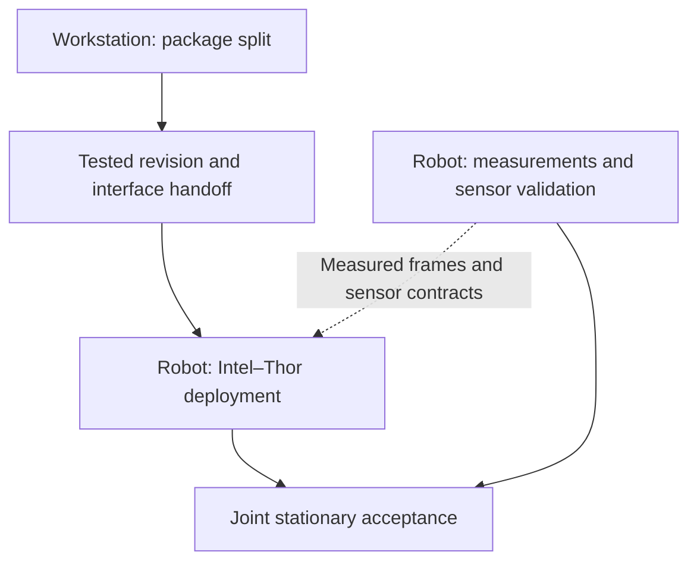
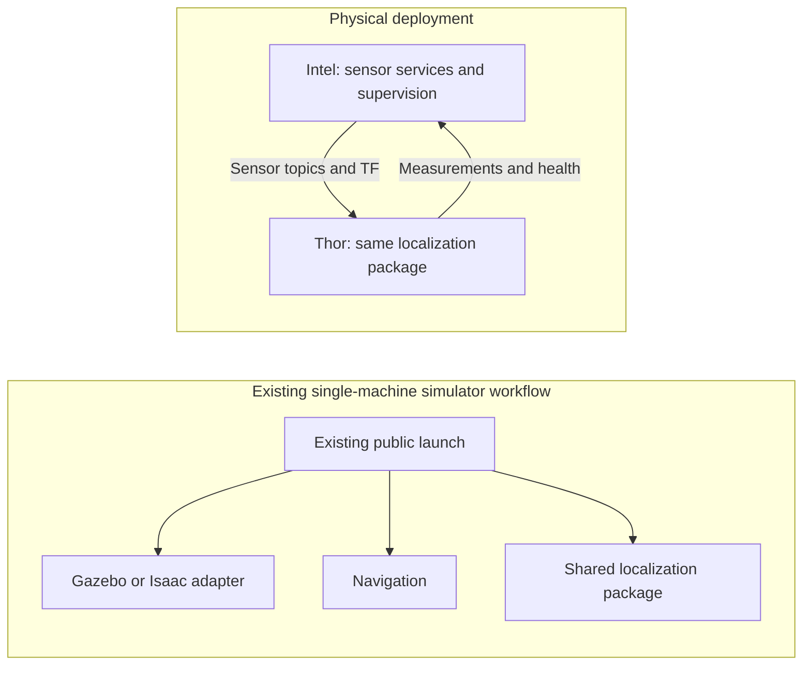

# PHYSICAL — Package split for distributed deployment

Status: **approved plan; implementation and qualification pending.** Owner:
the workstation implementation team. The package names and distributed roles
below describe the intended implementation, not currently available commands.
The [project backlog](../BACKLOG.md#physical-stationary-integration) owns the
coordinated milestone: stationary integration, without physical driving or
autonomous-mission qualification.

## Ownership and sequencing

This plan owns shared code, package boundaries, portable launches, health
reporting, and the tested handoff. The robot teams own
[Intel–Thor deployment](PHYSICAL_intel_thor_deployment.md) and
[measurements and sensor validation](PHYSICAL_robot_measurements_and_validation.md).
They may inventory hardware and measure the robot before this plan completes;
the final distributed tests require its accepted revision and interfaces.

Return robot-side shared-code defects to the workstation with the deployed
revision, configuration, logs, and reproducer. Keep robot configuration changes
separate from shared code changes so both teams can review their own boundary.

## Intended package and runtime boundaries

The current [application package](../../src/ridgeback_autonomy/package.xml)
combines messages, perception, navigation orchestration, diagnostics, and
benchmark tools. Extract responsibilities without creating a second localization
implementation or changing estimator algorithms and model defaults.

| Package | Responsibility and dependency boundary |
|---|---|
| `ridgeback_interfaces` | Shared ROS message definitions; no application runtime dependencies. |
| `ridgeback_common` | Reusable contracts and utilities; no navigation, benchmarking, or GPU dependencies. |
| `ridgeback_localization` | Existing detection, segmentation, depth, and localization code; independently launchable with optional displays. |
| `ridgeback_autonomy` | Existing public workflows, navigation orchestration, diagnostics, and benchmark tools; consumes the lower layers. |

Keep the Gazebo, Isaac, and hardware adapter packages. Do not extract a separate
benchmark package as part of this deliverable. Navigation-specific utilities
stay with autonomy rather than moving into common merely because of their old
directory. Keep reusable code below node and launch orchestration.

These are process placements, not separate repositories. Both physical devices
use the same repository revision and build their required package subsets.
Thor's dependency closure must exclude Nav2, simulator runtimes, and RViz.
Intel must consume and display results without importing inference frameworks
or loading model weights. Optional display code must not pull RViz into Thor's
headless runtime. Keep workstation GPU requirements separate from the eventual
verified Thor environment; this refactor does not prove ARM/GPU compatibility.

## Implementation stages

1. **Establish a baseline.** Run the dependency check and relevant existing
   package tests. Record public launch arguments, resolved topics/types/frames,
   simulation-time behavior, simulator smoke commands, and representative replay
   inputs. Preserve the revision and any pre-existing failures before moving code.
2. **Extract packages and migrate messages.** Move reusable code once, update
   imports, manifests, resource installation, executable ownership, launches,
   and test registration together. Add dependency guards and a clean build of
   the localization subset that cannot accidentally use the old install tree.
   Move `TargetDetections`, `TargetMeasurements`, and `PolarBeams` into the
   interfaces package, retaining fields and their semantics.
3. **Preserve public workflows.** Existing exploration, mapping, benchmark,
   sweep, configurator, and replay commands remain entrypoints. Gazebo and Isaac
   continue to run locally without Thor. Preserve topics, frames, acquisition
   stamps, estimator selection, model defaults, and benchmark artifact formats.
   Update all in-repository consumers for the new package-qualified ROS types.
4. **Expose deployment roles.** Supply an independent localization launch and
   an explicit external-localization mode for Intel. External mode consumes
   measurements/health without launching another detector or estimator worker.
   Separate compute startup from optional visualization and apply perception
   environment settings only where needed. Pass observed base-frame and sensor
   inputs explicitly; preserve namespaced TF and wall-time/simulation-time rules.
5. **Expose target labels.** Make detector labels configurable, retaining
   `humanoid robot` as the default. Record label selections in run evidence;
   support independently identified G1 and person checks without changing model
   thresholds or introducing estimator tuning.
6. **Add health and mission supervision.** Report startup, current processing,
   stale input, stalled work, and failure separately. Report input/output
   progress and the active mode; a live heartbeat alone is insufficient.
   Processing current frames with no detected target is healthy. Intel must
   inhibit new mission goals and request cancellation on required-localization
   loss. Recovery does not automatically resume a paused mission. Preserve the
   pause when cancellation fails or is still pending, and surface that outcome.

The message type-name migration is approved. It is a coordinated deployment:
old and new live message types are not interchangeable. Preserve old ROS bags
unchanged; use their original environment or an explicit conversion if needed.
The repository's benchmark/replay file formats must remain compatible. Rollback
must restore matching code and interfaces on both hosts, not only one process.

Health supervision is an application mechanism, not a physical stop guarantee.
Keep hardware autonomous motion disabled during this milestone. Define the
health contract, configurable timeouts, startup/readiness conditions, and manual
resume operation before the robot team uses them; record exact names and
semantics in the handoff rather than relying on illustrative commands.

## Acceptance and regression evidence

- A clean localization-only build/import test passes without navigation,
  simulator, or RViz dependencies. Intel display/consumer tests pass without
  loading inference models. Dependency-direction checks prevent cycles.
- Existing adapted tests pass; interface serialization, topic semantics,
  timestamp handling, and installed resources are checked after a real build.
  Compare the same recorded estimator inputs before and after extraction.
- Existing Gazebo and Isaac entrypoints pass bounded launch/localization smoke
  checks on the workstation, including localization disabled and both camera
  profiles where already supported. Verify that local mode has no remote-host
  requirement and that external mode creates no duplicate compute nodes.
- Benchmark launch/sweep parsing, configurator entrypoints, and representative
  existing replay artifacts remain usable. Preserve data schemas and scoring
  semantics; a successful build alone is not compatibility proof.
- A fake navigation action server covers startup-not-ready, missing/stale
  health, frozen progress despite heartbeats, empty current detections, process
  restart, delayed/rejected cancellation, and explicit resumption. No test sends
  a command to the physical base.
- Update public setup/commands and maintained interface references, run the
  documentation checks, and rebuild Graphify after code changes. If inputs or
  measured behavior change, mark affected benchmarks for rerun before quoting
  numbers; regression smoke checks do not replace benchmark qualification.

An unavailable simulator check or failed compatibility gate remains explicit
open work, not a claimed pass. Keep the structural extraction and new runtime
behavior reviewable as separately verified stages of the same workstream.

## Handoff and completion

Deliver one accepted revision with dependency pins, the package/dependency map,
exact build/start/stop commands for each host, installed-resource checks, and
the following contracts: topics and new message types, frames and time sources,
sensor inputs and QoS, localization modes and labels, health/progress fields,
timeouts, cancellation/resume behavior, and configuration ownership. Include
test evidence, known limits, and a paired-host rollback procedure.

The robot team must acknowledge the revision it actually built before joint
tests. Completion here establishes workstation compatibility and deployment
interfaces; the linked robot plans establish hardware evidence. Move implemented
contracts into their maintained references, retain consequential test evidence
with provenance, and retire this plan when its deliverable is complete.
