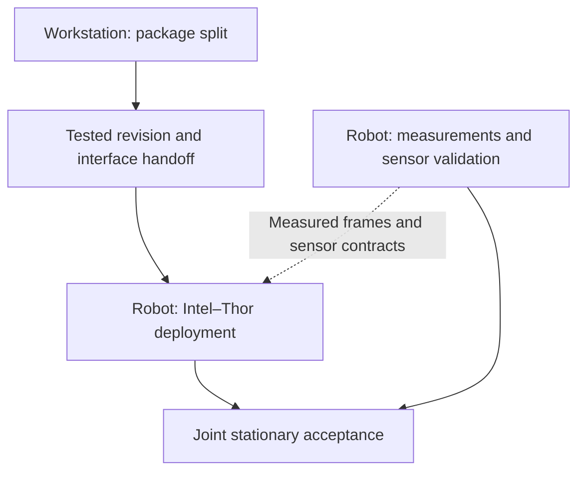

# PHYSICAL — Package split for distributed deployment

Status: **implementation and bounded simulator runtime checks complete; robot-team
acceptance pending.** Owner: the workstation implementation team. Implemented
contracts live in the [distributed deployment reference](../target_localization/distributed_deployment.md);
operator commands live in the [README](../../README.md#distributed-localization).
The [project backlog](../BACKLOG.md#physical-stationary-integration) owns the
coordinated milestone: stationary integration, without physical driving or
autonomous-mission qualification.

## Ownership and sequencing

This plan owns shared code, package boundaries, portable launches, health
reporting, and the tested handoff. The robot teams own
[Intel–Thor deployment](PHYSICAL_intel_thor_deployment.md) and
[measurements and sensor validation](PHYSICAL_robot_measurements_and_validation.md).
They may inventory hardware and measure the robot before this plan completes;
the final distributed tests require its accepted revision and interfaces.

Return robot-side shared-code defects to the workstation with the deployed
revision, configuration, logs, and reproducer. Keep robot configuration changes
separate from shared code changes so both teams can review their own boundary.

## Implemented contract

The [distributed deployment reference](../target_localization/distributed_deployment.md)
owns the package map, launch roles, message/QoS/frame contracts, labels, health,
mission cancellation/resume, and paired-host rollback. The implementation is
complete; this plan now tracks qualification and acceptance only.

## Qualification checkpoint and remaining work

Current handoff candidate: `eaacd24b2504e05a3d96c10e63c1f3d3b8d86ee3` on
`feat/real-hardware-exploration`. This includes all four package-split commits,
the Intel–Thor transport tools, and the DDS rollback/environment fixes. The
combined tree passed 1,037 tests, the autonomy and hardware packages rebuilt,
dependency pins/patches matched, and documentation checks passed. The new
transport regression tests use temporary files and mocked services; they do
not qualify the installed robot services. Local integration evidence is under
`artifacts/package-split/integration-eaacd24b/`.

The branch is available for deployment; neither host's installation or acceptance
of this candidate has been recorded. Existing simulator runtime evidence below
retains its original tested scope; the integration rerun did not repeat live
Gazebo/Isaac performance measurements or physical tests.

The interfaces extraction is commit `2e52712b`; the separately verified common/
localization extraction is `3330cc2d`. Deployment roles, configurable labels,
progress health, and latched mission supervision are implemented in
`abdbc12566c7cb7f4ab86d89b53eabf5fc119040`. The package map and implemented
behavior belong in the maintained reference linked above.

Workstation evidence is under `artifacts/package-split/`:

- Baseline `a01a4532a170fcb85df1a5aaffb8c28bf1601f96`: dependency pins/patches
  verified and 990 tests passed. Interfaces extraction preserved the original
  message sources byte-for-byte and passed 993 tests.
- `stage2-tests.log`: all 993 existing tests passed after package extraction;
  new dependency/import guards also passed. Workspace discovery supports nested
  install prefixes and explicit host environment selection.
- `headless-build.log` / `headless-import.log`: a fresh three-package localization
  subset builds from only the ROS underlay. All modules import with autonomy,
  Nav2, RViz, simulator, and inference-framework imports blocked; generated
  serialization and installed launch resources pass.
- `replay-evidence.json` and `replay-before.json` / `replay-after.json`: five
  recorded schema-1 trials produce byte-identical estimator/scoring results
  against the pre-extraction revision. This input has no captured LiDAR scans;
  it checks polar's missing-scan compatibility, not numerical polar accuracy.
- `stage3-tests.xml`: 1,024 passing tests cover full regressions, labels, both simulator/profile launch
  configurations, localization-disabled gating, external mode with no duplicate
  compute, stationary observer, and health/mission fault tests. The fake Nav2
  server receives cancellation; delayed/rejected/failed cancellation futures
  and late goal acceptance retain the pause until a terminal result and resume.
  `final-supervision.log` records the targeted rerun after checking the remaining
  health budget immediately before goal submission.
- `installed-smoke/result.json`: installed health and stationary Intel observer
  processes exchange the startup contract in an isolated local ROS domain.
  `workspace-build.log` records the normal workspace rebuild.

Remaining gates (do not retire this plan yet):

- Accept the candidate above or a subsequently tested revision, record manifest
  pins, and obtain the matching installed revision acknowledged by each robot
  team. Use the README's explicit per-host
  commands and the maintained contract's rollback procedure.
- Robot teams qualify Thor inference software/GPU execution, clock alignment,
  transport, observed sensor/TF inputs, and stationary G1/person checks under the
  linked robot plans. No physical robot commands were sent in workstation tests.

Live performance/benchmark qualification must be rerun before quoting results
for the changed process layout or non-default label queries. Recorded-input
parity establishes schema/scoring preservation, not runtime timing equivalence.

## Handoff and completion

Deliver one accepted revision with dependency pins, the package/dependency map,
exact build/start/stop commands for each host, installed-resource checks, and
the following contracts: topics and new message types, frames and time sources,
sensor inputs and QoS, localization modes and labels, health/progress fields,
timeouts, cancellation/resume behavior, and configuration ownership. Include
test evidence, known limits, and a paired-host rollback procedure.

The robot team must acknowledge the revision it actually built before joint
tests. Completion here establishes workstation compatibility and deployment
interfaces; the linked robot plans establish hardware evidence. Move implemented
contracts into their maintained references, retain consequential test evidence
with provenance, and retire this plan when its deliverable is complete.

## Archived evidence

- [Simulator runtime matrix and receive-buffer correction](../../archive/engineering/2026-09-18-package-split-runtime.md)
