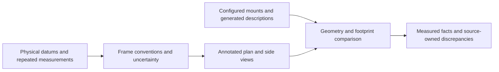

# PHYSICAL — Robot measurements and stationary sensor validation

Status: **approved plan; physical measurements and validation pending.** Owner:
people at the robot, assisted by an agent. The
[project backlog](../BACKLOG.md#physical-stationary-integration) owns the overall
stationary milestone; its individual geometry, camera, calibration, and motion
gates retain their own completion criteria.

This plan incorporates the detailed D455 procedure and adds robot metrology,
both LiDARs, stationary camera–LiDAR calibration, and G1/person integration.
Measurements and sensor inspection can start before the
[workstation package split](PHYSICAL_package_split.md) completes. Final
distributed tests use its accepted revision and the
[Intel–Thor deployment](PHYSICAL_intel_thor_deployment.md). Physical driving,
braking, dynamic calibration, and autonomous missions remain outside this plan.

## Preparation and evidence

Coordinate physical access and permission for any robot-side configuration
changes. Inspect the deployed setup before proposing a diff; the checked-in
CycloneDDS setting does not establish what is running on the robot or imply
that it still needs changing. Preserve the robot's configuration and services.
Do not overwrite its setup from the repository or run simulator cleanup.

Record code/installed-workspace/dependency revisions, effective setup path and
configuration, ROS domain/RMW, host load, USB topology, device firmware, driver
version, commands, and any applied configuration diff. Use a unique artifact
root under `artifacts/hardware/` and preserve logs, topic captures, parameter
dumps, timestamps, and TF evidence with checksums.

Prepare a human measurement worksheet before physical access. Use tape,
ruler/calipers, level, measured fixtures, and annotated photographs, with a
person performing physical measurements and the agent recording/analyzing them.
Record tool resolution and repeatability; request better instrumentation when
basic tools cannot resolve the quantity rather than inventing precision.

Freeze the tested profiles, target placements, warm-up interval, recording
window, stream-rate/gap criteria, timestamp criteria, and calibration validation
tolerances before collecting acceptance results. Keep the robot stationary,
autonomous motion disabled, and platform/sensor bringup owned by its existing
approved services. Disabling frontier goals alone is not a physical motion lock;
use the site's stationary setup and issue no base commands. A failed gate should
identify a specific follow-up; do not tune recipes, alter timestamps, or change
drivers/TF during the evidence run to turn it into a pass.

## Geometry measurements and provenance

For each measurement record the object/quantity, physical datum and frame,
axis/sign convention, units, method/tool, repeated readings, uncertainty,
photograph/drawing reference, and whether the value is measured, configured,
model-derived, or inferred. Record robot load, floor condition, and mounting
state. Do not measure an optical or laser origin by treating its housing edge
as the sensing origin.

| Worksheet group | Required observations |
|---|---|
| Body and floor reference | Chassis/deck bounds, accessible frame datums, floor clearance, wheel/contact references, and limits of the inferred base-frame placement. |
| Attachments | Mast and bracket dimensions, offsets/orientations, fastenings, protrusions, cables, and height-dependent envelope. |
| Sensors | Camera and both LiDAR housing/mount poses, orientation, accessible references, and the documented/calibrated offset to each sensing origin. |
| Navigation envelope | Measured body/attachment outline in the common frame, uncertainty, configured/effective footprint, and containment discrepancies. |

Produce annotated plan/side drawings with dimensions and sensing-origin
provenance, plus an overlay of the measured envelope and navigation footprint.
Compare with the [shared geometry](../robot/geometry.md) and
[collision model](../robot/collision_model.md), separating each backend's
model-derived contact plane from the physical floor reference. Record
discrepancies at those canonical owners. Geometry corrections go to their
source and require affected simulator/benchmark verification; measurements
alone do not close shared-attachment or contact-validation work.

## D455 camera validation

The [camera reference](../target_localization/camera_stack.md) owns the current
input contract, nominal profiles, and TF ownership. This section retains the
core camera gate: a pass establishes integration readiness for the tested
device/profiles, independently of the later camera–LiDAR and joint tests.

### 1. Device identity and effective configuration

- Enumerate the connected cameras. Record the intended D455 serial, firmware,
  USB mode, and advertised profiles; `serial_no: "0"` alone proves no identity.
- Identify the camera process/node and confirm one driver owns the intended
  device. Verify the participating stack's domain, RMW, and wall-time settings.
- Record effective parameters for colour/depth enablement, alignment, and
  synchronization. Inspect active driver profiles rather than inferring them
  from repository YAML.
- Request `640x480@30` and `1280x720@30` as separate runs. Record the actual
  colour and native-depth profiles and resulting aligned-depth grid. Unsupported
  requests or fallback profiles are unresolved findings, not successful tests
  of the requested profile.

Pass requires unambiguous device selection, exclusive ownership, and the frozen
configuration actually running. Propose only the configuration changes the
inspection demonstrates are necessary.

### 2. Image, depth, and calibration contract

Discover resolved colour, colour `CameraInfo`, and colour-aligned depth topics
from the running graph. Compare them with the configured application inputs.
For each topic record type, publisher/subscriber ownership, QoS, encoding,
units, dimensions, `frame_id`, rate, and bandwidth. Preserve live `K`, `D`, `R`,
and `P` calibration fields for each profile.

Pass requires supported encodings/units, compatible colour/aligned-depth/
calibration grids, and the expected publishing ownership. Compare the observed
calibration with the nominal simulation profiles and record a keep/update
recommendation; one device's calibration does not automatically redefine the
shared simulation model.

### 3. Timing and exact-frame availability

After the frozen warm-up, capture at least 60 seconds per profile using
QoS-compatible observers. Preserve colour and aligned-depth header stamp sets
and the resolved TF topics. Report received counts, unique stamps, duplicates,
regressions, out-of-order delivery, receive gaps, middleware loss reports, and
recording/subscriber overhead.

For unique colour stamps `C` and aligned-depth stamps `D`, report both
`|C ∩ D| / |C|` and `|C ∩ D| / |D|`. An empty stream fails the stream gate;
it does not receive a perfect matching score. Use the same declared steady-state
capture interval and document boundary handling.

The previous 99% raw-match target is a **proposed acceptance threshold** for
both directions, to confirm before measurement. It is not an observed device
guarantee. Preserve no-duplicate/no-regression criteria and the predeclared
rate/gap requirements; diagnose observer losses before attributing them to the
producer. The application smoke still requires exact depth availability for
every processed detection stamp, regardless of the raw-stream percentage.

Do not rewrite timestamps, widen matching tolerance, or substitute nearby frames.

### 4. Transform ownership and availability

Inspect the live TF graph, including namespaced topics, and record its publishers.
Query the observed colour-optical frame to the base frame the application
actually requests. The public exploration launch currently derives that frame
as `<namespace>/robot/base_link`; a ROS topic namespace alone does not establish
that the frame exists. Record a mismatch as an integration failure.

Pass requires a finite, stable camera-to-base transform and one owner of the
camera's internal calibrated transforms: the hardware RealSense driver. Verify
image/calibration frame IDs against the live graph and reject competing nominal
simulation or compatibility publishers. The configured mount is a sanity check;
it does not prove camera–LiDAR calibration.

### 5. Stationary application smoke

For the existing single-host smoke, attach to hardware services using
`backend:=hardware autonomous_motion_enabled:=false start_hardware_platform:=false`.
Use the public launch argument
`estimators:=projective_ranging,euclidean_reconstruction`, with
`depth_source:=stereoscopic mask_gate:=box depth_match_debug:=true`.
Use the device's domain, wall time, and the verified camera input topics.
Keep pointcloud and polar estimators out of this initial camera smoke. After
the package split, use the verified per-host commands in its handoff with the
same stationary defaults and estimator/input contracts; do not start a second
Intel detector alongside Thor.

Use predeclared visible, in-range targets at near, middle, farther, and one
off-centre position. Record target placement, duration, detections, measurements,
status histograms, exact-depth diagnostics, and host load. Images can illustrate
the run but cannot substitute for topic evidence.

Pass requires live detection/measurement topics, exact depth for every processed
detection, zero `NO_DEPTH_FRAME`, `NO_CAMERA_INFO`, `GRID_MISMATCH`, or
`TF_MISS_EXTRINSIC` results, and finite plausible outputs for the declared valid
target cases. Record driver restarts, callback failures, receive losses, and
stale-data warnings. These distance checks are integration sanity checks, not
an accuracy benchmark. The joint tests below extend this initial smoke to the
required model modes after their GPU environment and inputs are qualified.

## Both LiDARs and stationary auxiliary sensors

For each front/rear LiDAR, record device identity, driver/configuration,
publisher ownership, topic/type/QoS, frame and TF, angular bounds/increment,
range bounds, scan timing fields, rate, gaps, and timestamp behavior. Use the
deployed device/configuration as evidence rather than assuming nominal settings.

Measure ranges to suitable fixtures at multiple distances and bearings, with
explicit target-surface and range-origin conventions. Check angle ordering,
front/rear orientation, invalid-return handling, mounting/self-occlusion, and
any merged-scan transformation against the individual scans. Preserve annotated
scan/fixture plots and distinguish sensor error, fixture uncertainty, and
representation effects. Set tolerances before validation; unresolved geometry
or clock discrepancies block affected projection claims.

Inventory IMU and odometry publishers actually present. At rest, capture their
frames, time bases, rates, covariance fields, stationary bias/drift, and
consistency with the stationary scene. Absence of an expected signal is an
explicit finding; an at-rest check cannot validate wheel scale, lateral motion,
dynamic odometry, or drift during travel.

Inspect the deployed command-chain types, topics, QoS, mux ownership,
controller/timeout settings, and available e-stop/deadman configuration without
issuing base commands. Hand findings to
[physical command-chain validation](../BACKLOG.md#physical-command-chain-validation);
its actuation, stop, timeout, and e-stop tests remain open.

## Stationary camera–LiDAR calibration

Qualify the front-LiDAR projection used by polar profiling after the camera and
scan contracts pass. Validate the rear LiDAR's base transform separately; do
not claim a camera–rear calibration without actual shared observations.

1. Define transform direction, units, frame conventions, fixture geometry,
   intrinsics/distortion handling, and storage/publisher ownership. Use live
   camera calibration and sensing origins; housing measurements supply a
   starting estimate and uncertainty, not calibrated extrinsics.
2. Choose fixtures visible in the camera whose surfaces intersect the scan
   plane. Capture multiple distances, lateral placements, and orientations so
   calibration is not fitted to one pose. Move fixtures while the base remains
   stationary. Preserve paired observations and clock/timestamp evidence.
3. Estimate or validate the transform, document the method and constrained
   degrees of freedom, and report uncertainty. If the geometry does not
   constrain the required transform, improve the setup or leave it unresolved.
   Keep independent placements out of the fitting set.
4. On the held-out placements, project beams onto images and compare against
   the measured fixture surfaces. Preserve annotated overlays, residuals, and
   uncertainty against the predeclared tolerances. Distinguish valid no-beam
   cases from wrong projection or transform ownership.
5. Publish an accepted transform through one designated owner, with the old
   configuration retained for rollback. Document recalibration triggers such
   as mount movement, impact, sensor replacement, or an unexplained residual
   change. Do not tune polar segmentation to absorb an extrinsic error.

This is stationary evidence only. A static scene cannot establish the effect
of temporal skew during motion. The broader
[camera–LiDAR deployment gate](../BACKLOG.md#camera-lidar-calibration) remains
open for moving-robot validation even when its stationary portion passes.

## Joint stationary target tests

Use the package-split handoff and the deployment plan's qualified environment,
topology, model-mode matrix, and frozen recording protocol. The deployment plan
owns transport/resource measurements; this plan owns scene placement and sensor
validity. Record one shared run identifier so both reports refer to the same
revision, configuration, captures, and acceptance observations.

Test a real G1 and a person as separately labelled cases. Use the default
`humanoid robot` label for G1 and the new configurable `person` label for the
person; record exact prompts and model/checkpoint versions. Calibration fixtures
or supplied boxes cannot substitute for the live detector in this acceptance.
Test near/middle/farther visible placements and off-centre positions with
measured reference conventions, plus an empty scene to verify healthy
no-detection behavior.

Run projective ranging and Euclidean reconstruction with all four combinations
of box/silhouette masks and stereoscopic/monocular depth. Add polar profiling
after its stationary calibration gate; do not expect every visible target to
intersect the scan plane. Declare valid-target and expected-no-return cases
before the run. Keep organized point clouds optional and disabled unless their
separate contract has been demonstrated.

Require current detections and finite plausible results in the declared valid
cases, correct status for invalid/no-return cases, consistent labels/frames,
and no concealed missing calibration, TF, or required input. Stereo cases
retain exact-depth matching; monocular cases verify actual GPU inference and
source-frame identity rather than asserting a stereo requirement they do not
use. Report detection misses and estimator failures separately. Compare with
measured references while preserving their uncertainty and point/surface
conventions; do not present these integration checks as a general accuracy
benchmark or tune parameters during acceptance.

## Completion and separate work

Completion requires traceable geometry measurements and diagrams, the core
D455 gates, both LiDAR and auxiliary-sensor observations, stationary
camera–LiDAR validation, and successful distributed G1/person tests. Unknown
uncertainty, unsuitable equipment, unavailable profiles, and failed checks
remain explicit open work rather than being hidden in a broad pass label.

Write a dated engineering record with provenance, worksheets, profile results,
calibration method and validation plots, timing analysis, TF ownership,
application outcomes, artifacts/checksums, observer limitations, and every
unavailable/failed check. Update shared geometry, collision, and camera/polar
references only with demonstrated facts. Hand the deployment team accepted
frames/transforms, device/profile identities, uncertainty, scene definitions,
configuration revisions, and limits; apply each backlog item's own completion
criteria independently.

[Organized-pointcloud qualification](../BACKLOG.md#optional-physical-organized-pointcloud-qualification)
remains optional. Stationary camera–LiDAR calibration is required for this
broader plan but is independent of the core colour/aligned-depth camera gate.
Physical motion, dynamic calibration, wheel response, braking, clearance/contact
tests, and autonomous missions remain separate. A fix to a failed boundary
requires a separately scoped change and rerunning the affected checks; a sensor
plan pass does not automatically certify simulator geometry or close motion
gates.
