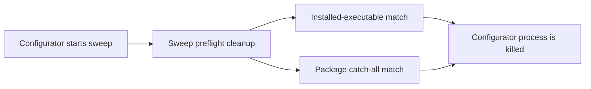

# Start live benchmark sweeps from the configurator

Status: **blocked on process cleanup and ownership.** The
[benchmarking backlog](../target_distance_benchmarking/BACKLOG.md#live-sweeps-from-the-configurator)
owns this feature and its priority. Environment qualification takes priority;
it can run through the existing terminal workflow without waiting for this UI.
This plan covers the remaining live-run implementation, not the completed
[offline run infrastructure](../target_distance_benchmarking/configurator.md).

## Current blocker

The UI disables Start for `live-system`, and `RunSupervisor.ensure_startable`
rejects it server-side. A sweep calls preflight cleanup before starting Gazebo.
Two patterns in [`cleanup.sh`](../../cleanup.sh) can match the installed
configurator process:

- `REPO_NODES_RE`, which matches executables under this checkout's installed
  package `lib/` directories;
- the later `lib/ridgeback_autonomy/` catch-all.

Cleanup also has broad process-name matches. Correcting only one pattern or
simply exempting the configurator does not establish isolation from unrelated
runs. Do not enable Start by bypassing preflight cleanup.

## Remaining implementation

### Process ownership and cleanup

Establish which processes belong to a sweep and which stale processes it may
clean up. Preserve the configurator, unrelated sessions, and other checkouts.
Apply that ownership consistently to preflight, cancellation, and leftover
checks. Audit both install-path patterns and broad simulator/node matches.
Keep live Start disabled until the cleanup and ownership checks pass.

### Dry-run estimate and execution environment

Reuse `target_benchmark_sweep --dry-run` for validation and duration estimates;
it must not start a simulator or terminate processes. Use the same canonical
job/sweep parser as the CLI rather than recreating validation in browser code.

Before Start, show the renderer for the environment the child will actually
inherit, along with the recorded qualification status and covered conditions.
A GPU renderer alone does not establish
[environment qualification](../target_distance_benchmarking/BACKLOG.md#benchmark-execution-environment-qualification).
Keep unknown or unqualified conditions explicit. Apply that workflow gate to
tuning and result claims without inventing a second qualification policy.

### Conflicting runs

Extend the existing server-side single-run guard to identify genuinely
conflicting terminal-started runs and stale processes. Report the conflicting
process and resource, with an actionable resolution. The mere presence of a
`gz sim` process, especially a retained GUI, does not establish a conflict.
Recheck at launch so two near-simultaneous requests cannot bypass the guard.

### Start, progress, cancellation, and reconnection

Reuse existing persistent run records and process-group supervision. Locate the
actual created or resumed sweep directory from the supervisor's output; do not
recompute its timestamp. Read per-configuration progress and failures from
`sweep.json` and link to the existing results artifacts.

A tab close, browser restart, or configurator restart must not lose ownership
of the live sweep. Reattach only after checking process identity. Cancellation
must stop the owned live-run processes and finish recording their state, while
preserving unrelated processes. Removing the browser and server live-start
restrictions is the final step after these paths are verified.

## Acceptance checks

- Dry run returns validation and estimates without launching or killing anything.
- Preflight preserves the configurator and unrelated sentinel processes while
  removing only the identified stale benchmark processes; both broad install
  matches and simulator/node matches are covered.
- Real conflicts, including terminal-started runs, are identified before launch;
  unrelated simulator GUIs do not cause a blanket refusal.
- The displayed renderer describes the child environment, and qualification
  status is not inferred merely from a successful GL probe.
- Created and resumed sweeps reconnect to their actual output directory; progress
  and failures agree with `sweep.json`.
- Cancellation, tab close, browser restart, and server restart work during a
  representative live sweep, with no orphaned owned processes or stale PID attach.
- Existing offline start/cancel/reattach behavior still passes its focused checks.

Use focused process tests with harmless owned subprocesses before a live smoke.
Then validate the lifecycle in the qualified environment. Keep benchmark inputs,
measurement defaults, profile contracts, and scoring unchanged. Follow the
[installed-file build rules](../project/conventions.md#generated-state).
Record evidence, update the configurator reference and run guide, and close the
owning backlog item when the acceptance checks pass.

## Archived evidence

- [GUI execution decision](../../archive/engineering/benchmark_gui_direct_run.md)
