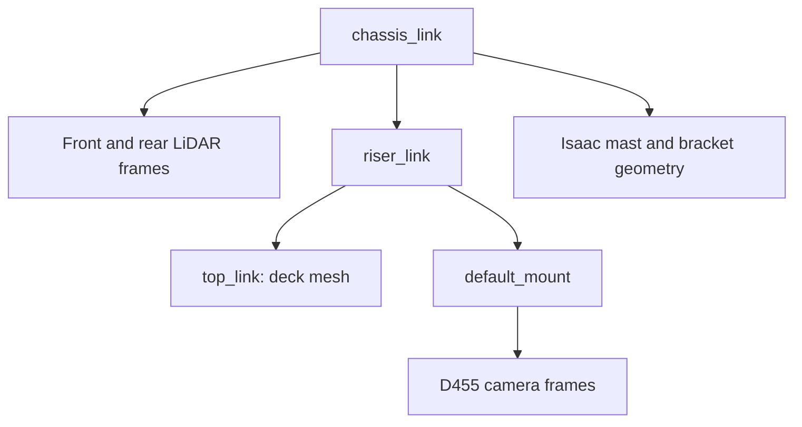

# ISAAC — Shared robot geometry, camera support and footprint handoff

**Author:** geometry discussion session  
**Written:** 2026-09-22  
**Inspected revision:** `f65197b1551cb4f1b7a46050b3a6a995c38355f6` (`dev`)  
**Status:** discussion handoff; no geometry changes authorized by this document.

## User direction and next-session objective

The user wants to discuss a narrower approach: **leave the existing deck
placements and drive models as they are for now, and adjust the beam/mast and
bracket supporting the camera so the camera is at the correct height.**
This replaces the previous discussion's immediate push to reconcile deck
placement. Do not automatically resume deck normalization, physical mecanum
experiments, production USD regeneration or Nav2 footprint changes.

Start by explaining the distinction between adjusting support geometry and
moving the actual camera frame. Check whether the current camera height already
meets the recorded measurements; propose only the changes that are needed.
Present side/top views and the proposed changes for discussion before applying
production changes. This handoff does not request a new hardware survey.

## Whole-chat goal and retained requirements

The overall goal is to make the robot's geometry understandable, reproducible
and consistent enough for Gazebo/Isaac navigation and perception, then validate
its relationship to Nav2 and the physical robot. The camera support discussion
is the next step, not the whole deliverable. Three existing backlog items own
completion; do not replace them with new competing lists:

- [Shared camera mast and bracket geometry](../../BACKLOG.md#shared-camera-mast-and-bracket-geometry):
  one geometry definition consumed by both simulators; eliminate independent
  Isaac-only authoring after equivalence checks.
- [Robot geometry and drawing audit](../../BACKLOG.md#robot-geometry-and-drawing-audit):
  reconcile model geometry, transforms, drawings and recorded hardware evidence,
  distinguishing confirmed readings from nominal dimensions and assumptions.
- [Collision-envelope and navigation-footprint validation](../../BACKLOG.md#collision-envelope-and-navigation-footprint-validation):
  compare the agreed occupied envelope, backend collision geometry and effective
  navigation footprint; qualify their remaining differences.

The user additionally requested **D455 only** in active project configuration
and code, while preserving historical D435 references. Active D435-specific
importer matching and stale current-model comments were cleaned up. Remaining
mentions in the inspected importer describe historical import defects; do not
blindly erase history or remove generic upstream support from dependencies.

The user explicitly wants **top-down and side-view differences**, included in
the documentation and shown before any footprint change. Keep implementation
candidates under `artifacts/` until the proposed production changes are reviewed.

## Progress and decisions to carry forward

| Workstream | State at handoff |
|---|---|
| Isaac drive | Retain the existing planar chassis drive for flat-floor navigation/perception. Rationale, odometry assumptions and limits are documented. |
| Physical mecanum investigation | Completed isolated prototype and nine-boot comparison. Required cases passed: physical 120 Hz 1/15; physical 240 Hz 3/15; production 14/14 applicable, identical outcomes across three boots per condition. Free settling is inapplicable to production. No migration occurred. |
| O3dyn alternative | Asset inspection only; no adapted Ridgeback or qualification. User deferred this complexity. Do not restart without a new traction/terrain/wheel-control requirement. |
| Geometry comparison | Reproducible static extraction and top/side figures exist. Mesh shapes agree; assembled transforms, deck placement and attachment presence differ. Live Gazebo parity remains unverified. |
| Physical measurements | Reuse completed field readings and their uncertainty; photos waived. These do not certify every structural dimension or camera calibration. |
| Shared mast/bracket | Still absent from the shared description; not implemented. Latest preference is to fit supports while leaving decks unchanged for now. |
| Nav2 | Source local/global polygons match each other. The audit found Isaac's rear collider 4.663 mm outside the unpadded polygon; shared-description maximum violation was 0.254 mm. Effective runtime padding was not checked. No footprint change occurred. |
| Production/hardware qualification | No geometry replacement, full cross-backend contact qualification or hardware-clearance certification was completed by this chat. Affected benchmark reruns remain open. |

Earlier discussion proposed normalizing the vendor chassis transform and
resolving deck placement before unification. The latest user preference puts
those changes on hold. Document retained backend differences explicitly; do not
claim full geometry parity merely because a camera-support change succeeds.

## End-to-end continuation after the camera discussion

1. Establish whether any camera pose correction is needed using the existing
   readings and each backend's floor/reference frames. Discuss support-only
   changes first; keep deck normalization deferred.
2. Propose a shared support definition that fits the retained deck placements
   and camera housing. Use the supported shared-description extension rather
   than another independent USD-only definition. Clearly label unmeasured
   structural dimensions and any mass/inertia assumptions.
3. Generate isolated backend candidates and refreshed top/side comparisons.
   Check visual/collision alignment, duplicate attachments, unchanged sensor
   frame names and poses, moving TF and self-occlusion. Review the candidate
   before production replacement.
4. Resume footprint validation independently. A 2D footprint is a conservative
   enclosure of the agreed XY occupied projection, not a demand for identical
   simulator contact solvers. Read actual local/global padding and published
   footprints; distinguish them from inflation costs. Do not enlarge Nav2 to
   hide unresolved model disagreement. Retain the polygon if it passes.
5. After geometry decisions, qualify frontal, lateral and 45-degree wall
   approaches, held contact and stop/reverse recovery in both simulators. The
   previously proposed matrix was 0.05/0.1/0.2 m/s, three boots per backend and
   a 10 mm contact-position gate, with effective solver/contact settings saved.
   Do not transfer an Isaac-only pass to Gazebo or hardware.
6. Apply only reviewed production changes, rerun affected sensor/navigation and
   benchmark checks, update the canonical references, and close each backlog
   item only when its own acceptance conditions pass. Hardware motion/clearance
   needs its separate physical qualification; do not drive hardware as a side
   effect of this geometry discussion.

**Next-session stopping point:** an agreed camera/support proposal and an
explicit account of what it resolves versus what remains in the whole geometry
and footprint goal. Discussion alone is not permission to apply the proposal.

## Read first

- [Shared geometry and physical readings](../../robot/geometry.md): canonical
  measurement values, uncertainty, and repository versus deployed configuration.
- [Isaac model and drive rationale](../../isaac/robot-model.md): planar drive,
  vendor visuals and Isaac-only attachments.
- [Collision and footprint reference](../../robot/collision_model.md): static
  comparison procedure and outstanding clearance qualification.
- [Physical measurement plan](../PHYSICAL_robot_measurements_and_validation.md):
  completed field readings, waived photos and remaining sensor checks.

## What was verified in this discussion

The Clearpath chassis and deck meshes and their NVIDIA counterparts have
identical local-coordinate vertex sets (duplicate vertex counts differ).
The assembled representations differ because of transforms, not different
underlying deck shapes.

| Component | Verified placement or relationship |
|---|---|
| NVIDIA chassis root | Translation approximately −4.408 mm X, −0.201 mm Y, plus a tiny yaw rotation; this explains the assembled chassis offset. |
| Shared-description deck | Chassis → riser is +220 mm; riser → top is −205 mm. The deck mesh already has its top at +280 mm locally, giving **295 mm above base_link**. |
| Isaac vendor deck | Same mesh top at **280 mm above base_link**, without the additional 15 mm vertical transform. |
| Both repository LiDARs | Parent is `chassis_link`; laser height is 179 + 47.4 = **226.4 mm above base_link**. Deck transforms do not move them. |
| Camera mount | `default_mount` is a child of the riser, independently of `top_link`; its height is **295 mm above base_link**. |
| Isaac beam/bracket | Authored as visual/collision geometry under the chassis. **No camera TF is parented to them.** Changing their dimensions alone does not move the camera. |

The deck discrepancy was checked in the expanded URDF, source Xacro, mesh
coordinates and composed Isaac USD. It has **not** been confirmed in a running
Gazebo instance. A subsequent SDF-conversion attempt could not run because
`gz` was unavailable in that shell. Do not relabel static evidence as a live
Gazebo result.

## How the field readings change the earlier plan

The September 18 visit on `r100_0160` recorded floor-to-deck **30.6 cm**,
deck-to-camera-housing-bottom **74 or 75 cm**, and front-edge-to-camera-front
setback **18 cm**, at approximately **±1 cm tape precision**. The camera was
reported centred and level. Mount photographs were explicitly waived.

The deck reading supports Isaac's placement: 280 mm plus its model seating
height of 26.17 mm is about 30.6 cm. It is not millimetre-level calibration.
The two camera readings have not been resolved into one more precise number.
The existing nominal camera housing bottom is 1.020 m above `base_link`, about
1.046 m above Isaac's floor; this agrees with the 30.6 + 74 cm reading.
**Do not assume that the camera needs to move merely because the deck differs.**

The field visit did not measure every mast/bracket dimension or certify the
full collision envelope. Reuse its readings; request another endpoint only if
a specific remaining disagreement actually requires it. Hardware also has a
separate robot-local configuration and an unresolved camera-to-base TF
connection; a simulator support edit does not fix that hardware integration.

## Suggested discussion and bounded follow-up

- Confirm the intended target is the camera housing height above the floor,
  with housing-to-optical transforms kept distinct. Do not impose identical
  deck-to-camera distances on models whose decks sit at different heights.
- Inspect the current rendered camera pose in each backend before proposing
  a mount change. Retain the existing nominal pose if it meets the readings.
- If only the support is wrong, fit its base to that backend's existing deck
  and its bracket to the camera's actual housing bounds. Keep camera TF fixed.
  A shared support definition can accept the existing deck height as an input;
  identical beam lengths are not required while deck placements differ.
- If the camera pose itself is wrong, present an explicit mount/TF correction
  separately from the support edit. Shortening or extending the beam does not
  change the camera position in the current implementation.
- Show top-down and side-view differences before applying production changes.
  After any approved edit, verify support/camera contact, sensor transforms
  during motion and LiDAR/camera self-occlusion. Rerun affected benchmarks before
  reusing their numbers. Leave broader deck/footprint parity as an explicit gap.

## Implementation entry points and boundaries

The shared camera declaration is in `clearpath/robot.yaml`. The deck and
`default_mount` chains come from the Clearpath R100 Xacro; generated descriptions
are not editing targets. The Isaac importer function `_author_camera_mast`
creates the beam and derives the bracket from the camera mesh bounds.

The existing [comparison tool](../../../tools/isaac/compare_collision_envelopes.py)
produces reproducible static top/side figures without changing either simulator.
The [importer](../../../tools/isaac/import_ridgeback_urdf.py) is a production
regeneration tool: do not run it merely to inspect this question. Prepare any
candidate output under `artifacts/` and preserve production assets for review.

No code, geometry, sensor configuration, Nav2 parameters or robot-local state
was changed to create this handoff.

## Archived evidence

- [September 18 physical mecanum investigation](../../../archive/engineering/2026-09-18-mecanum-drive-investigation.md):
  tested at `09840529df62af6612deadfe4d4990c9d1011e5c` with per-boot dirty-tree
  snapshots; partial provenance, qualification results and recorded-state videos.
- [September 18 static envelope audit](../../../archive/engineering/2026-09-18-collision-envelope-audit.md):
  tested at `2c8533f42e8fae403f4a641d2c6f0358f3db6a8a` with preserved inputs;
  partial provenance, top/side comparisons, bounds and reproduction commands.
- [September 18 physical field record](../../../archive/engineering/2026-09-18-r100-0160-field-measurements.md):
  robot checkout `a01a4532a170fcb85df1a5aaffb8c28bf1601f96`, partial provenance;
  raw probes remain on the robot. The current geometry reference includes later
  interpretation and the reported rear-offset correction.
