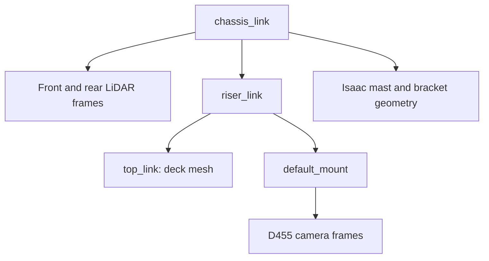

# ISAAC — Camera support and deck geometry discussion handoff

**Author:** geometry discussion session  
**Written:** 2026-09-22  
**Inspected revision:** `f65197b1551cb4f1b7a46050b3a6a995c38355f6` (`dev`)  
**Status:** discussion handoff; no geometry changes authorized by this document.

## User direction and next-session objective

The user wants to discuss a narrower approach: **leave the existing deck
placements and drive models as they are for now, and adjust the beam/mast and
bracket supporting the camera so the camera is at the correct height.**
This replaces the previous discussion's immediate push to reconcile deck
placement. Do not automatically resume deck normalization, physical mecanum
experiments, production USD regeneration or Nav2 footprint changes.

Start by explaining the distinction between adjusting support geometry and
moving the actual camera frame. Check whether the current camera height already
meets the recorded measurements; propose only the changes that are needed.
Present side/top views and the proposed changes for discussion before applying
production changes. This handoff does not request a new hardware survey.

## Read first

- [Shared geometry and physical readings](../../robot/geometry.md): canonical
  measurement values, uncertainty, and repository versus deployed configuration.
- [Isaac model and drive rationale](../../isaac/robot-model.md): planar drive,
  vendor visuals and Isaac-only attachments.
- [Collision and footprint reference](../../robot/collision_model.md): static
  comparison procedure and outstanding clearance qualification.
- [Physical measurement plan](../PHYSICAL_robot_measurements_and_validation.md):
  completed field readings, waived photos and remaining sensor checks.

## What was verified in this discussion

The Clearpath chassis and deck meshes and their NVIDIA counterparts have
identical local-coordinate vertex sets (duplicate vertex counts differ).
The assembled representations differ because of transforms, not different
underlying deck shapes.

| Component | Verified placement or relationship |
|---|---|
| NVIDIA chassis root | Translation approximately −4.408 mm X, −0.201 mm Y, plus a tiny yaw rotation; this explains the assembled chassis offset. |
| Shared-description deck | Chassis → riser is +220 mm; riser → top is −205 mm. The deck mesh already has its top at +280 mm locally, giving **295 mm above base_link**. |
| Isaac vendor deck | Same mesh top at **280 mm above base_link**, without the additional 15 mm vertical transform. |
| Both repository LiDARs | Parent is `chassis_link`; laser height is 179 + 47.4 = **226.4 mm above base_link**. Deck transforms do not move them. |
| Camera mount | `default_mount` is a child of the riser, independently of `top_link`; its height is **295 mm above base_link**. |
| Isaac beam/bracket | Authored as visual/collision geometry under the chassis. **No camera TF is parented to them.** Changing their dimensions alone does not move the camera. |

The deck discrepancy was checked in the expanded URDF, source Xacro, mesh
coordinates and composed Isaac USD. It has **not** been confirmed in a running
Gazebo instance. A subsequent SDF-conversion attempt could not run because
`gz` was unavailable in that shell. Do not relabel static evidence as a live
Gazebo result.

## How the field readings change the earlier plan

The September 18 visit on `r100_0160` recorded floor-to-deck **30.6 cm**,
deck-to-camera-housing-bottom **74 or 75 cm**, and front-edge-to-camera-front
setback **18 cm**, at approximately **±1 cm tape precision**. The camera was
reported centred and level. Mount photographs were explicitly waived.

The deck reading supports Isaac's placement: 280 mm plus its model seating
height of 26.17 mm is about 30.6 cm. It is not millimetre-level calibration.
The two camera readings have not been resolved into one more precise number.
The existing nominal camera housing bottom is 1.020 m above `base_link`, about
1.046 m above Isaac's floor; this agrees with the 30.6 + 74 cm reading.
**Do not assume that the camera needs to move merely because the deck differs.**

The field visit did not measure every mast/bracket dimension or certify the
full collision envelope. Reuse its readings; request another endpoint only if
a specific remaining disagreement actually requires it. Hardware also has a
separate robot-local configuration and an unresolved camera-to-base TF
connection; a simulator support edit does not fix that hardware integration.

## Suggested discussion and bounded follow-up

- Confirm the intended target is the camera housing height above the floor,
  with housing-to-optical transforms kept distinct. Do not impose identical
  deck-to-camera distances on models whose decks sit at different heights.
- Inspect the current rendered camera pose in each backend before proposing
  a mount change. Retain the existing nominal pose if it meets the readings.
- If only the support is wrong, fit its base to that backend's existing deck
  and its bracket to the camera's actual housing bounds. Keep camera TF fixed.
  A shared support definition can accept the existing deck height as an input;
  identical beam lengths are not required while deck placements differ.
- If the camera pose itself is wrong, present an explicit mount/TF correction
  separately from the support edit. Shortening or extending the beam does not
  change the camera position in the current implementation.
- Show top-down and side-view differences before applying production changes.
  After any approved edit, verify support/camera contact, sensor transforms
  during motion and LiDAR/camera self-occlusion. Rerun affected benchmarks before
  reusing their numbers. Leave broader deck/footprint parity as an explicit gap.

## Implementation entry points and boundaries

The shared camera declaration is in `clearpath/robot.yaml`. The deck and
`default_mount` chains come from the Clearpath R100 Xacro; generated descriptions
are not editing targets. The Isaac importer function `_author_camera_mast`
creates the beam and derives the bracket from the camera mesh bounds.

The existing [comparison tool](../../../tools/isaac/compare_collision_envelopes.py)
produces reproducible static top/side figures without changing either simulator.
The [importer](../../../tools/isaac/import_ridgeback_urdf.py) is a production
regeneration tool: do not run it merely to inspect this question. Prepare any
candidate output under `artifacts/` and preserve production assets for review.

No code, geometry, sensor configuration, Nav2 parameters or robot-local state
was changed to create this handoff.
