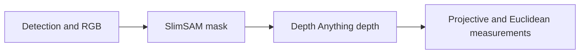

# Measure combined segmentation and monocular-depth throughput

Status: **measurement pending.** Timing diagnostics and the fourteen-configuration
sweep already exist. The [benchmarking backlog](../target_distance_benchmarking/BACKLOG.md#combined-segmentation-and-monocular-depth-throughput)
owns the open item and completion criteria; this plan owns its execution recipe.

## Question and experiment

Does the combined SlimSAM/Depth-Anything measurement path keep up with incoming
detections on the current GPU? Separate cold model startup, sustained processing
cost, and resource contention before deciding whether concurrency is needed.

This is the combined configuration's sequential model work, not every
localization configuration. Compare these four cells:

| Cell | Mask gate | Depth source | Mask-worker model work |
|---|---|---|---|
| A | `box` | `stereoscopic` | neither model |
| B | `silhouette` | `stereoscopic` | SlimSAM |
| C | `box` | `monocular` | Depth Anything |
| D | `silhouette` | `monocular` | SlimSAM then Depth Anything |

Use the existing [sweep YAML](../../src/ridgeback_autonomy/config/benchmark_sweep_model_concurrency.yaml).
It starts with D diagnostics off/on, followed by three process-level replications
of A/B/C/D in rotated order. Each configuration also repeats its scenes three
times. These are distinct replication levels. The YAML owns settings and order;
do not reconstruct the matrix as separate manual launches.

## Freeze the run

- Use a clean, committed experimental checkout and verify the installed files
  match it. Preserve other sessions' work and processes; use an isolated checkout
  if needed rather than cleaning a shared tree.
- Record code and dependency revisions, sweep/scenario hashes, model checkpoint
  revisions, Python/PyTorch/Transformers/CUDA/driver versions, hardware, ROS domain,
  RMW, renderer, host load, and video/RViz settings.
- Use a dedicated ROS domain and a unique output directory under
  `artifacts/benchmarks/`. Establish an otherwise idle host for this comparison.
- Freeze the detector cadence, exact-stamp behavior, camera geometry, recipes,
  scenario bytes, scoring, and CycloneDDS. Record effective values, including
  inherited defaults, before starting.
- Declare the required publication-latency window and criteria for material
  diagnostic overhead before collecting results. If no application latency
  requirement exists, report measured latency without inventing a pass limit.

## Execute the existing sweep

1. Follow the [benchmark run procedure](../target_distance_benchmarking/running_benchmarks.md)
   and validate the installed sweep with `target_benchmark_sweep <yaml> --dry-run`.
2. Run all fourteen configurations through one persistent-environment sweep.
   Preserve the YAML order and ordinary resume behavior; do not edit inputs
   during a run. A changed input hash starts a new experiment.
3. Check that each per-configuration process terminates and releases its model
   memory. Never run `cleanup.sh` between configurations. Inspect process
   ownership before preflight cleanup so unrelated runs are not terminated.
4. Inspect the diagnostics-off/on pair for observer effects. If enabling timing
   materially changes throughput or replacements, the instrumented matrix is
   observational; resolve the probe overhead before making a bottleneck claim.
5. Sample GPU utilization/VRAM/power/temperature, CPU/RSS/PSS, host load, and
   simulator RTF consistently. Keep video/RViz and sampling settings fixed.

Record cold load duration, first valid publication, and initial batches separately
from warm steady-state statistics. Collect model-stage and full-worker timings,
observed detection arrival intervals, completion ratio, pending replacements,
dequeue/publication age, scored coverage, miss reasons, error, and resource use.
Report distributions and variation across replications, not only one percentile
from one run. GPU utilization alone does not establish useful concurrency.

## Interpret and report

Use the observed arrival cadence to assess whether D keeps up. Look for repeated
pending replacements/completion loss, increasing age, exceeded declared latency,
resource failures, or lost scored outcomes. A slow model call alone is not proof
that concurrent execution would help.

Compare A/B/C/D using the same latency statistic: the additive prediction for D
is `B + C - A`; report `D - (B + C - A)` alongside replicate variation. Treat this
as evidence about combined workload cost, not direct proof of GPU contention.

Classify the result as no current problem, cold-start only, warm sequential
overload, resource interaction, or inconclusive. Preserve a dated evidence record
with frozen provenance, commands, artifact hashes, cold/warm tables, diagnostic
overhead, and limitations. Apply the backlog's completion criteria.

If the current path keeps up, close the item without a concurrency redesign.
If a bottleneck is demonstrated, propose a separate, scoped follow-up. Threads,
processes, ROS workers, and AutoVision remain candidate options, not committed
implementation work. This assignment does not change production execution,
queueing, defaults, or exact-stamp semantics.
