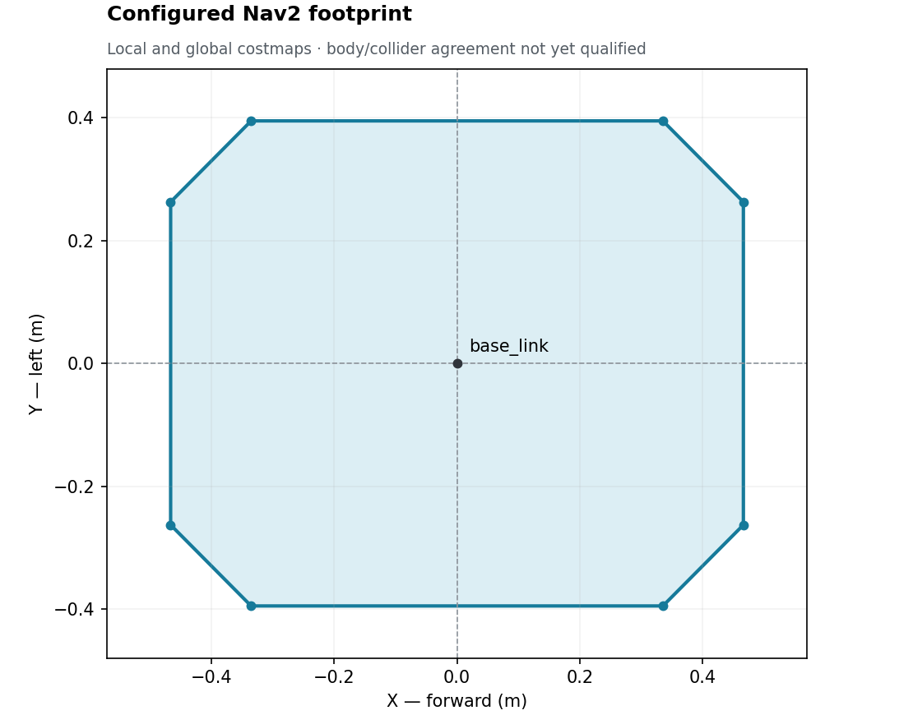
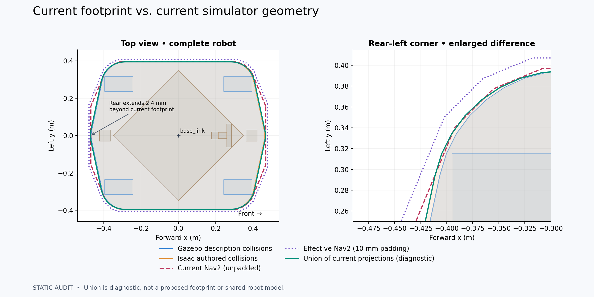
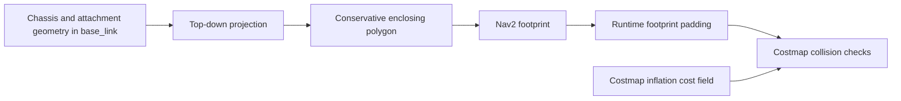

# Robot collision model and navigation footprint

The shared robot reference distinguishes three envelopes. They serve different
purposes and must be compared in the same frame before claiming agreement.

| Envelope | Owner | Meaning |
|---|---|---|
| Physical occupied volume | Measured robot, including attachments | The space the hardware occupies |
| Simulator collision geometry | Each backend's collision model | Shapes used by that simulator to resolve contact |
| Navigation footprint | Shared Nav2 configuration | The planar polygon supplied to navigation; it does not generate simulator colliders |

The [geometry reference](geometry.md) owns mounts and dimensional provenance.
A rendered mesh, a physics collider, and a navigation footprint may differ.
An image of one does not establish the others.

## Configured navigation footprint



The figure plots the identical local/global costmap `footprint` entries from
[`nav2_params.yaml`](../../src/ridgeback_autonomy/config/nav2_params.yaml).
It shows the nominal polygon before runtime padding or costmap inflation. Both
costmaps explicitly apply 10 mm of `footprint_padding`; this pins the former
Nav2 default as part of the project configuration.


The nominal outline treats the 4.408 mm longitudinal and 0.201 mm lateral Isaac
chassis translation as a backend origin-equivalence offset. After recentering
Isaac onto Gazebo, their union is symmetrized and enclosed with 16 evenly spaced
support directions plus 2 mm of model margin. Compared with the former octagon,
the outline removes falsely occupied corners and reduces nominal area by 1.5%.



In the raw backend frames, Isaac's accepted origin offset leaves its rear edge
2.409 mm outside the nominal outline. The effective padded polygon encloses both
raw simulator projections with at least 7.591 mm clearance. The green union is
diagnostic; it is not a replacement robot outline.

The containment policy is: the nominal polygon encloses the aligned shared body
envelope with at least 2 mm model margin, while the effective polygon must
enclose every raw simulator collision projection with at least 5 mm clearance.
Inflation remains an obstacle-cost policy and does not count toward either
geometric margin. Physical hardware requires a separately measured outline and
clearance qualification.

Live Gazebo and Isaac launches of the initial outline both reported the expected
10 mm padding. After the refinement, a fresh Gazebo launch loaded the exact
16-point polygon in both costmaps and published all 16 padded points. Nav2's
collision monitor consumed `local_costmap/published_footprint` and republished
the same padded outline in `base_link` during command flow. The archived runtime
capture records the configured and observed points.

## Backend contact representations

| Backend | Current reference or limitation |
|---|---|
| Gazebo | Collision elements come through the generated robot description. Three cold-boot wall-contact matrices passed for front, side and 45° approaches at 0.05, 0.10 and 0.20 m/s. |
| Isaac | The importer grafts vendor chassis geometry, uses its convex hull, and authors additional parts. Three cold-boot wall-contact matrices passed the same orientation/speed set plus full-robot and retired-AABB controls. The [Isaac collider reference](../isaac/robot-model.md#colliders) owns those shapes. |
| Hardware | The physical robot determines contact. Navigation geometry must account for the deployed attachments and required clearance; software polygons do not prove physical clearance. |

Both simulator matrices used a 10 mm stop-position gate, 5 mm penetration,
hold-oscillation and tangent-drift gates, 0.5° yaw drift, and stop/reverse
recovery. Isaac passed all 39 cases. Gazebo passed all 27 cases; its worst
penetration was 0.341 mm, worst stop-position spread across boots was 0.001 mm,
and every recovery cleared the first 5 mm within 0.163 s. These simulator
results do not transfer to hardware.

## Relationship between the outline and contact geometry

A projected 2D outline is the top-down shadow of occupied geometry: transform
all relevant parts into `base_link`, then discard their height. A conservative
polygon can enclose that projection, including overhangs. It does not reproduce
height-dependent 3D contact; an obstacle below a camera is not the same as one
at camera height.



The navigation footprint should conservatively enclose the agreed occupied
projection. It need not be vertex-for-vertex identical to either simulator mesh.
Padding and inflation have separate roles and must be recorded explicitly;
inflation is not a correction for missing robot geometry. Compare the unpadded
source polygon and the effective published footprint separately. Nav2 documents
[footprint padding](https://docs.nav2.org/jazzy/configuration_and_development/configuration_guide/core_servers/costmap_2d/)
and [inflation costs](https://docs.nav2.org/jazzy/configuration_and_development/configuration_guide/core_servers/costmap_2d/costmap_plugins/inflation/)
as separate settings.

Gazebo and Isaac need an agreed chassis/attachment envelope, not identical wheel
solvers. Isaac deliberately uses a fixed-height planar drive and disables wheel
contacts; its [drive rationale and limits](../isaac/robot-model.md#why-this-abstraction-fits-the-current-work)
explain the scope. The small chassis-transform differences remain visible in the
static comparison and are covered by the explicit clearance policy rather than
being hidden by replacing the nominal polygon with the model union.

## Qualification ownership

[Dimensional provenance](geometry.md#dimensioned-reference-drawing) and the
remaining [physical envelope qualification](../BACKLOG.md#collision-envelope-and-navigation-footprint-validation)
have separate ownership. A geometry change that affects benchmark inputs
or measured behavior requires rerunning the affected benchmarks before quoting
results.

## Reproducing the static comparison

Generate a fresh description in an artifact directory, then compare its
collisions with the committed Isaac USD and both configured Nav2 polygons:

```bash
source install/setup.bash
mkdir -p artifacts/collision-envelope-validation/setup
cp clearpath/robot.yaml artifacts/collision-envelope-validation/setup/robot.yaml
ros2 run clearpath_generator_common generate_description \
  -s "$PWD/artifacts/collision-envelope-validation/setup/"
xacro artifacts/collision-envelope-validation/setup/robot.urdf.xacro \
  is_sim:=true > artifacts/collision-envelope-validation/robot.urdf
MPLCONFIGDIR=/tmp/ridgeback-mpl isaac_venv/bin/python \
  tools/isaac/compare_collision_envelopes.py \
  --urdf artifacts/collision-envelope-validation/robot.urdf \
  --output artifacts/collision-envelope-validation/review-new \
  --footprint-padding 0.01
```

The review directory must be fresh. Outputs include top-down and side figures,
backend collision hulls, per-part bounds, effective-footprint clearance, input
hashes, source/configuration snapshots and the dirty-tree patch. The plotted
union is a diagnostic outline, not an automatically approved footprint. Use
`tools/isaac/validate_chassis_contacts.py` and
`tools/gazebo/validate_chassis_contacts.py` for physics contact evidence; the
static extraction does not qualify hardware.

## Archived evidence

- [September 18 static envelope audit](../../archive/engineering/2026-09-18-collision-envelope-audit.md)
- [September 22 simulator footprint qualification](../../archive/engineering/2026-09-22-navigation-footprint-qualification.md)
- [September 22 refined-footprint runtime capture](../../archive/engineering/assets/2026-09-22-footprint-qualification/runtime-16-point.json)
