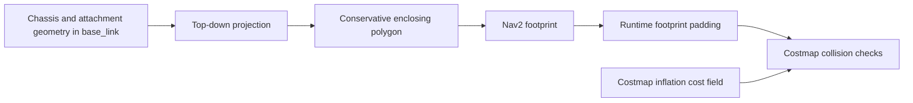

# Robot collision model and navigation footprint

The shared robot reference distinguishes three envelopes. They serve different
purposes and must be compared in the same frame before claiming agreement.

| Envelope | Owner | Meaning |
|---|---|---|
| Physical occupied volume | Measured robot, including attachments | The space the hardware occupies |
| Simulator collision geometry | Each backend's collision model | Shapes used by that simulator to resolve contact |
| Navigation footprint | Shared Nav2 configuration | The planar polygon supplied to navigation; it does not generate simulator colliders |

The [geometry reference](geometry.md) owns mounts and dimensional provenance.
A rendered mesh, a physics collider, and a navigation footprint may differ.
An image of one does not establish the others.

## Configured navigation footprint


The figure plots the identical local/global costmap `footprint` entries from
[`nav2_params.yaml`](../../src/ridgeback_autonomy/config/nav2_params.yaml).
It shows the configured polygon before any runtime padding or costmap inflation;
no physical-body or simulator-collider outline is asserted by this plot.
The configuration comments describe an intended circumscribing body octagon.
That intent still needs the [envelope audit](../BACKLOG.md#collision-envelope-and-navigation-footprint-validation)
against the actual backend meshes and physical attachments.

Nav2's collision monitor consumes `local_costmap/published_footprint` for its
approach polygon. Inspect the effective parameters and published footprint when
qualifying a deployment; a source configuration alone does not prove the live
robot's clearance.

## Backend contact representations

| Backend | Current reference or limitation |
|---|---|
| Gazebo | Collision elements come through the generated robot description; agreement with the Isaac hull and physical robot has not been established by this documentation split. |
| Isaac | The importer grafts vendor chassis geometry, uses its convex hull, and authors additional parts. The [Isaac collider reference](../isaac/robot-model.md#colliders) owns those shapes and its contact-envelope comparison. |
| Hardware | The physical robot determines contact. Navigation geometry must account for the deployed attachments and required clearance; software polygons do not prove physical clearance. |

The existing yellow-hull/red-box contact figure compares Isaac representations.
It stays with that backend. Its contact tolerance and validation results cannot
be transferred to Gazebo or hardware without separate evidence.

## Relationship between the outline and contact geometry

A projected 2D outline is the top-down shadow of occupied geometry: transform
all relevant parts into `base_link`, then discard their height. A conservative
polygon can enclose that projection, including overhangs. It does not reproduce
height-dependent 3D contact; an obstacle below a camera is not the same as one
at camera height.



The navigation footprint should conservatively enclose the agreed occupied
projection. It need not be vertex-for-vertex identical to either simulator mesh.
Padding and inflation have separate roles and must be recorded explicitly;
inflation is not a correction for missing robot geometry. Compare the unpadded
source polygon and the effective published footprint separately. Nav2 documents
[footprint padding](https://docs.nav2.org/jazzy/configuration_and_development/configuration_guide/core_servers/costmap_2d/)
and [inflation costs](https://docs.nav2.org/jazzy/configuration_and_development/configuration_guide/core_servers/costmap_2d/costmap_plugins/inflation/)
as separate settings.

Gazebo and Isaac need an agreed chassis/attachment envelope, not identical wheel
solvers. Isaac deliberately uses a fixed-height planar drive and disables wheel
contacts; its [drive rationale and limits](../isaac/robot-model.md#why-this-abstraction-fits-the-current-work)
explain the scope. Missing mast geometry or different chassis extents are still
gaps to resolve. Enlarging Nav2 to the union of disagreeing models would not
resolve those gaps.

## Qualification ownership

[Shared mast geometry](../BACKLOG.md#shared-camera-mast-and-bracket-geometry),
[dimensional provenance](../BACKLOG.md#robot-geometry-and-drawing-audit), and
[collision-envelope validation](../BACKLOG.md#collision-envelope-and-navigation-footprint-validation)
are separate completion gates. A geometry change that affects benchmark inputs
or measured behavior requires rerunning the affected benchmarks before quoting
results.

## Reproducing the static comparison

Generate a fresh description in an artifact directory, then compare its
collisions with the committed Isaac USD and both configured Nav2 polygons:

```bash
source install/setup.bash
mkdir -p artifacts/collision-envelope-validation/setup
cp clearpath/robot.yaml artifacts/collision-envelope-validation/setup/robot.yaml
ros2 run clearpath_generator_common generate_description \
  -s "$PWD/artifacts/collision-envelope-validation/setup/"
xacro artifacts/collision-envelope-validation/setup/robot.urdf.xacro \
  is_sim:=true > artifacts/collision-envelope-validation/robot.urdf
MPLCONFIGDIR=/tmp/ridgeback-mpl isaac_venv/bin/python \
  tools/isaac/compare_collision_envelopes.py \
  --urdf artifacts/collision-envelope-validation/robot.urdf \
  --output artifacts/collision-envelope-validation/review-new
```

The review directory must be fresh. Outputs include top-down and side figures,
per-part bounds, input hashes, source/configuration snapshots and the dirty-tree
patch. The plotted union is a diagnostic outline, not an automatically approved
footprint. This static extraction does not inspect Gazebo's live physics engine,
contact margins, runtime padding or hardware.

## Archived evidence

- [September 18 static envelope audit](../../archive/engineering/2026-09-18-collision-envelope-audit.md)
