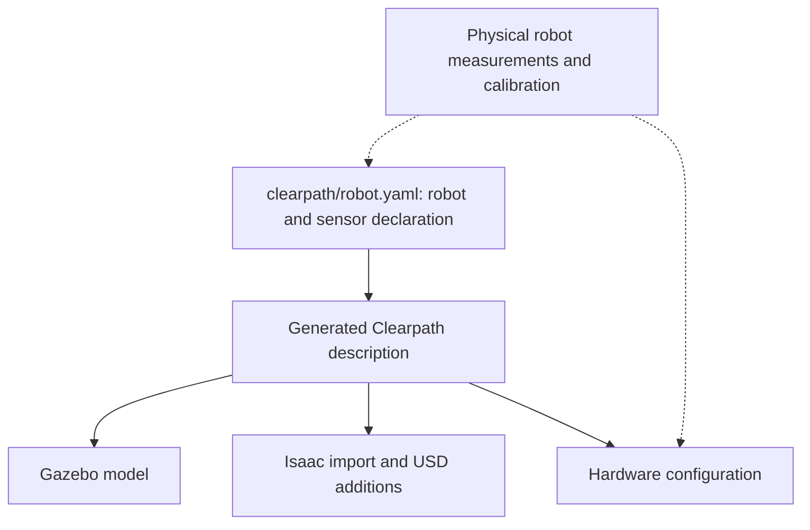

# Robot geometry and mounting

This page owns the shared robot geometry reference for Gazebo, Isaac Sim, and
physical hardware. It distinguishes configured mounts from model-derived
measurements; sharing a reference does not certify identical geometry in all
three backends. The [collision model](collision_model.md) owns navigation
footprint and contact-envelope interpretation.

## Sources and ownership

[`clearpath/robot.yaml`](../../clearpath/robot.yaml) owns sensor selection and
mount poses. Generated descriptions are outputs. The
[Isaac robot model](../isaac/robot-model.md) owns USD import, vendor mesh grafting,
articulation, and Isaac-only additions. The
[camera stack](../target_localization/camera_stack.md#physical-declaration-and-pose)
owns derived camera-frame transforms and hardware calibration differences.

## Configured mounts

These are declaration origins relative to their named parent, not sensor
optical origins or laser emission planes. Distances are metres; angles are
radians. Read the generated TF chain for the resulting sensing frame.

| Device | Parent | XYZ | RPY |
|---|---|---|---|
| Front Hokuyo | `chassis_link` | `[0.3922, 0, 0.179]` | `[0, 0, 0]` |
| Rear Hokuyo | `chassis_link` | `[-0.3922, 0, 0.179]` | `[0, 0, 3.14159]` |
| D455 mount | `default_mount` | `[0.2692, 0, 0.725]` | `[0, 0, 0]` |

The YAML remains authoritative for these values. Camera internal transforms
come from the nominal description in simulation and device calibration on
hardware; a configured mount is not a calibration result.

## Dimensioned reference drawing

This existing hand-plotted drawing describes the Isaac USD representation.
Its dimensions retain that scope; the camera-mount annotation follows the
shared YAML declaration. It is housed here alongside the
shared geometry reference, but does not establish Gazebo or hardware parity.
It does not update automatically when mounts or meshes change. The
[geometry audit](../BACKLOG.md#robot-geometry-and-drawing-audit) must reconcile
its annotations with generated geometry and physical measurements.

## Model-derived dimensions awaiting a shared audit

The following dimensions were documented from the Isaac model. They are
reference measurements, not verified equivalence across Gazebo, Isaac, and
hardware. Values are in metres relative to `base_link`; the model wheel-contact
plane places that frame **0.02617 above the floor**. The recorded wheel-mesh
bounds bottom at −0.02617 in `base_link`, with height 0.15234 and radius
0.07617. Use that model-derived contact plane only with the corresponding model;
physical seating and each backend require their own check.

| | x | y | z |
|---|---|---|---|
| chassis hull | −0.4706 … +0.4618 | ±0.3966 | +0.0037 … +0.2800 |
| top deck plate | −0.4702 … +0.4614 | ±0.3950 | +0.2737 … +0.2800 |
| `default_mount` | 0 | 0 | +0.2950 |
| `lidar2d_0_laser` (front) | **+0.3922** | 0 | **+0.2264** |
| `lidar2d_1_laser` (rear, yaw 180°) | **−0.3922** | 0 | **+0.2264** |
| D455 body | +0.2590 … +0.2850 | ±0.0620 | +1.0200 … +1.0490 |
| camera mast (37.5 mm sq) | +0.1955 | 0 | +0.2800 … +1.0950 |
| standoff bracket | +0.2142 … +0.2590 | ±0.015 | centred 1.0345 |

## Known representation differences

The camera mast and standoff are authored by the Isaac importer rather than
by the shared Clearpath description. They have collision geometry in Isaac;
their presence there does not establish their presence in Gazebo. Their
implementation remains documented with the
[Isaac additions](../isaac/robot-model.md#hand-authored-parts).

The [shared attachment work](../BACKLOG.md#shared-camera-mast-and-bracket-geometry)
owns closing that gap. Do not silently treat an Isaac-only addition or a
model-derived dimension as a verified physical measurement.

## Archived evidence

- [September 18 static envelope audit](../../archive/engineering/2026-09-18-collision-envelope-audit.md) — measured backend differences and regenerated top-down/side comparisons; hardware and drawing reconciliation remain open.
