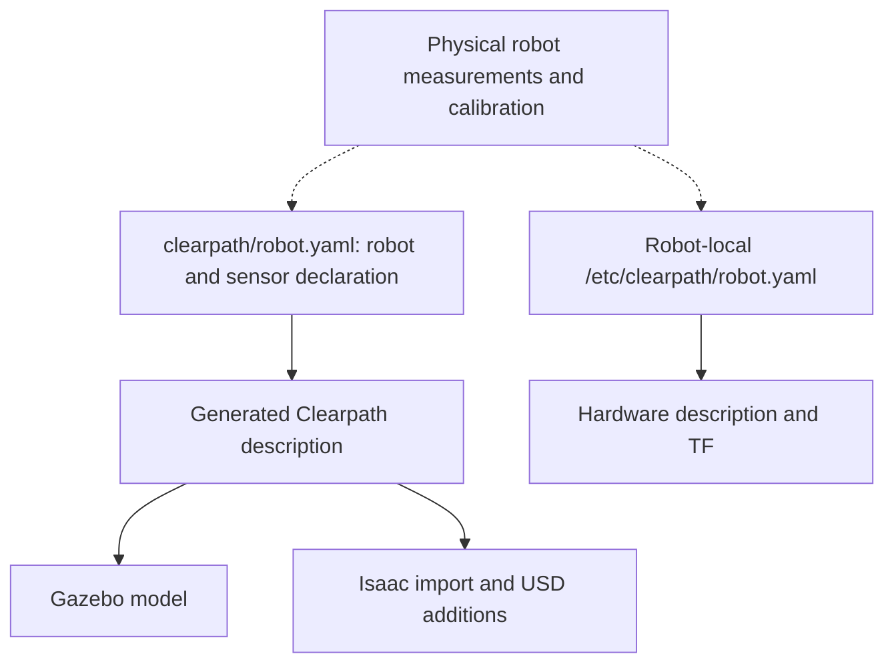
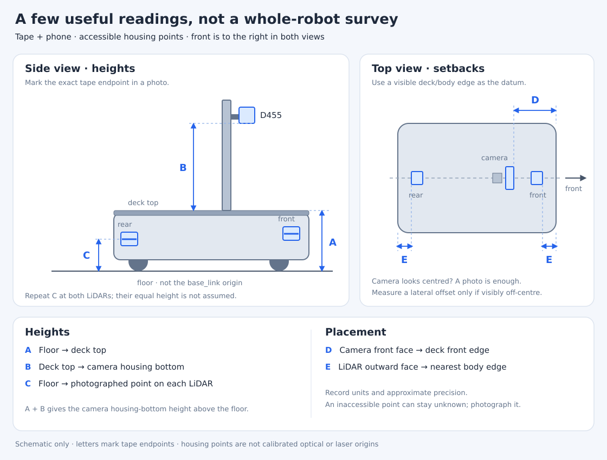
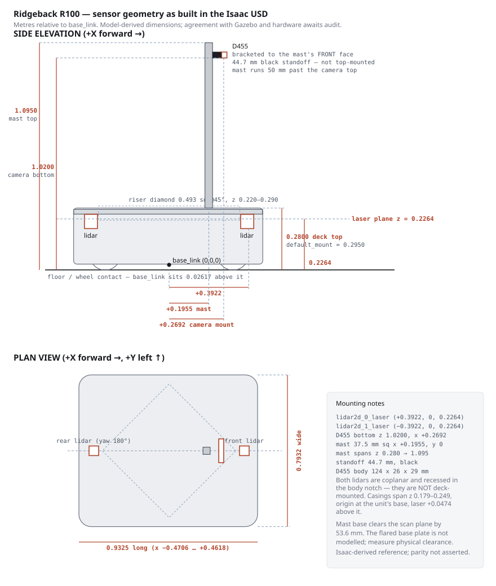
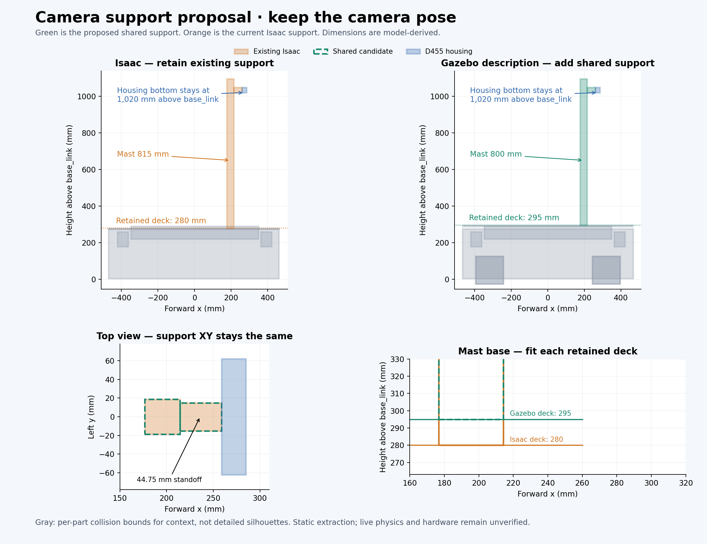

# Robot geometry and mounting

This page owns the shared robot geometry reference for Gazebo, Isaac Sim, and
physical hardware. It distinguishes configured mounts from model-derived
measurements; sharing a reference does not certify identical geometry in all
three backends. The [collision model](collision_model.md) owns navigation
footprint and contact-envelope interpretation.

## Sources and ownership

[`clearpath/robot.yaml`](../../clearpath/robot.yaml) owns the repository's sensor
selection and mount poses; deployed hardware uses the robot-local declaration
described below. Generated descriptions are outputs. The
[Isaac robot model](../isaac/robot-model.md) owns USD import, vendor mesh grafting,
articulation, and Isaac-only additions. The
[camera stack](../target_localization/camera_stack.md#physical-declaration-and-pose)
owns derived camera-frame transforms and hardware calibration differences.

## Configured mounts

These are declaration origins relative to their named parent, not sensor
optical origins or laser emission planes. Distances are metres; angles are
radians. Read the generated TF chain for the resulting sensing frame.

| Device | Parent | XYZ | RPY |
|---|---|---|---|
| Front Hokuyo | `chassis_link` | `[0.3922, 0, 0.179]` | `[0, 0, 0]` |
| Rear Hokuyo | `chassis_link` | `[-0.3922, 0, 0.179]` | `[0, 0, 3.14159]` |
| D455 mount | `default_mount` | `[0.2692, 0, 0.725]` | `[0, 0, 0]` |

The YAML remains authoritative for these values. Camera internal transforms
come from the nominal description in simulation and device calibration on
hardware; a configured mount is not a calibration result.

## Deployed hardware mounts

The physical robot does not generate its description from the repository YAML.
Clearpath's services on `r100_0160` read the robot's own
`/etc/clearpath/robot.yaml`, which the integrator (MyBotShop) maintains
separately. It differs from the repository declaration in namespace,
middleware and sensors. The table records the reported September 18 state,
including the 18:58 rear correction. Inspect live TF before reuse.

| Item | Robot-local declaration | Relation to the repository YAML |
|---|---|---|
| Front Hokuyo | `chassis_link`, `[0.3922, 0, 0.1856]` | Same x; z differs by 6.6 mm, below the resolution of the field tape readings |
| Rear Hokuyo | `chassis_link`, `[-0.3922, 0, 0.1856]`, yaw π | Symmetric correction applied and live TF/merger values checked; independent target recheck pending; same z difference |
| D455 | Not declared; the camera driver's frames are not connected to the robot tree | Repository mount unverified on hardware |

The MyBotShop scan merger keeps its own copy of both LiDAR offsets for the
merged `sensors/scan`. Change it together with the robot-local YAML.

Field readings match the model deck height and the configured forward camera
setback, and show symmetric front/rear LiDAR mounts. The camera housing height
agrees with the declared mount to within tape precision. These are
integration checks, not a calibration or a dimensional audit. The
[rear-offset acceptance item](../BACKLOG.md#rear-lidar-mounting-offset) retains
the independent-placement check and the recorded yaw-error ambiguity.

## Physical field readings

Robot `r100_0160`, September 18 visit: tape precision approximately **±1 cm**.
The camera was reported centred and level; the user waived mount photos.
The archived field record names checkout
`a01a4532a170fcb85df1a5aaffb8c28bf1601f96` with partial provenance; raw probes,
captures, and checksums remain on the robot. These are housing/edge readings,
not fitted optical origins or a camera-to-base calibration.

*Endpoint guide only; dimensions below come from the field note, not the
schematic. The separate Isaac drawing retains its model-derived dimensions.*

| Mark | Endpoint | Recorded reading |
|---|---|---|
| A | Floor to main deck top | 30.6 cm |
| B | Deck top to camera housing bottom | 74 or 75 cm; two readings dated September 10 and 18, not a resolved more precise value |
| C | Floor to LiDAR window | 25 cm, accepted for both units |
| D | Deck front edge to camera front face | 18 cm |
| E | LiDAR housing outward face to nearest body edge | Front 6.3 cm; rear 6.1 cm |

These readings support a gross mounting check. They cannot resolve the
6.6 mm difference between configured LiDAR heights, or supply the missing
camera-to-base transform by themselves. Reuse them for the
[remaining stationary validation](../plans/PHYSICAL_robot_measurements_and_validation.md);
repeat only a changed mount or a specific disputed endpoint.

## Dimensioned reference drawing

This existing hand-plotted drawing describes the Isaac USD representation.
Its dimensions retain that scope; the camera-mount annotation follows the
shared YAML declaration. It is housed here alongside the
shared geometry reference, but does not establish Gazebo or hardware parity.
It does not update automatically when mounts or meshes change. The
[geometry audit](../BACKLOG.md#robot-geometry-and-drawing-audit) must reconcile
its annotations with generated geometry and physical measurements.

## Model-derived dimensions awaiting a shared audit

The following dimensions were documented from the Isaac model. They are
reference measurements, not verified equivalence across Gazebo, Isaac, and
hardware. Values are in metres relative to `base_link`; the model wheel-contact
plane places that frame **0.02617 above the floor**. The recorded wheel-mesh
bounds bottom at −0.02617 in `base_link`, with height 0.15234 and radius
0.07617. Use that model-derived contact plane only with the corresponding model;
physical seating and each backend require their own check.

| | x | y | z |
|---|---|---|---|
| chassis hull | −0.4706 … +0.4618 | ±0.3966 | +0.0037 … +0.2800 |
| top deck plate | −0.4702 … +0.4614 | ±0.3950 | +0.2737 … +0.2800 |
| `default_mount` | 0 | 0 | +0.2950 |
| `lidar2d_0_laser` (front) | **+0.3922** | 0 | **+0.2264** |
| `lidar2d_1_laser` (rear, yaw 180°) | **−0.3922** | 0 | **+0.2264** |
| D455 body | +0.2590 … +0.2850 | ±0.0620 | +1.0200 … +1.0490 |
| camera mast (37.5 mm sq) | +0.1955 | 0 | +0.2800 … +1.0950 |
| standoff bracket | +0.2142 … +0.2590 | ±0.015 | centred 1.0345 |

## Shared camera support

*Approved September 22 design. Gray boxes are per-part collision bounds for
context, not detailed chassis silhouettes. The image retains the comparison
with the former Isaac-only support; Gazebo now receives the green geometry.*

[`camera_support.urdf.xacro`](../../src/ridgeback_common/urdf/camera_support.urdf.xacro)
is the single mast/bracket geometry definition. The repository YAML includes it
through `platform.extras.urdf`. The default deck input is 0.295 m for the shared
Clearpath description; the Isaac importer supplies 0.280 m when grafting its
retained vendor chassis. This gives 0.800 m and 0.815 m mast lengths respectively,
with a common top at 1.095 m above `base_link`. The mast remains 37.5 mm square
and centred at x=0.1955 m. The 30 mm square bracket spans x=0.21425–0.259 m,
at z=1.0344997668 m. Dimensions retain model provenance, not a new survey.

Both attachment joints are fixed to `chassis_link`. No sensor frame is parented
to them. Camera housing bottom stays at 1.020 m above `base_link`; the camera
mount remains owned by `clearpath/robot.yaml`. The bracket uses the reviewed
D455 housing bounds. Isaac regeneration rejects a moved/mismatched housing;
review the shared support if the camera pose or housing model changes.

Gazebo retains the support through fixed-joint reduction, with identical visual
and collision boxes. Its **nominal simulation masses** are 0.65 kg for the mast
and 0.10 kg for the bracket, with uniform-box inertias. These are explicit
approximations, not measured payload mass/inertia. Isaac reads the same expanded
URDF boxes and attaches them to its existing chassis body; it omits the two
support bodies from import to preserve the existing planar articulation and
mass. The [Isaac adapter](../isaac/robot-model.md#hand-authored-parts) owns that
backend treatment, not another set of dimensions.

### Verification boundary

The September 22 implementation was checked by expanding both deck inputs,
converting Gazebo URDF to SDF, comparing the updated Isaac asset with its prior
state, and running a complete isolated Isaac regeneration. Existing robot links,
joints, sensor transforms and Isaac physics schemas were preserved; each backend
has exactly one mast and one bracket collider. Isaac selects the `physx` variant
before rig construction, including when the converter leaves it unselected.

Bounded headless runs in `initial_test_world` at 640×480 passed in both simulators:
RGB/depth and both scans published, SLAM/Nav2 became active, and the camera mount
remained fixed during a commanded turn with no scan returns below 0.35 m. The
Isaac run additionally checked the mast TF against its retained-deck geometry.
These are focused integration checks, not full field-of-view, wall-contact,
hardware-clearance or benchmark qualification. Neither benchmark results nor
navigation-footprint parameters were updated by this change.

## Known representation differences

Deck placements and chassis transforms remain different. Shared support
geometry does not certify cross-backend contact behavior or hardware clearance.
The retained beam top and simplified bracket have not been fully surveyed.
The [shared support qualification](../BACKLOG.md#shared-camera-mast-and-bracket-geometry)
retains broader sensor/contact, physical-dimension and affected-benchmark gates; the
[envelope audit](../BACKLOG.md#collision-envelope-and-navigation-footprint-validation)
retains effective footprint/padding and contact validation.

## Archived evidence

- [September 18 static envelope audit](../../archive/engineering/2026-09-18-collision-envelope-audit.md) — measured backend differences and regenerated top-down/side comparisons; hardware and drawing reconciliation remain open.
- [r100_0160 field readings and LiDAR box checks](../../archive/engineering/2026-09-18-r100-0160-field-measurements.md) — tape mount readings, LiDAR range/side checks, and the rear-offset correction's evidence.
