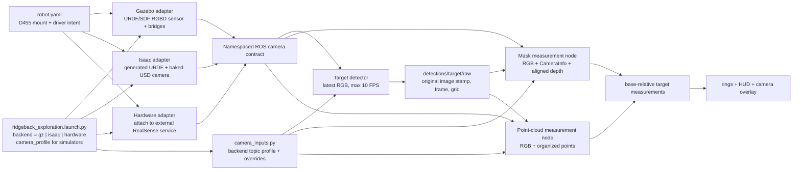

# Camera stack

This page is the canonical end-to-end camera reference for Gazebo, Isaac Sim,
and the physical D455. The robot mount and application-facing data contract are
shared; image formation, topic production, and internal-frame ownership are
backend-specific.

## Physical declaration and pose

`clearpath/robot.yaml` declares one forward-facing Intel RealSense D455 named
`camera_0` on `default_mount`:

```yaml
parent: default_mount
xyz: [0.2692, 0.0, 0.725]
rpy: [0.0, 0.0, 0.0]
```

The R100 description places `default_mount` at `[0, 0, 0.295]` relative to
`base_link`. The D455 description then models the bottom screw, camera body,
depth imager, 95 mm stereo baseline, and colour-imager offset. The resulting
nominal origins in `base_link` are:

| Frame or reference | XYZ in `base_link` (m) | RPY | Meaning |
|---|---:|---:|---|
| `default_mount` | `[0, 0, 0.295]` | `[0, 0, 0]` | top mounting hardpoint |
| `camera_0_bottom_screw_frame` | `[0.2692, 0, 1.0200]` | `[0, 0, 0]` | configured tripod screw |
| `camera_0_link` / depth frame | `[0.28035, 0.0475, 1.0345]` | `[0, 0, 0]` | nominal left-depth origin |
| `camera_0_color_frame` | `[0.28035, -0.0115, 1.0345]` | `[0, 0, 0]` | RGB/render origin |
| `camera_0_color_optical_frame` | same translation | `[-pi/2, 0, -pi/2]` | ROS optical convention |

The configured heading has no roll, pitch, or yaw: the camera looks straight
forward. In the body-style colour frame, +X is forward, +Y is left, and +Z is
up. In the optical frame, +Z is forward through the image, +X is image-right,
and +Y is image-down.

The measured mount determines the screw position. The D455's nominal internal
offsets determine the simulated optical position. On hardware, the RealSense
driver replaces those nominal internal transforms with factory-calibrated
extrinsics, so its exact optical pose must be recorded from live TF rather than
copied from this table.

## Backend optics and producers

Gazebo and Isaac use the same named nominal D455 RGB profiles from
`ridgeback_autonomy/common/camera_profiles.py`. The default is `640x480`; select
the larger grid with `camera_profile:=1280x720`. Both stay at 30 Hz.

| Profile | Grid | Nominal pinhole `(fx, fy, cx, cy)` px | FoV (H x V) |
|---|---:|---:|---:|
| `640x480` (default) | 640 x 480 | `(384, 384, 320, 240)` | 79.61 x 64.01 deg |
| `1280x720` | 1280 x 720 | `(640, 640, 640, 360)` | 90.00 x 58.72 deg |

This is a reproducible simulation approximation, not a claim of factory
calibration. The manufacturer specifies a 1280 x 800 maximum RGB stream and a
nominal 90 x 65 degree RGB FoV. The model uses the 90-degree horizontal value,
square pixels, and a centred principal point: the HD option is a centred
1280 x 720 vertical crop, while VGA is a centred 4:3 crop scaled to 640 x 480.
The resulting native vertical FoV is about 64 degrees, consistent with the
rounded 65-degree datasheet value. The datasheet does not publish the effective
intrinsics for every stream mode; only live `CameraInfo` can establish those
for the physical unit.

Manufacturer references: [D455 product specifications](https://www.realsenseai.com/products/real-sense-depth-camera-d455f/),
the [D400 family datasheet](https://www.realsenseai.com/wp-content/uploads/2023/10/Intel-RealSense-D400-Series-Datasheet-September-2023.pdf),
and the [librealsense per-stream intrinsics API](https://github.com/realsenseai/librealsense/wiki/API-How-To).

| Contract | Gazebo | Isaac Sim 6 | Physical D455 |
|---|---|---|---|
| Producer | Clearpath Gazebo `rgbd_camera` plus ROS-Gazebo bridges | generated USD camera plus Isaac ROS 2 Camera Helpers | externally managed `realsense2_camera` service |
| Profile | shared `640x480` default or `1280x720` | shared `640x480` default or `1280x720` | driver/device-selected; verify both requested modes live |
| Authored rate | 30 Hz | 30 Hz | verify live rate |
| Intrinsics | selected nominal profile, published as `CameraInfo` | selected nominal profile, published as `CameraInfo` | factory calibration in live `CameraInfo` |
| Clip/range model | 0.3-100 m render clip | 0.1-100 m render clip | physical stereo validity; no application hard cutoff |
| Depth formation | clean GPU Z-buffer | clean rendered depth | active-IR stereo depth |
| RGB/depth registration | same render product, aligned by construction | same render product, aligned by construction | driver align-to-colour filter (`align_depth.enable: true`) |
| Distortion/noise | no D455 distortion, stereo, projector, or noise model | no physical stereo/projector model | real calibrated optics, holes, noise, and occlusions |
| Internal camera TF owner | `robot_state_publisher`, nominal URDF frames | `robot_state_publisher`, nominal URDF frames | RealSense driver, factory extrinsics |

Algorithms must consume each stream's `CameraInfo`; neither profile name nor a
hard-coded FoV is an application projection input.

## ROS topics

All application defaults below are relative to the robot namespace
(`/r100_0001` by default).

| Product | Gazebo and Isaac application topic | Physical D455 application topic |
|---|---|---|
| RGB | `sensors/camera_0/color/image` | `sensors/camera_0/color/image_raw` |
| Colour calibration | `sensors/camera_0/color/camera_info` | `sensors/camera_0/color/camera_info` |
| Colour-aligned depth | `sensors/camera_0/depth/image` | `sensors/camera_0/aligned_depth_to_color/image_raw` |
| Organized cloud | `sensors/camera_0/points` | deliberately unset until organization, frame, and stamps are verified |

Gazebo's generated image bridges remap the simulator image and depth-image
transport topics to this contract; its parameter bridge carries both
`CameraInfo` streams and the point cloud. Isaac creates one render product and
attaches RGB, depth, depth-point-cloud, and two `CameraInfo` publishers to it.
All Isaac camera products are labelled `camera_0_color_optical_frame`; its
flattened `width*height x 1` point cloud is restored to the active image shape
by the application after an exact point-count check.

Hardware is attach-first. The hardware adapter does not start the camera or
sensor service, including when its optional platform bringup is enabled; it
expects the Clearpath/RealSense services to be running externally. The YAML
requests colour, depth, synchronization, and align-to-colour, but the live
device identity, effective profiles, encodings, timestamps, and TF tree remain
a deployment validation gate. `serial_no: "0"` also needs confirmation against
the intended physical device.

## Launch and application flow



The public launch selects `simulation` camera inputs for both simulator
backends and `realsense` inputs for hardware. `color_topic`,
`camera_info_topic`, `depth_topic`, and `pointcloud_topic` remain explicit
overrides. Backend selection changes only producers and those input topics; the
detector and estimators are the same ROS nodes in all three environments.
`camera_profile` is forwarded only to Gazebo and Isaac. The hardware adapter
deliberately ignores it and remains attach-only.

The detector uses sensor-data QoS, keeps only the newest RGB frame, and limits
inference to 10 FPS by default even though the sensors are authored at 30 Hz.
It publishes detections with the source image's stamp, optical frame, width,
and height. The mask path exact-matches RGB/depth data to that detection stamp,
uses the live colour `CameraInfo` matrix, deprojects in the optical frame, and
looks up optical-to-base TF at the same stamp. The point-cloud path uses the
cloud stamp for TF and validates its grid against the image, but currently uses
latest-arrival RGB/cloud inputs rather than exact-stamp pairing.

Accepted colour encodings include `rgb8`, `bgr8`, `rgba8`, and `bgra8`.
Aligned depth accepts RealSense-style `16UC1`/`mono16` millimetres and `32FC1`
metres, normalizing both to floating-point metres. No downstream estimator
contains a Gazebo-, Isaac-, or RealSense-specific projection constant.

## Validation state and known gaps

- The shared profile math and Gazebo URDF/SDF expansion are covered at both
  resolutions. The regenerated Isaac asset carries the default profile, and
  its adapter changes aperture and render-product dimensions for either choice.
- Isaac's earlier live check at 1280 x 720 used the retired hand-authored
  `fx=fy=631` contract. It remains historical integration evidence, not
  certification of the new shared nominal profile; rerun both modes live.
- Gazebo's observed rate may fall below the authored 30 Hz under rendering
  load; that is a performance failure, not an alternate camera contract.
- Physical-camera validation is still pending. The
  [hardware validation plan](../plans/camera_hardware_validation.md) owns the
  device, profile, encoding, timestamp, TF-ownership, and organized-cloud gates.
- Physical camera-to-LiDAR extrinsic and clock validation remains a deployment
  gate for polar profiling.
- The committed benchmark scenarios carry visibility certifications generated
  against older camera and LiDAR geometry. They remain useful fixed A/B scenes,
  but their certified fractions must be regenerated before being quoted for the
  current measured mounts.

## Source map

- Robot declaration: `clearpath/robot.yaml`
- R100 mounting chain: `clearpath_platform_description/urdf/r100/r100.urdf.xacro`
- D455 frames: `clearpath_sensors_description/urdf/intel/d455.urdf.xacro`
- Gazebo camera model: `clearpath_sensors_description/urdf/intel_realsense.urdf.xacro`
- Gazebo generated bridges: `clearpath/sensors/config/camera_0.yaml` and
  `clearpath/sensors/launch/camera_0.launch.py`
- Shared simulation optics: `ridgeback_autonomy/common/camera_profiles.py`
- Isaac publishers: `ridgeback_autonomy_isaac/sim/isaac/sensors.py`
- Backend-neutral topic contract: `ridgeback_autonomy/common/camera_inputs.py`
- Shared consumers: `ridgeback_autonomy/perception/target_localization/`
