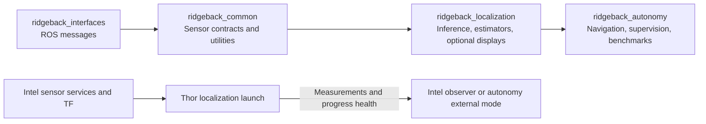
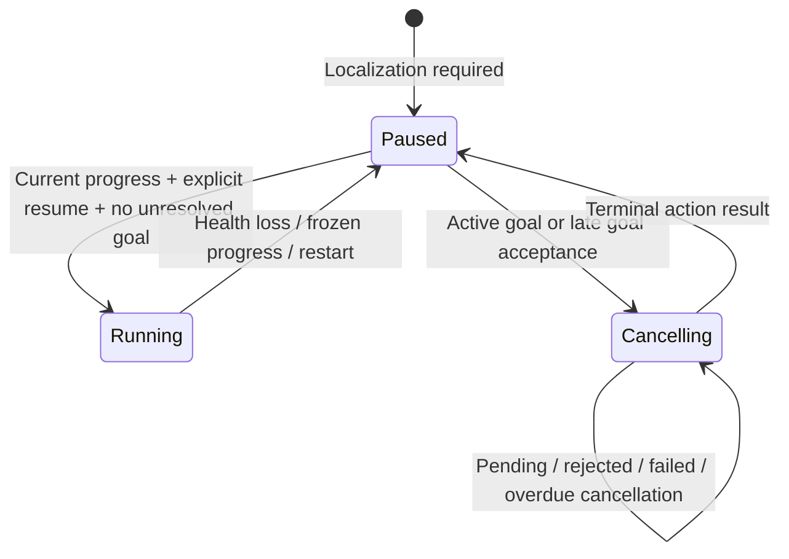

# Distributed localization contract

The same localization implementation runs on a workstation or Thor. Intel
can consume results without starting inference. Robot deployment remains a
stationary qualification task; the workstation checks below do not establish
Thor GPU compatibility, network performance, or safe physical motion.

Arrows between packages point from dependency to consumer. Common has no
navigation, benchmark, or inference-framework imports. Localization has no
Nav2, simulator, autonomy, or RViz dependency. Its display nodes publish ROS
images/markers and do not load model weights. Autonomy retains the benchmark,
configurator, replay, navigation, readiness, and general HUD entrypoints.

## Launch roles and configuration

The [README](../../README.md#distributed-localization) owns installation and
start/stop commands. `ridgeback_localization localization.launch.py` starts
compute and a separate health observer, with `displays:=false` by default.
`ridgeback_autonomy localization_observer.launch.py` starts only result displays
and a health consumer: no sensor bringup, Nav2, frontier goals, or inference.

Exploration retains its public launch. `localization_mode:=local` starts one
local detector and the selected estimator workers. `localization_mode:=external`
starts result consumers without a detector, measurement worker, or duplicate
health producer. `target_localization_enabled:=false` suppresses the whole
localization block. External mode defaults `localization_required:=true`;
local mode retains optional localization unless explicitly required.

Supply the observed `base_frame`, namespace, and sensor topics. Standalone
compute and observer launches require `base_frame`; hardware exploration also
requires it when localization is enabled. Simulation exploration retains the
namespace-based simulator default. TF subscribers remap `/tf` and `/tf_static`
to relative names. Standalone/observer default to wall time; simulation uses
`use_sim_time:=true`. These settings must agree across hosts, with synchronized
host clocks for wall-time acquisition-age checks.

`RIDGEBACK_PERCEPTION_VENV` selects the compute Python environment. Without it,
a discovered checkout's `perception_venv` is used if present; otherwise the
current Python environment is used. Only compute process environments change.
An explicit invalid venv is rejected; Intel external/observer mode does not
inspect it. `RIDGEBACK_WORKSPACE` explicitly selects checkout resources;
otherwise checkout markers are discovered without assuming install depth.

`target_labels` is a comma-separated list, default `humanoid robot`. Use
`person`, `humanoid robot`, or both for separately recorded checks. These are
language queries, not a new trained G1 class. Detection threshold, checkpoint,
NMS, segmentation, and estimator defaults are unchanged. Labels are logged by
the detector, published in health, and recorded in benchmark parameters and run
evidence. Benchmark sweeps set labels in `defaults`, since their detector is
persistent; per-config changes are rejected. Existing replay payloads retain
their recorded detections and cannot change detector queries after capture.

## Topics, types, and acquisition semantics

All names below are relative to the selected namespace. Existing message fields,
source stamps, measurement coordinates, and debug topics are unchanged; their
shared types live in `ridgeback_interfaces`. See the
[pipeline reference](target_localization_pipeline.md) for estimator semantics and
[camera contract](camera_stack.md) for frames and aligned depth.

| Topic | Type | Producer / QoS |
|---|---|---|
| `detections/target/raw` | `ridgeback_interfaces/msg/TargetDetections` | Detector; reliable, depth 10 |
| `measurements/target/mask` | `ridgeback_interfaces/msg/TargetMeasurements` | Selected mask estimators; reliable, depth 10 |
| `measurements/target/pointcloud` | `ridgeback_interfaces/msg/TargetMeasurements` | Optional qualified pointcloud path; reliable, depth 10 |
| `debug/target/polar_beams` | `ridgeback_interfaces/msg/PolarBeams` | Optional debug publication; preserves scan and detection stamps |
| `localization/health` | `ridgeback_interfaces/msg/LocalizationHealth` | Separate health process; reliable, volatile, depth 10, every 0.5 wall seconds |
| `localization/workers/{detector,mask,pointcloud}` | `std_msgs/msg/String` JSON | Selected workers; reliable, transient-local, depth 1; state transitions |
| `localization/status` | `std_msgs/msg/String` JSON | Intel consumer; external mode, reported state/detail or missing health |
| `mission/status` | `std_msgs/msg/String` JSON | Frontier owner; required, paused, healthy, reason, cancellation, goal_pending |
| `mission/resume` | `std_srvs/srv/Trigger` | Explicit resume on the frontier owner; unavailable when frontier is not launched |

Sensor subscriptions use ROS sensor-data QoS. Health observes color and selected
sensor streams (CameraInfo, stereo depth, scan, or organized pointcloud), raw
detections, and every selected measurement output. Configure those topics to
match the actual producers; optional pointcloud requires explicit hardware
qualification. TF and source stamps remain sensor-owned.

Health fields include a monitor/worker `session_id`, compute `mode`, selected
`estimators`, `depth_source`, `mask_gate`, `labels`, `state`, and `detail`.
Parallel `streams`, `progress`, and `source_stamps` arrays identify each observed
stream and its advancing acquisition stamps. Progress increments only on a
strictly newer source stamp. Repeated old messages and heartbeat-only activity
do not refresh progress. Health timestamps use the selected ROS clock;
receipt/progress watchdogs use monotonic wall time, including when simulation
is paused. Restarting a producer changes the session; backward clock jumps
require restarting the pipeline and explicitly resuming a required mission.

| State | Meaning |
|---|---|
| `startup` | Required streams have not all produced data within the startup window |
| `processing` | All required streams have current, advancing acquisition stamps |
| `stale_input` | A required sensor is missing, frozen, too old, or future-dated |
| `stalled` | Sensor inputs remain current but detections or selected measurement output do not progress |
| `failure` | A worker explicitly reported a caught processing/model failure |

A current batch with no target is healthy. Health reports processing/liveness,
not localization accuracy: calibration, TF correctness, usable estimates,
and physical sensor qualification still need their own evidence. Worker publishers that disappear (or never appear before the startup deadline)
are reported as failure; duplicate worker publishers are also rejected. Missing
output progress still detects a live but stalled worker.

| Setting | Default | Meaning |
|---|---:|---|
| `startup_timeout` | 120 s | Maximum initial wait for all streams |
| `input_timeout` | 3 s | Maximum wall interval without sensor stamp progress |
| `progress_timeout` | 15 s | Maximum wall interval without each output's progress |
| `source_age` | 15 s | Maximum source age against the selected ROS clock |
| `health_timeout` | 3 s | Intel/frontier maximum interval without health messages |
| `localization_progress_timeout` | 15 s | Frontier watchdog against frozen progress despite health messages; exploration forwards `progress_timeout` |
| `cancellation_timeout` | 5 s | Mark unresolved cancellation overdue; never treat timeout as success |

Compute timeout values must be finite and positive. Set matching progress
budgets on both hosts for the measured inference cadence. The Intel stationary
status viewer reports remote state and missing heartbeat; the mission owner
also independently verifies every progress counter and source stamp advances.

## Mission pause and cancellation

A required mission starts inhibited and needs `mission/resume` after at least
two advancing health observations. Loss latches a pause and requests cancellation
of the frontier owner's active `NavigateToPose` goal. A goal accepted after
health loss is immediately canceled. Recovery alone never resumes the mission.

A cancellation acknowledgment is not a terminal result. While acceptance or
cancellation is pending, rejected, failed, or overdue, resume is refused and new
goals are inhibited. Only a confirmed terminal action result releases the old
goal; an exception retrieving that result leaves the pause intact. Status
reports the cancellation outcome. This supervises this application's frontier
goals, not arbitrary Nav2 clients, teleoperation, or a physical emergency stop.
Hardware autonomous motion remains off by default; do not enable it for the
stationary milestone.

## Qualification and paired rollback

The package plan retains the [remaining handoff gates](../plans/PHYSICAL_package_split.md).
The current workstation checks include clean headless builds/imports, generated
serialization, unchanged recorded-input estimator/scoring results, launch-role
construction, fake Nav2 action cancellation, and bounded headless Gazebo/Isaac
runtime checks with localization on/off at both supported camera resolutions.
These startup and empty-frame progress checks do not qualify target-distance
accuracy, sustained performance, GUI behavior, or physical deployment. The robot
team must acknowledge the exact commit actually installed on each host; branch
names are insufficient.

Before deployment record `git rev-parse HEAD`, dependency-manifest hashes,
`tools/check_dependencies` output, effective launch arguments, environment/model
versions, topics/types/frames, and per-host logs. Keep a separate build/install
prefix for each candidate so rollback cannot accidentally load stale generated
messages or copied executables.

To roll back, stop only the processes started by this deployment on both hosts,
restore the same previously accepted revision and its matching dependency pins
on both, rebuild in fresh prefixes, and source only the restored prefixes in
new shells. Restore host configuration separately from code. Restart the
stationary consumers/compute and recheck message types and health. Never pair
new `ridgeback_interfaces` publishers with old `ridgeback_autonomy/msg/*`
consumers. Preserve old bags unchanged; use their original environment or an
explicit conversion. Do not run simulator cleanup on the robot.

## Archived evidence

- [Simulator runtime matrix and receive-buffer correction](../../archive/engineering/2026-09-18-package-split-runtime.md)
