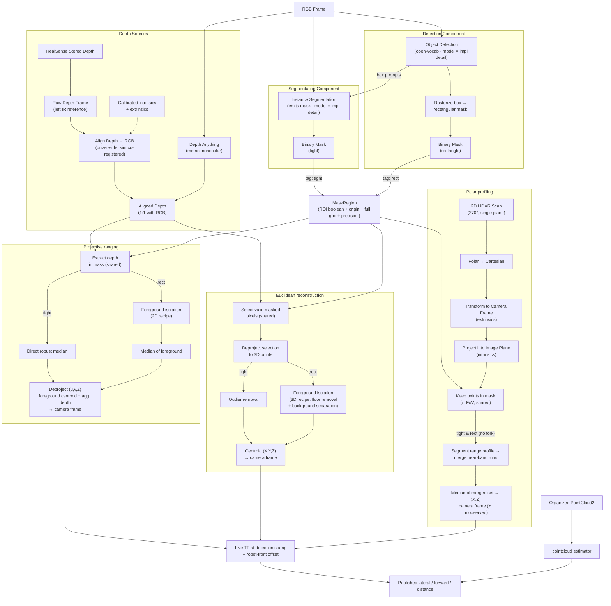

# Target-localization pipeline

**Purpose:** Detect a target class in RGB and report per-detection planar
positions relative to the robot front. This document covers target localization,
not the project's mapping, navigation, or exploration architecture.

**Output contract:** Pure mask estimators produce camera-optical coordinates
(XYZ for depth paths, XZ for polar). The measurement pipeline transforms them
at the detection stamp into `(lateral_m, forward_m, distance_m)` in the shared
base convention (Section 7). The separate `pointcloud` row publishes the same
planar convention. No estimator fusion or fallback substitution is implemented.

## 1. Sensor stack

### Intel RealSense D455 (camera-based sensors)

The robot carries a single **Intel RealSense D455**, forward-facing, mounted at `xyz [0.3, 0.0, 0.85]` on `default_mount` (`clearpath/robot.yaml: device_type: d455`). It is a standard Clearpath camera accessory. The **same** `robot.yaml` drives both the Gazebo sim model and the real `realsense2_camera` driver, but the two produce their data very differently. This section documents only the **camera-based** products used by the localization pipeline (the 2D LiDAR is covered separately, below).

`device_type` is not a family selector: the driver uses it as a device-name filter, and the description generator uses it to pick which `intel/*.urdf.xacro` model is expanded. So the one key decides both the driver's device match and the robot's camera geometry.

**Data products we use:**

1. **RGB color image** - input to detection / segmentation. The repo leaves the stream profile unspecified, so the checked-out Clearpath configuration supplies its 640x480 @ 30 fps default to both backends. Sim: rendered color frame; hardware: the stream the driver selects. Record the profile the driver actually activates rather than inferring it from YAML.
2. **Depth image** (made 1:1 with RGB) - input to projective ranging and euclidean reconstruction. Euclidean reconstruction deprojects its masked pixels into camera-frame points in code (`docs/target_localization/euclidean_reconstruction.md`; provenance decision in `docs/history/pointcloud_provenance_evaluation.md` §7) - the points are a derived, in-code representation, not a sensor product.
3. **Camera IMU - present on the device, unused by this stack.** The D455 carries an IMU, unlike the D435. Nothing here enables, subscribes to, or fuses those streams, and SLAM does not consume them. Capability is not configuration.
4. **Organized point cloud - configured, unverified.** Clearpath's checked-out `IntelRealsense` sets `POINTCLOUD_ENABLED = True`, so the parser emits `pointcloud.enable: true` for hardware. That is a *driver default resolved from the checked-out config*, which is a different fact from what the device actually publishes and a different fact again from whether the published layout can feed the `pointcloud` estimator. `common/camera_inputs.py` therefore leaves the organized-cloud input **unspecified** for the `realsense` profile. Before wiring it, verify organization (`height > 1`), colour-grid indexing, frame, and timestamps on the robot.

**How depth is produced - this is where sim and real diverge:**

- **Real D455:** active infrared **stereo**. Two IR imagers plus an IR projector; the on-board ASIC rectifies the pair and matches horizontal disparity into a per-pixel depth map. Raw depth is expressed in the **left IR imager frame, NOT the RGB frame**, so it must be **aligned** (reprojected) onto the color pixel grid before use — which is what `align_depth.enable: true` buys. Read the operating FoV and intrinsics off the driver's `CameraInfo` on the robot; a datasheet *recommended range* is not a validity cutoff, and a finite depth outside it is not automatically discarded.
- **Sim (Gazebo `rgbd_camera`):** no IR, no projector, no stereo matching. Gazebo renders the scene and reads the GPU **depth (Z) buffer** directly - the exact geometric distance to the first surface along each pixel ray, clipped to `near 0.3 / far 100`. Because color and depth come from the **same render pass and pose**, sim depth is **already co-registered with RGB** - no alignment step exists or is needed. The sim camera renders at `horizontal_fov = 1.25 rad = 71.6°`.

**Simulated geometry vs simulated optics.** These are scoped separately, and only the first is modelled faithfully. The **body and frame geometry** are the D455's own: `d455.urdf.xacro` supplies the mount-to-link transform and the nominal internal frames, including the `-0.059 m` depth-to-colour offset, and the render sensor hangs off `camera_0_color_frame` so the rendered viewpoint is the pose its products are labelled with. The **optics** remain a single idealized RGBD camera: one 71.6° FoV, no stereo baseline, no IR projector, no noise model, no per-model distortion. Sim is not a D455 fidelity simulator and benchmark numbers should not be read as one.

**Sim vs real summary (camera-based):**

| Data product | Simulation | Real robot |
|---|---|---|
| RGB color | rendered frame (Clearpath default 640x480 @ 30) | D455 RGB sensor (Clearpath default 640x480 @ 30; verify on hardware) |
| Depth source | rendered GPU Z-buffer (ground truth) | active IR stereo on the device ASIC |
| Depth alignment to RGB | none - co-registered by construction | required (depth in left-IR frame) |
| Depth FoV | 71.6° H (rendered) | read from the driver's `CameraInfo`; not yet recorded |
| Camera IMU | not rendered | present on the D455, not enabled or consumed |
| Internal camera TF | `robot_state_publisher`, from the D455 nominal frames | `realsense2_camera`, from the factory calibration |

Hardware readiness is tracked once in the [camera validation plan](../plans/camera_hardware_validation.md).
Simulation and parser tests cannot establish physical profiles, matching stamps,
device selection, or driver TF ownership. The old `camera_config.json` and its
unused loader have been deleted; active paths use the color `CameraInfo`.

Repository sources: `clearpath/robot.yaml`, the Clearpath RealSense/D455 model,
and `common/camera_inputs.py`. The removed D435 transform and its root cause are
recorded in [operational incident history](../history/operational_incidents.md#d435-static-camera-transform--removed-2026-08-31).

### 2D LiDAR (Hokuyo UST, planar 270°)

A single-plane scanner returning range vs. bearing. It is **2D**: it samples only one horizontal slice at the LiDAR's mounting height, so it sees no height information. Within that slice it is typically more accurate and longer-range than RealSense stereo.

**What we actually have (NOT a 360° unit):**

- Model: **Hokuyo UST** (`robot.yaml: model: hokuyo_ust`), UST-10LX class - **270° scan** (±135°), 0.25° angular resolution, ~0.06-10 m range (30 m max), single horizontal plane.
- On the **real Ridgeback**, a **front** and a **rear** laser.
- Our **`robot.yaml` declares two** units: front (`xyz [0.3922, 0, 0]`, yaw 0) and rear (`xyz [-0.3922, 0, 0.05]`, yaw 180°). 
- **A 360° scan is possible.** Front + rear can be merged into one ~360° ring. It stays **2D** (one height, no Y) and the rear only adds side/rear coverage. 

**Sim vs real:**

| | Simulation | Real robot |
|---|---|---|
| Sensor | 2x gz `gpu_lidar`, single plane, 270° (±135°), 0.25°, 40 Hz, 0.06-30 m | front Hokuyo UST standard (270°); rear optional |
| Units present | both front + rear (from `robot.yaml`) | front always; rear only if the optional unit is fitted |
| Coverage used by perception | front 270° (`lidar2d_0`) | front 270° (`lidar2d_0`) |

Sources: Hokuyo UST-10LX specification (270°, 0.25°, 0.06-10 m / 30 m max); Clearpath Ridgeback user manual (front standard / rear optional); repo `clearpath/robot.yaml`, `clearpath_sensors_description/urdf/hokuyo_ust.urdf.xacro`; perception `target_mask_measurement_node`'s polar profiling path (`sensors/lidar2d_0/scan`).

### Design goal: one pipeline, two interchangeable backends

All the sim-vs-real differences documented above are real, but they must **not** leak into the perception logic. The goal is that the detection / depth / path code is written **once** and runs unchanged in both simulation and on hardware.

Simulation and the real robot are treated as two interchangeable **backends behind a single, identical interface**. The interface exposes the same methods and the same normalized data contract to everything downstream; each backend is a thin implementation of it, and the environment is selected at startup so that no code in the paths ever branches on "sim vs real."

Rationale — easy maintenance:

- **Maximize shared code.** One interface, two thin implementations. The paths, estimators, and benchmark consume the interface and stay environment-agnostic.
- **Isolate divergence behind one boundary.** Every sim/real quirk (intrinsics source, where depth alignment happens, topic names, noise handling) lives in exactly one place — the backend — instead of being scattered as conditionals through the pipeline.
- **Swappable and testable.** A backend can be replaced, or faked for tests, without touching any downstream path.

The boundary is implemented: `common/camera_inputs.py` resolves simulation or
RealSense topic contracts; color `CameraInfo` provides intrinsics; the hardware
driver owns alignment; `core/depth_sources.py` converts the selected input at
the detection stamp. This is source/configuration support, not proof of a live
hardware deployment. Noise and finite-but-inaccurate depths are not silently
corrected by a backend.

---

## 2. Architecture overview

---

## 3. Front-end: detection components and the mask interface

The [detection component](detection.md) publishes one index-aligned batch of
accepted boxes from an RGB frame.
Inside the measurement node, `mask_gate` chooses how those boxes become masks:

- `box`: `region_from_bbox` constructs an all-true rectangular ROI.
- `silhouette`: the [segmenter](segmentation.md) consumes those boxes and the
  exact RGB frame; `region_from_blob` crops each output to its nonzero extent.

Both produce a `MaskRegion`: ROI boolean payload, origin, full color-grid
dimensions, and an explicit `rect`/`tight` precision tag. The model boundary
still returns full-grid blobs; production measurement does not allocate a full
mask per detection. [Mask representation](mask_representation.md) owns that
contract. Model alternatives belong to
[segmentation candidates](../do_not_try_again/segmentation.md).

> **Design note:** the rasterize step is a deliberate, lossy adapter — it discards shape to conform to the interface. The rectangular mask is *not* a real segmentation; it carries a known background contamination. Mark this clearly at the code boundary so it is never mistaken for a tight mask.

---

## 4. Depth sources

Two interchangeable sources produce an **aligned depth frame** that is 1:1 with the RGB pixels. Both live in `perception/target_localization/core/depth_sources.py` behind one switch (`depth_source: stereoscopic | monocular`) and are pulled by `target_mask_measurement_node` at the detection stamp — there is no depth producer process and no depth topic between them and the paths that consume them (`docs/history/aligned_depth_coverage.md` §6). The node buffers the source's *input* stream raw and converts only the frame the detections were made on; the localization paths never branch on which source ran.

- **RealSense stereo depth (`stereoscopic`)** — the raw depth lives in the left-IR frame, so it must be **aligned** (reprojected with the calibrated intrinsics + extrinsics) onto the RGB pixel grid. After alignment, depth pixel `(u, v)` corresponds to color pixel `(u, v)`. The alignment is not pipeline code: on hardware the driver performs it (`aligned_depth_to_color`); in sim color and depth are co-registered by construction (Section 1). The source converts the matched frame to float meters, nothing more — the RealSense camera contract therefore selects `sensors/camera_0/aligned_depth_to_color/image_raw`, pending robot verification.
- **Depth Anything (`monocular`)** — predicted directly from the RGB frame, so it is *already* pixel-aligned. The implementation uses the **metric-trained variant** (`Depth-Anything-V2-Metric-Indoor`), which emits meters directly — no scaling step against stereo; the prediction is only resized to the color grid. (The base Depth Anything models output affine-invariant depth; choosing the metric variant is what removed the scaling stage from the architecture.)

Both converge to the same `Aligned Depth` contract (float32 meters on the color grid; 0/NaN/inf = no depth) that feeds projective ranging and euclidean reconstruction. The mask node subscribes to the color camera's live `camera_info`, so the paths deproject with the grid's true intrinsics instead of static FoV constants.

A depth source is built only when a run actually selects a depth path (`enabled_estimators`, Section 5). Polar profiling reads the scan, not a depth frame, so a polar-only run constructs no source, subscribes to no depth input, and under `monocular` loads no model.

> **Gotcha (alignment):** reprojection resamples the data and produces gaps at occlusion edges, because the baseline offset means some pixels are visible to one sensor but hidden from the other.

> **Gotcha (monocular):** Depth Anything tends to bend flat surfaces and warp absolute geometry. It produces a much messier point cloud than stereo, which matters for euclidean reconstruction's clustering and box fitting.

---

## 5. Downstream paths

All three paths consume the same mask interface and resolve to camera-frame coordinates. They differ in what 3D information they recover and in cost.

They are also independently selectable. A run picks its subset with `enabled_estimators` (the benchmark launch splits its own `estimators` list per stack, so one list selects across the mask node and the point cloud node alike). A path outside the subset is never executed: its fields stay NaN, its status stays `UNSET` — the honest record, since the node did not miss, it never looked — and it gets no benchmark row at all, exactly like an unselected `pointcloud` row. The inputs only that path needs go unsubscribed with it.

The two depth-image paths share their cleaning prologue. The node evaluates the
frame-level finite/positive/range gate once, intersects that result with each
detection mask once, and hands the same valid-masked array to projective ranging
and euclidean reconstruction. Their algorithms diverge only after this common
selection; standalone calls may omit the precomputed array and retain the same
self-contained behavior.

### Projective ranging — aggregate depth, then deproject
Extract depth values at the masked pixels, aggregate to a single distance, then deproject the representative pixel (centroid of the foreground pixels — `docs/target_localization/projective_ranging.md` §2.4) + aggregated depth through the intrinsics to a 3D point.

- **tight branch:** direct robust median of the masked depths.
- **rect branch:** the masked depths are multimodal (object + background), so a plain median can land on background. Isolate the foreground first with a pluggable 2D recipe (`isolation_2d.py`; implemented: nearest-mode histogram — the default — and Otsu; catalogue in `docs/target_localization/projective_ranging.md`), *then* median.
- **Output:** `(X, Y, Z)` from a single representative pixel.

> Projective ranging's coordinate is only as good as that one representative pixel. If the centroid lands on a depth discontinuity (object edge vs. far background) the depth can be wrong even when the aggregate range was fine. The representative pixel must be the centroid of the *foreground* pixels — the isolation output on the `rect` branch, all valid masked pixels on the `tight` branch — never the raw geometric box center (`docs/target_localization/projective_ranging.md` §2.4). Both the aggregate and the centroid read the same foreground set, so they agree by construction.

### Euclidean reconstruction — deproject, then aggregate
Select the valid masked pixels, deproject only those into camera-optical-frame points (select and deproject commute, so no full organized cloud is ever materialized — the published cloud topic is never consumed, per `docs/history/pointcloud_provenance_evaluation.md`), isolate the foreground in the point domain, and take the centroid.

- **tight branch:** statistical outlier removal (median ± k·MAD on camera-frame range) → centroid.
- **rect branch:** the box drags in the floor and background, so a pluggable 3D isolation recipe runs (`isolation_3d.py`; registered recipes in `docs/target_localization/euclidean_reconstruction.md`). The implemented default is **height crop → nearest-mode band**. RANSAC, clustering, min-cut, and learned approaches are unimplemented [candidates](../do_not_try_again/foreground_isolation.md), not selectable swap-ins.
- **Output:** centroid `(X, Y, Z)`; published distance is derived from that centroid after base-frame conversion, not from a separate range median. The foreground points are returned as a by-product for any later geometry analysis.

### Polar profiling — project and segment the planar scan
Independent sensor stream; rejoins the pipeline only at the mask. Convert the scan to Cartesian, transform into the camera frame via **extrinsic calibration**, project into the image plane with the intrinsics, then keep only the points falling inside the mask ∩ camera FoV.

- **tight branch:** segment the 1D range profile, **merge the runs lying within a small range band of the nearest run**, and median the merged set — same recovery as the rect branch, only over a narrower bearing window. A plain median over the arc is unsafe even with a tight mask: parallax lets background points into the arc (see the callout below).
- **rect branch:** the wider box widens the bearing window and admits neighbors, so segment the 1D range profile, merge the runs within the range band of the nearest, and median the merged set.
- **Output:** `(X, Z)` in the camera frame. **Y (height) is unobservable** from a single-plane LiDAR.

> Polar profiling only returns points where the scan plane physically intersects the object at the LiDAR's height. A valid mask can yield zero LiDAR points if the plane passes above/below the object → the path returns `None`, which is first-class (`docs/target_localization/polar_profiling.md` §4). In the **benchmark** a miss records a no-value outcome — it is never substituted with another path's answer. Any fallback routing to projective ranging / euclidean reconstruction is a **production-pipeline consumer concern only** (not implemented; Section 9), never something the benchmark does.
>
> **Parallax contamination — why even the tight branch segments:** the mask is defined from the camera's viewpoint, but the LiDAR samples from a different position. A `rect` mask admits background the camera can see through gaps in the object (between the G1's legs at scan height). A `tight` mask rejects those (gap pixels are False) but still admits background the camera *cannot* see: an occluded point projects inside the silhouette by definition of occlusion — the sensors' vertical offset means a beam through the leg gap that hits the wall behind lands on *torso* pixels from the camera's higher viewpoint (full geometry in `docs/target_localization/polar_profiling.md` §2.5). Mask membership only certifies that the *camera's* ray hits the object; it says nothing about a LiDAR point further along that ray. The zero-point fallback does not catch this (points exist, they are just wrong); segmenting the range profile and keeping only the near runs drops them. **Convention (pinned):** runs lying within a small range band of the nearest run are merged before the median. On a legged object the nearest run alone would be one leg (range = leg face, offset from body center); merging the band averages both legs.

---

## 6. The mask-type fork (why downstream is not uniform)

The common interface unifies the **selection** mechanic (indexing depth / points / LiDAR by the mask) but **not foreground recovery**. The rectangular mask carries contamination the tight mask does not, so each path forks at a recovery sub-stage that dispatches on the precision tag:

| Path | tight branch | rect branch (extra work) |
|------|--------------|--------------------------|
| projective ranging (2D depth) | robust median | 2D isolation recipe (default: nearest-mode histogram) → median |
| euclidean reconstruction (point cloud) | MAD outlier removal | 3D isolation recipe (default: height crop → nearest-mode band) |
| polar profiling (LiDAR) | arc segmentation → merge near-band runs → median (narrow window) | arc segmentation → merge near-band runs → median (wide window admits neighbors) |

Selection stays shared; the fork sits exactly where behavior genuinely diverges. Polar profiling is the exception: parallax contaminates even the tight mask (see the polar profiling callout), so its branches run the same recovery and differ only in bearing-window width. The rect recoveries are pluggable recipes (`ISOLATION_2D_RECIPES` / `ISOLATION_3D_NAMES`, selected per launch via the `isolation_2d` / `isolation_3d` parameters of `target_mask_measurement_node`). The implemented defaults use NumPy; extra recovery still has a cost, and alternative recipe costs require measurement on the selected hardware.

---

## 7. Coordinate frame convention

The mask stack does not stop at a camera-frame coordinate: each path's camera-optical point is transformed to a `base_link` **planar** measurement via the live TF extrinsic at the detection stamp — `optical_to_base_planar(xyz_optical, rotation, translation, front_offset_m)`. The rotation *and* translation are the camera-optical → base extrinsics from TF, so the full mounting pose (not just pitch) is applied. The output is `(lateral_m, forward_m, distance_m)` where lateral is base **+Y, left-positive (REP-103)** and forward is base +X minus the 0.25 m robot front offset. Polar profiling runs the same transform with the optical Y component set to 0 (height is unobservable from a single plane; at zero camera pitch the substitution is exact).

The convention is **uniform** across every estimator: **left-positive** (base +Y, REP-103). That covers the mask-based paths, `pointcloud`, and the benchmark ground truth — every registered row reports a full planar position, which is the invariant `ESTIMATOR_POSITION_ATTRS` carries and `test_target_visualization` asserts.

(Historical: the deleted `rgb` path reached base +Y by negating camera-optical +X in `rotate_camera_to_vehicle_frame`, since optical X is image-right. It was briefly left un-negated, making `rgb` the one right-positive producer, which pushed pair costs past the benchmark's assignment gate whenever `rgb` served as the locator. That family is gone; the sign convention it had to be corrected into is the one above.)

The **forward** component is likewise uniform: base +X minus the 0.25 m robot front offset, for estimates *and* ground truth. Any planar comparison can therefore be done component-wise without a conversion step.

---

## 8. Supported comparison axes

The benchmark exposes mask gate (`box`/`silhouette`), depth source
(`stereoscopic`/`monocular`), estimator selection, and registered isolation
recipes. Polar is independent of depth source; the pointcloud row uses its own
organized-cloud input. A silhouette depth row bypasses rect isolation recipes.
See [benchmark semantics](../benchmarking/target_distance_benchmarking.md).

These are supported configurations, not a claim that the complete matrix has
been measured. [Isolation validation](../BACKLOG.md#isolation-validation) owns
the controlled comparison; unselected methods live in `docs/do_not_try_again/`.

## 9. Conditional extensions, not current behaviour

Shared coordinate conventions permit comparison, but do not establish a fusion
policy or comparable per-path confidence. Fusion, polar/depth consistency guards,
and `None`-to-another-path routing require a production-consumer requirement and
an explicit selection policy. Benchmark rows must remain independent; no failed
row is replaced with another estimator's answer.

Front/rear LiDAR merging is also outside the current target-localization
contract, which uses `lidar2d_0`. Pitched-camera polar geometry requires separate
validation because the reduction discards optical Y. Neither is a current
implementation commitment merely because the interface could be extended.

## 10. Integration and validation boundaries

`perception/target_localization/launch.py` supplies shared factories to exploration
and benchmarking; `contracts.py` owns their ROS topic names. `measurement_pipeline.py`
owns batch-local preparation and path execution, while `synchronization.py` owns
stamp matching and diagnostics. The node owns subscriptions, TF, and model life
cycles. `test_imports.py`, `test_shared_defaults.py`, and `test_launch_layout.py`
guard dependency direction and shared wiring.

Depth uses an exact detection-stamp match; scans use the nearest stamp within
`scan_match_tolerance_s`. Those software rules do not prove sensor clocks are
aligned. Outstanding depth-availability and physical-calibration work is tracked
in the [backlog](../BACKLOG.md), not duplicated as local TODOs.

## Glossary

- **Tight mask** — pixel-precise segmentation mask.
- **Rect mask** — rasterized bounding box (rectangular, contains background).
- **Organized point cloud** — cloud whose points retain image row/column ordering, so a 2D mask indexes it directly.
- **Affine-invariant depth** — relative depth defined up to an unknown scale and offset (monocular estimators); needs metric scaling.
- **Extrinsics** — rigid transform (rotation + translation) between two sensors' frames.
- **Intrinsics** — a sensor's internal projection parameters (focal lengths, principal point, distortion).

### Miss-reason codes (`run.json` → `reason_histogram`, trial CSV → `miss_reason`)

Authoritative source: `common/miss_reason.py` (`MissReason` enum). Every
mask-estimator value carries one of these per detection; the benchmark tallies
them over all captured events. Grouped by where in the pipeline the frame died:

**Frame-level** — the whole frame was unusable before any per-detection work:

- `NO_CAMERA_INFO` — camera intrinsics never arrived for this frame.
- `GRID_MISMATCH` — camera_info grid does not match the image grid.
- `NO_COLOR_FRAME` — silhouette gate: the exact color frame for the detection
  stamp never arrived (aged out of the buffer or dropped).
- `TF_MISS_EXTRINSIC` — camera-optical → base transform unavailable.

**Mask-level** — this detection's mask was rejected before any path ran:

- `MASK_OVERSIZED_BOX` — detector box too large to trust (gate threshold).
- `MASK_EMPTY_SEGMENTATION` — segmenter returned an empty mask.

**Input-missing** — the source stream a path needs was not matched:

- `NO_DEPTH_FRAME` — projective + euclidean: no usable aligned-depth frame at
  the detection's exact stamp — nothing buffered at that stamp, an unsupported
  encoding, a monocular model that is unavailable, or a grid the masks cannot
  index. Was the dominant sim miss until depth acquisition moved into the mask
  node (`docs/history/aligned_depth_coverage.md` §6).
- `NO_SCAN` / `TF_MISS_SCAN` / `SCAN_INVALID` — polar: scan missing within
  tolerance / scan→optical TF unavailable / scan undecodable.

**Path-internal** — inputs present, the path itself gave up:

- `TOO_FEW_VALID_PIXELS` — projective: too few valid masked depth pixels.
- `TOO_FEW_VALID_POINTS` — euclidean: too few valid deprojected points.
- `TOO_FEW_AFTER_ISOLATION` — foreground isolation left too few pixels/points.
- `NO_BEAMS_IN_VIEW` — polar: no scan beam projects into the image.
- `TOO_FEW_RAYS_SELECTED` — polar: too few beams fall inside the mask (the
  expected signature when an occluder blocks the scan plane).
- `TOO_FEW_RAYS_MERGED` — polar: near-band merge left too few beams.

**Bookkeeping:**

- `OK` — the path produced an estimate.
- `UNSET` — no status at all: that estimator's producer node published nothing
  for this event's frame key (node behind the camera rate, or a legacy
  estimator on an event its node skipped). Not a path failure — the frame
  simply never reached the estimator.
