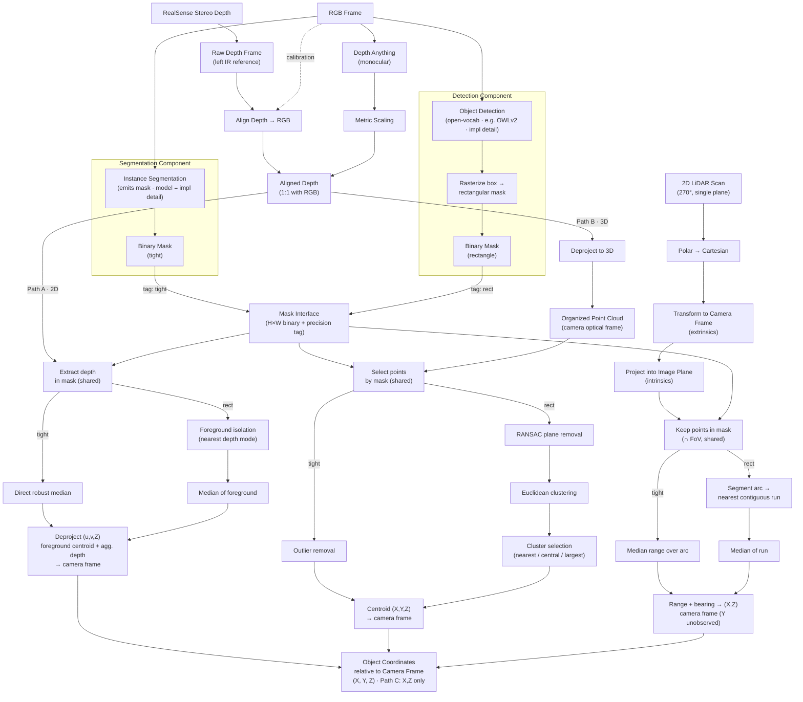

# Object Localization Pipeline — Handover

**Purpose:** Given a RealSense camera (and optionally a planar 2D LiDAR), detect objects of a target class in the RGB image and report each object's coordinates **relative to the camera frame**. The system is designed as a set of swappable components so that every combination of detector, depth source, and downstream path can be benchmarked for accuracy vs. compute.

**Output contract:** Every path terminates at a single representation — `(X, Y, Z)` in the camera frame (the LiDAR path yields `(X, Z)` only; see Path C). This shared output makes the paths directly comparable and fusible.

---

## 1. Sensor stack

### Intel RealSense D435 (camera-based sensors)

The robot carries a single **Intel RealSense D435**, forward-facing, mounted at `xyz [0.3, 0.0, 0.85]` on `default_mount` (`clearpath/robot.yaml: device_type: d435`). It is a standard Clearpath camera accessory. The **same** `robot.yaml` drives both the Gazebo sim model and the real `realsense2_camera` driver, but the two produce their data very differently. This section documents only the **camera-based** products used by the localization pipeline (the 2D LiDAR is covered separately, below).

**Data products we use:**

1. **RGB color image** - input to detection / segmentation. Real D435: up to 1920x1080; our config requests 1280x720 @ 30 fps. Sim: rendered color frame.
2. **Depth image** (made 1:1 with RGB) - input to Path A and Path B. Path B deprojects it into an organized point cloud in code (`depth_based_B.md`; provenance decision in `pointcloud_provenance_test.md` §7) - the cloud is a derived, in-code representation, not a sensor product.
3. **Camera IMU - NONE.** The D435 SKU has no IMU; only the D435i does.

**How depth is produced - this is where sim and real diverge:**

- **Real D435:** active infrared **stereo**. Two IR imagers (left/right) plus a Class-1 IR laser projector that casts a texture pattern; the on-board D4 ASIC rectifies the pair and matches horizontal disparity into a per-pixel depth map. Raw depth is expressed in the **left IR imager frame, NOT the RGB frame**, so it must be **aligned** (reprojected) onto the color pixel grid before use. Depth FoV (HD 16:9) is **86° H x 57° V** (datasheet); usable range ~0.2 m to >10 m.
- **Sim (Gazebo `rgbd_camera`):** no IR, no projector, no stereo matching. Gazebo renders the scene and reads the GPU **depth (Z) buffer** directly - the exact geometric distance to the first surface along each pixel ray, clipped to `near 0.3 / far 100`. Because color and depth come from the **same render pass and pose**, sim depth is **already co-registered with RGB** - no alignment step exists or is needed. The sim camera renders at `horizontal_fov = 1.25 rad = 71.6°`, NOT the real 86-87°.

**Sim vs real summary (camera-based):**

| Data product | Simulation | Real robot |
|---|---|---|
| RGB color | rendered frame | D435 RGB sensor (config 1280x720 @ 30) |
| Depth source | rendered GPU Z-buffer (ground truth) | active IR stereo on D4 ASIC |
| Depth alignment to RGB | none - co-registered by construction | required (depth in left-IR frame) |
| Depth FoV | 71.6° H (rendered) | 86° H x 57° V (config uses 87x58) |
| Camera IMU | none (D435) | none (D435) |

**Open config gaps on the real robot** (invisible in sim, so the sim benchmark hides them):

- `align_depth.enable: true` is missing from `robot.yaml` -> no `aligned_depth_to_color` topic on hardware -> Paths A and B have no depth input there (`depth_based_path.md` §2.1).
- Stream profile keys are stale: `robot.yaml` uses `rgb_camera.profile` / `depth_module.profile`; current Clearpath / realsense-ros use `rgb_camera.color_profile` / `depth_module.depth_profile` -> the requested 1280x720 may be silently ignored. Verify against the installed driver version.
- `config/camera_config.json` intrinsics (87° x 58°) match the real D435, **not** the sim render (71.6°) - so estimators assume the wrong FoV in sim.

Sources: Intel RealSense D400 Series Datasheet (doc 337029-005, §2.3 / §3.6 / Table 4-5 / §4.5 / §4.9.1); Gazebo `gz-sensors` RgbdCameraSensor docs; Clearpath RealSense D435 + Cameras config docs; repo `clearpath/robot.yaml`, `intel_realsense.urdf.xacro`, `config/camera_config.json`, `r100.urdf.xacro`.

### 2D LiDAR (Hokuyo UST, planar 270°)

A single-plane scanner returning range vs. bearing. It is **2D**: it samples only one horizontal slice at the LiDAR's mounting height, so it sees no height information. Within that slice it is typically more accurate and longer-range than RealSense stereo.

**What we actually have (NOT a 360° unit):**

- Model: **Hokuyo UST** (`robot.yaml: model: hokuyo_ust`), UST-10LX class - **270° scan** (±135°), 0.25° angular resolution, ~0.06-10 m range (30 m max), single horizontal plane.
- On the **real Ridgeback**, a **front** and a **rear** laser.
- Our **`robot.yaml` declares two** units: front (`xyz [0.3922, 0, 0]`, yaw 0) and rear (`xyz [-0.3922, 0, 0.05]`, yaw 180°). 
- **A 360° scan is possible.** Front + rear can be merged into one ~360° ring. It stays **2D** (one height, no Y) and the rear only adds side/rear coverage. 

**Sim vs real:**

| | Simulation | Real robot |
|---|---|---|
| Sensor | 2x gz `gpu_lidar`, single plane, 270° (±135°), 0.25°, 40 Hz, 0.06-30 m | front Hokuyo UST standard (270°); rear optional |
| Units present | both front + rear (from `robot.yaml`) | front always; rear only if the optional unit is fitted |
| Coverage used by perception | front 270° (`lidar2d_0`) | front 270° (`lidar2d_0`) |

Sources: Hokuyo UST-10LX specification (270°, 0.25°, 0.06-10 m / 30 m max); Clearpath Ridgeback user manual (front standard / rear optional); repo `clearpath/robot.yaml`, `clearpath_sensors_description/urdf/hokuyo_ust.urdf.xacro`; perception `g1_lidar_measurement_node` (`sensors/lidar2d_0/scan`).

### Design goal: one pipeline, two interchangeable backends

All the sim-vs-real differences documented above are real, but they must **not** leak into the perception logic. The goal is that the detection / depth / path code is written **once** and runs unchanged in both simulation and on hardware.

Simulation and the real robot are treated as two interchangeable **backends behind a single, identical interface**. The interface exposes the same methods and the same normalized data contract to everything downstream; each backend is a thin implementation of it, and the environment is selected at startup so that no code in the paths ever branches on "sim vs real."

Rationale — easy maintenance:

- **Maximize shared code.** One interface, two thin implementations. The paths, estimators, and benchmark consume the interface and stay environment-agnostic.
- **Isolate divergence behind one boundary.** Every sim/real quirk (intrinsics source, where depth alignment happens, topic names, noise handling) lives in exactly one place — the backend — instead of being scattered as conditionals through the pipeline.
- **Swappable and testable.** A backend can be replaced, or faked for tests, without touching any downstream path.

The concrete mechanism (how intrinsics are obtained, where alignment is performed, what is solved by driver config vs. in code) is deliberately **deferred**. This section fixes only the principle: *very similar code and interfaces across both versions, with all environment-specific behaviour confined to one swappable backend.*

---

## 2. Architecture overview

---

## 3. Front-end: detection components and the mask interface

Two detector components run off the RGB frame. They are kept structurally separate (different models, different compute profiles, independently versioned and benchmarked) but are unified behind a **common data contract**.

- **Segmentation component** — emits a pixel-precise (*tight*) binary mask.
- **Detection component** — emits a bounding box, then **rasterizes the box into a rectangular binary mask**. The detector model is an implementation detail (an open-vocabulary detector such as OWLv2 is the current intent; nothing downstream depends on the choice).

Both emit into the **Mask Interface**: an `H×W` binary mask plus a **precision tag** (`tight` | `rect`). Everything downstream reads only this interface and never branches on which model produced the mask. Adding a third front-end later (e.g. a promptable segmenter like SAM) means another component emitting into the same node, with zero downstream changes.

> **Design note:** the rasterize step is a deliberate, lossy adapter — it discards shape to conform to the interface. The rectangular mask is *not* a real segmentation; it carries a known background contamination. Mark this clearly at the code boundary so it is never mistaken for a tight mask.

---

## 4. Depth sources

Two interchangeable sources produce an **aligned depth frame** that is 1:1 with the RGB pixels:

- **RealSense stereo depth** — the raw depth lives in the left-IR frame, so it must pass through an **alignment** step (using the calibrated intrinsics + extrinsics) to reproject it onto the RGB pixel grid. After alignment, depth pixel `(u, v)` corresponds to color pixel `(u, v)`.
- **Depth Anything (monocular)** — estimated directly from the RGB frame, so it is *already* pixel-aligned (no alignment step). However it outputs **affine-invariant / relative** depth, so it needs a **metric scaling** step to become meters. If RealSense depth is available, it is the natural ground-truth reference for that scaling.

Both converge to the same `Aligned Depth` node that feeds Paths A and B.

> **Gotcha (alignment):** reprojection resamples the data and produces gaps at occlusion edges, because the baseline offset means some pixels are visible to one sensor but hidden from the other.

> **Gotcha (monocular):** Depth Anything tends to bend flat surfaces and warp absolute geometry. It produces a much messier point cloud than stereo, which matters for Path B's clustering and box fitting.

---

## 5. Downstream paths

All three paths consume the same mask interface and resolve to camera-frame coordinates. They differ in what 3D information they recover and in cost.

### Path A — 2D depth-image route (cheapest)
Extract depth values at the masked pixels, aggregate to a single distance, then deproject the representative pixel (centroid of the foreground pixels — `depth_based_A.md` §2.4) + aggregated depth through the intrinsics to a 3D point.

- **tight branch:** direct robust median of the masked depths.
- **rect branch:** the masked depths are multimodal (object + background), so a plain median can land on background. Isolate the foreground first (histogram → nearest dominant depth mode, or center-weight the box), *then* median.
- **Output:** `(X, Y, Z)` from a single representative pixel.

> Path A's coordinate is only as good as that one representative pixel. If the centroid lands on a depth discontinuity (object edge vs. far background) the depth can be wrong even when the aggregate range was fine. The representative pixel must be the centroid of the *foreground* pixels — the isolation output on the `rect` branch, all valid masked pixels on the `tight` branch — never the raw geometric box center (`depth_based_A.md` §2.4). Both the aggregate and the centroid read the same foreground set, so they agree by construction.

### Path B — 3D point cloud route (richest, heaviest)
Deproject the aligned depth into an **organized** point cloud (points keep pixel ordering, so the 2D mask indexes them directly), select the instance's points, clean up, and take the centroid.

- **tight branch:** outlier removal → centroid.
- **rect branch:** the box drags in the ground plane and neighbors, so: **RANSAC plane removal** → **Euclidean clustering** → **cluster selection** (nearest / most central / largest-after-plane). The tight mask never has to choose a cluster; the rectangular mask does.
- **Output:** centroid `(X, Y, Z)` plus, if wanted, oriented bounding box and physical dimensions.

### Path C — 2D 270° LiDAR route (accurate, planar only)
Independent sensor stream; rejoins the pipeline only at the mask. Convert the scan to Cartesian, transform into the camera frame via **extrinsic calibration**, project into the image plane with the intrinsics, then keep only the points falling inside the mask ∩ camera FoV.

- **tight branch:** segment the 1D range profile, **merge the runs lying within a small range band of the nearest run**, and median the merged set — same recovery as the rect branch, only over a narrower bearing window. A plain median over the arc is unsafe even with a tight mask: parallax lets background points into the arc (see the callout below).
- **rect branch:** the wider box widens the bearing window and admits neighbors, so segment the 1D range profile, merge the runs within the range band of the nearest, and median the merged set.
- **Output:** `(X, Z)` in the camera frame. **Y (height) is unobservable** from a single-plane LiDAR.

> Path C only returns points where the scan plane physically intersects the object at the LiDAR's height. A valid mask can yield zero LiDAR points if the plane passes above/below the object → the system needs a fallback to Path A/B in that case.
>
> **Parallax contamination — why even the tight branch segments:** the mask is defined from the camera's viewpoint, but the LiDAR samples from a different position. Background points the camera cannot see — occluded behind the object, or visible through gaps in it (between the G1's legs at scan height) — still project inside the mask and enter the arc carrying background ranges. Mask membership only certifies that the *camera's* ray hits the object; it says nothing about a LiDAR point further along that ray. The zero-point fallback does not catch this (points exist, they are just wrong); segmenting the range profile and keeping only the near runs drops them. **Convention (pinned):** runs lying within a small range band of the nearest run are merged before the median. On a legged object the nearest run alone would be one leg (range = leg face, offset from body center); merging the band averages both legs.

---

## 6. The mask-type fork (why downstream is not uniform)

The common interface unifies the **selection** mechanic (indexing depth / points / LiDAR by the mask) but **not foreground recovery**. The rectangular mask carries contamination the tight mask does not, so each path forks at a recovery sub-stage that dispatches on the precision tag:

| Path | tight branch | rect branch (extra work) |
|------|--------------|--------------------------|
| A (2D depth) | robust median | foreground isolation (depth-mode/center) → median |
| B (point cloud) | outlier removal | RANSAC plane removal → clustering → cluster selection |
| C (LiDAR) | arc segmentation → merge near-band runs → median (narrow window) | arc segmentation → merge near-band runs → median (wide window admits neighbors) |

Selection stays shared; the fork sits exactly where behavior genuinely diverges. Path C is the exception: parallax contaminates even the tight mask (see the Path C callout), so its branches run the same recovery and differ only in bearing-window width. The practical consequence: choosing the cheap box detector also switches you onto the heavier recovery branch downstream — most punishing in Path B (plane + clustering), nearly free in Path A.

---

## 7. Coordinate frame convention — **TO PIN DOWN**

All paths agree to emit into one camera frame, but the exact convention must be fixed before integration. Proposed default (RealSense / OpenCV optical convention, to be confirmed):

- **Origin:** camera optical center.
- **Axes:** X right, Y down, Z forward (into the scene), right-handed.
- **Units:** meters.

Path C must be expressed in this same frame after the extrinsic transform, with Y left undefined/NaN. **Action:** confirm handedness and axis directions against the actual SDK output and the robot's TF tree.

---

## 8. Combination matrix to benchmark

The design intent is to evaluate every combination on two axes: **accuracy** (vs. ground-truth coordinates) and **latency / compute**.

- **Detectors (2):** segmentation (tight) · detection→rect
- **Depth sources (2):** RealSense stereo · Depth Anything (Paths A/B); LiDAR is its own source for Path C
- **Paths (3):** A (2D depth) · B (point cloud) · C (LiDAR)

Working hypotheses to validate:

- **Box + Path B** may approach mask + Path B in accuracy because the 3D clustering recovers what the mask would have given for free — but it spends the detector savings back on plane removal + clustering, so the "box is cheaper" intuition can partly invert here.
- **Box + Path A** is where the box stays genuinely cheap end-to-end.
- **Path C** is the most accurate within its plane but only 2D; best as a high-accuracy range cross-check or fallback, not a standalone 3D source.

---

## 9. Fusion opportunity

Because every path emits in the same frame and at least `(X, Z)`, the outputs are mutually checkable and fusible: weight by per-path confidence, prefer Path B's full geometry when available, fall back to A or C otherwise, and use Path C's accurate range to cross-validate B's depth. No further frame juggling is required once Section 7 is fixed.

---

## 10. Open items / TODO

1. **Pin the camera-frame convention** (Section 7) — axes, handedness, units — against SDK + robot TF.
2. **Calibration procedures:** RealSense intrinsics/extrinsics are factory-calibrated; the **camera–LiDAR extrinsic** must be calibrated and documented. Define the procedure and store the transform.
3. **Time synchronization** between camera and LiDAR — without matched timestamps, a moving platform/object smears the LiDAR projection against the mask.
4. **Fallback logic** for Path C empty returns (scan plane misses object) → route to A/B.
5. **Metric-scaling strategy** for Depth Anything — metric-trained variant vs. calibrate against stereo.
6. **Build the benchmark scaffold** — enumerate the matrix rows, columns for accuracy + latency, drop in measured numbers.
7. **Define the component interface signatures** in code (the mask-interface contract, the per-path recovery dispatch) so the separation is enforced, not just diagrammed.

---

## Glossary

- **Tight mask** — pixel-precise segmentation mask.
- **Rect mask** — rasterized bounding box (rectangular, contains background).
- **Organized point cloud** — cloud whose points retain image row/column ordering, so a 2D mask indexes it directly.
- **Affine-invariant depth** — relative depth defined up to an unknown scale and offset (monocular estimators); needs metric scaling.
- **Extrinsics** — rigid transform (rotation + translation) between two sensors' frames.
- **Intrinsics** — a sensor's internal projection parameters (focal lengths, principal point, distortion).
