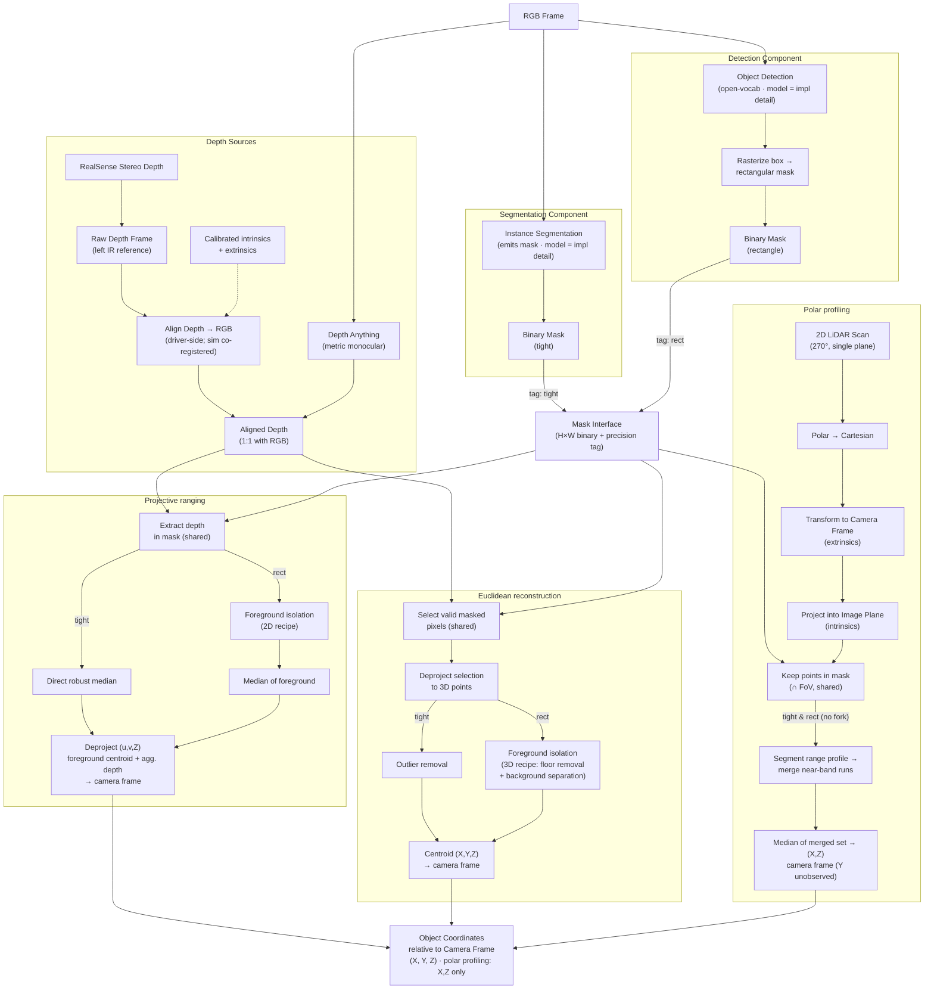

# Object Localization Pipeline

**Purpose:** Given a RealSense camera (and optionally a planar 2D LiDAR), detect objects of a target class in the RGB image and report each object's coordinates **relative to the camera frame**. The system is designed as a set of swappable components so that every combination of detector, depth source, and downstream path can be benchmarked for accuracy vs. compute.

**Output contract:** Every path terminates at a single representation — `(X, Y, Z)` in the camera frame (the LiDAR path yields `(X, Z)` only; see polar profiling). This shared output makes the paths directly comparable and fusible.

---

## 1. Sensor stack

### Intel RealSense D435 (camera-based sensors)

The robot carries a single **Intel RealSense D435**, forward-facing, mounted at `xyz [0.3, 0.0, 0.85]` on `default_mount` (`clearpath/robot.yaml: device_type: d435`). It is a standard Clearpath camera accessory. The **same** `robot.yaml` drives both the Gazebo sim model and the real `realsense2_camera` driver, but the two produce their data very differently. This section documents only the **camera-based** products used by the localization pipeline (the 2D LiDAR is covered separately, below).

**Data products we use:**

1. **RGB color image** - input to detection / segmentation. Real D435: up to 1920x1080; our config requests 1280x720 @ 30 fps. Sim: rendered color frame.
2. **Depth image** (made 1:1 with RGB) - input to projective ranging and euclidean reconstruction. Euclidean reconstruction deprojects its masked pixels into camera-frame points in code (`euclidean_reconstruction.md`; provenance decision in `pointcloud_provenance_test.md` §7) - the points are a derived, in-code representation, not a sensor product.
3. **Camera IMU - NONE.** The D435 SKU has no IMU; only the D435i does.

**How depth is produced - this is where sim and real diverge:**

- **Real D435:** active infrared **stereo**. Two IR imagers (left/right) plus a Class-1 IR laser projector that casts a texture pattern; the on-board D4 ASIC rectifies the pair and matches horizontal disparity into a per-pixel depth map. Raw depth is expressed in the **left IR imager frame, NOT the RGB frame**, so it must be **aligned** (reprojected) onto the color pixel grid before use. Depth FoV (HD 16:9) is **86° H x 57° V** (datasheet); usable range ~0.2 m to >10 m.
- **Sim (Gazebo `rgbd_camera`):** no IR, no projector, no stereo matching. Gazebo renders the scene and reads the GPU **depth (Z) buffer** directly - the exact geometric distance to the first surface along each pixel ray, clipped to `near 0.3 / far 100`. Because color and depth come from the **same render pass and pose**, sim depth is **already co-registered with RGB** - no alignment step exists or is needed. The sim camera renders at `horizontal_fov = 1.25 rad = 71.6°`, NOT the real 86-87°.

**Sim vs real summary (camera-based):**

| Data product | Simulation | Real robot |
|---|---|---|
| RGB color | rendered frame | D435 RGB sensor (config 1280x720 @ 30) |
| Depth source | rendered GPU Z-buffer (ground truth) | active IR stereo on D4 ASIC |
| Depth alignment to RGB | none - co-registered by construction | required (depth in left-IR frame) |
| Depth FoV | 71.6° H (rendered) | 86° H x 57° V (config uses 87x58) |
| Camera IMU | none (D435) | none (D435) |

**Open config gaps on the real robot** (invisible in sim, so the sim benchmark hides them):

- `align_depth.enable: true` is missing from `robot.yaml` -> no `aligned_depth_to_color` topic on hardware -> projective ranging and euclidean reconstruction have no depth input there (`aligned_depth.md` §2.1).
- Stream profile keys are stale: `robot.yaml` uses `rgb_camera.profile` / `depth_module.profile`; current Clearpath / realsense-ros use `rgb_camera.color_profile` / `depth_module.depth_profile` -> the requested 1280x720 may be silently ignored. Verify against the installed driver version.
- `config/camera_config.json` intrinsics (87° x 58°) match the real D435, **not** the sim render (71.6°) - so estimators assume the wrong FoV in sim.

Sources: Intel RealSense D400 Series Datasheet (doc 337029-005, §2.3 / §3.6 / Table 4-5 / §4.5 / §4.9.1); Gazebo `gz-sensors` RgbdCameraSensor docs; Clearpath RealSense D435 + Cameras config docs; repo `clearpath/robot.yaml`, `intel_realsense.urdf.xacro`, `config/camera_config.json`, `r100.urdf.xacro`.

### 2D LiDAR (Hokuyo UST, planar 270°)

A single-plane scanner returning range vs. bearing. It is **2D**: it samples only one horizontal slice at the LiDAR's mounting height, so it sees no height information. Within that slice it is typically more accurate and longer-range than RealSense stereo.

**What we actually have (NOT a 360° unit):**

- Model: **Hokuyo UST** (`robot.yaml: model: hokuyo_ust`), UST-10LX class - **270° scan** (±135°), 0.25° angular resolution, ~0.06-10 m range (30 m max), single horizontal plane.
- On the **real Ridgeback**, a **front** and a **rear** laser.
- Our **`robot.yaml` declares two** units: front (`xyz [0.3922, 0, 0]`, yaw 0) and rear (`xyz [-0.3922, 0, 0.05]`, yaw 180°). 
- **A 360° scan is possible.** Front + rear can be merged into one ~360° ring. It stays **2D** (one height, no Y) and the rear only adds side/rear coverage. 

**Sim vs real:**

| | Simulation | Real robot |
|---|---|---|
| Sensor | 2x gz `gpu_lidar`, single plane, 270° (±135°), 0.25°, 40 Hz, 0.06-30 m | front Hokuyo UST standard (270°); rear optional |
| Units present | both front + rear (from `robot.yaml`) | front always; rear only if the optional unit is fitted |
| Coverage used by perception | front 270° (`lidar2d_0`) | front 270° (`lidar2d_0`) |

Sources: Hokuyo UST-10LX specification (270°, 0.25°, 0.06-10 m / 30 m max); Clearpath Ridgeback user manual (front standard / rear optional); repo `clearpath/robot.yaml`, `clearpath_sensors_description/urdf/hokuyo_ust.urdf.xacro`; perception `g1_mask_measurement_node`'s polar profiling path (`sensors/lidar2d_0/scan`).

### Design goal: one pipeline, two interchangeable backends

All the sim-vs-real differences documented above are real, but they must **not** leak into the perception logic. The goal is that the detection / depth / path code is written **once** and runs unchanged in both simulation and on hardware.

Simulation and the real robot are treated as two interchangeable **backends behind a single, identical interface**. The interface exposes the same methods and the same normalized data contract to everything downstream; each backend is a thin implementation of it, and the environment is selected at startup so that no code in the paths ever branches on "sim vs real."

Rationale — easy maintenance:

- **Maximize shared code.** One interface, two thin implementations. The paths, estimators, and benchmark consume the interface and stay environment-agnostic.
- **Isolate divergence behind one boundary.** Every sim/real quirk (intrinsics source, where depth alignment happens, topic names, noise handling) lives in exactly one place — the backend — instead of being scattered as conditionals through the pipeline.
- **Swappable and testable.** A backend can be replaced, or faked for tests, without touching any downstream path.

The concrete mechanism (how intrinsics are obtained, where alignment is performed, what is solved by driver config vs. in code) is deliberately **deferred**. This section fixes only the principle: *very similar code and interfaces across both versions, with all environment-specific behaviour confined to one swappable backend.*

---

## 2. Architecture overview

---

## 3. Front-end: detection components and the mask interface

Two detector components run off the RGB frame. They are kept structurally separate (different models, different compute profiles, independently versioned and benchmarked) but are unified behind a **common data contract**.

- **Segmentation component** — emits a pixel-precise (*tight*) binary mask. Implemented as a **box-promptable segmenter prompted with the detection component's boxes** (SlimSAM by default; `perception/core/segmentation.py`, documented in `segmentation_component.md` — evaluated alternatives in §7 there: Florence-2 spike failed, SAM 3 spike passed with adoption undecided), which keeps the detector's open-vocabulary property: one box prompt → one mask. Like rasterization, it executes in the consuming measurement node (the mask never crosses the wire); a run selects it with `mask_gate:=silhouette`.
- **Detection component** — emits a bounding box, then **rasterizes the box into a rectangular binary mask** (the default, `mask_gate:=box`). The detector model is an implementation detail (an open-vocabulary detector such as OWLv2 is the current implementation; nothing downstream depends on the choice). In code the rasterization currently executes in the consuming measurement node (`rasterize_detection` in `perception/core/mask.py`) — it belongs to this component's contract regardless of where it runs.

Both emit into the **Mask Interface**: an `H×W` binary mask plus a **precision tag** (`tight` | `rect`). Everything downstream reads only this interface and never branches on which model produced the mask. Adding a third front-end later means another component emitting into the same interface, with zero downstream changes.

> **Design note:** the rasterize step is a deliberate, lossy adapter — it discards shape to conform to the interface. The rectangular mask is *not* a real segmentation; it carries a known background contamination. Mark this clearly at the code boundary so it is never mistaken for a tight mask.

---

## 4. Depth sources

Two interchangeable sources produce an **aligned depth frame** that is 1:1 with the RGB pixels. Both live in `perception/core/depth_sources.py` behind one switch (`depth_source: stereoscopic | monocular`) and are pulled by `g1_mask_measurement_node` at the detection stamp — there is no depth producer process and no depth topic between them and the paths that consume them (`aligned_depth_coverage.md` §6). The node buffers the source's *input* stream raw and converts only the frame the detections were made on; the localization paths never branch on which source ran.

- **RealSense stereo depth (`stereoscopic`)** — the raw depth lives in the left-IR frame, so it must be **aligned** (reprojected with the calibrated intrinsics + extrinsics) onto the RGB pixel grid. After alignment, depth pixel `(u, v)` corresponds to color pixel `(u, v)`. The alignment is not pipeline code: on hardware the driver performs it (`aligned_depth_to_color`); in sim color and depth are co-registered by construction (Section 1). The source converts the matched frame to float meters, nothing more — on hardware its `depth_topic` must therefore point at `aligned_depth_to_color`.
- **Depth Anything (`monocular`)** — predicted directly from the RGB frame, so it is *already* pixel-aligned. The implementation uses the **metric-trained variant** (`Depth-Anything-V2-Metric-Indoor`), which emits meters directly — no scaling step against stereo; the prediction is only resized to the color grid. (The base Depth Anything models output affine-invariant depth; choosing the metric variant is what removed the scaling stage from the architecture.)

Both converge to the same `Aligned Depth` contract (float32 meters on the color grid; 0/NaN/inf = no depth) that feeds projective ranging and euclidean reconstruction. The mask node subscribes to the color camera's live `camera_info`, so the paths deproject with the grid's true intrinsics instead of static FoV constants.

A depth source is built only when a run actually selects a depth path (`enabled_estimators`, Section 5). Polar profiling reads the scan, not a depth frame, so a polar-only run constructs no source, subscribes to no depth input, and under `monocular` loads no model.

> **Gotcha (alignment):** reprojection resamples the data and produces gaps at occlusion edges, because the baseline offset means some pixels are visible to one sensor but hidden from the other.

> **Gotcha (monocular):** Depth Anything tends to bend flat surfaces and warp absolute geometry. It produces a much messier point cloud than stereo, which matters for euclidean reconstruction's clustering and box fitting.

---

## 5. Downstream paths

All three paths consume the same mask interface and resolve to camera-frame coordinates. They differ in what 3D information they recover and in cost.

They are also independently selectable. A run picks its subset with `enabled_estimators` (the benchmark launch splits its own `estimators` list per stack, so one list selects across the mask node and the point cloud node alike). A path outside the subset is never executed: its fields stay NaN, its status stays `UNSET` — the honest record, since the node did not miss, it never looked — and it gets no benchmark row at all, exactly like an unselected `pointcloud` row. The inputs only that path needs go unsubscribed with it.

### Projective ranging — 2D depth-image route (cheapest)
Extract depth values at the masked pixels, aggregate to a single distance, then deproject the representative pixel (centroid of the foreground pixels — `projective_ranging.md` §2.4) + aggregated depth through the intrinsics to a 3D point.

- **tight branch:** direct robust median of the masked depths.
- **rect branch:** the masked depths are multimodal (object + background), so a plain median can land on background. Isolate the foreground first with a pluggable 2D recipe (`isolation_2d.py`; implemented: nearest-mode histogram — the default — and Otsu; catalogue in `foreground_isolation_2d.md`), *then* median.
- **Output:** `(X, Y, Z)` from a single representative pixel.

> Projective ranging's coordinate is only as good as that one representative pixel. If the centroid lands on a depth discontinuity (object edge vs. far background) the depth can be wrong even when the aggregate range was fine. The representative pixel must be the centroid of the *foreground* pixels — the isolation output on the `rect` branch, all valid masked pixels on the `tight` branch — never the raw geometric box center (`projective_ranging.md` §2.4). Both the aggregate and the centroid read the same foreground set, so they agree by construction.

### Euclidean reconstruction — 3D point-domain route (richest)
Select the valid masked pixels, deproject only those into camera-optical-frame points (select and deproject commute, so no full organized cloud is ever materialized — the published cloud topic is never consumed, per `pointcloud_provenance_test.md`), isolate the foreground in the point domain, and take the centroid.

- **tight branch:** statistical outlier removal (median ± k·MAD on camera-frame range) → centroid.
- **rect branch:** the box drags in the floor and background, so a pluggable 3D isolation recipe runs (`isolation_3d.py`; catalogue in `foreground_isolation_3d.md`). Implemented default: **height crop** (extrinsic ground-plane crop — the floor is removed by known calibration, not estimation) → **range band** (percentile anchor + asymmetric inlier window tied to the object's body depth). Heavier catalogue entries (RANSAC plane removal, Euclidean clustering, min-cut) remain swap-ins, deliberately not implemented — see the catalogue for why RANSAC's dominant-plane premise is weak inside a detector box.
- **Output:** centroid `(X, Y, Z)`; the distance is the median camera-frame range of the same foreground set, so coordinate and distance agree by construction. The foreground points are returned as a by-product (extent, oriented box later if wanted).

### Polar profiling — 2D 270° LiDAR route (accurate, planar only)
Independent sensor stream; rejoins the pipeline only at the mask. Convert the scan to Cartesian, transform into the camera frame via **extrinsic calibration**, project into the image plane with the intrinsics, then keep only the points falling inside the mask ∩ camera FoV.

- **tight branch:** segment the 1D range profile, **merge the runs lying within a small range band of the nearest run**, and median the merged set — same recovery as the rect branch, only over a narrower bearing window. A plain median over the arc is unsafe even with a tight mask: parallax lets background points into the arc (see the callout below).
- **rect branch:** the wider box widens the bearing window and admits neighbors, so segment the 1D range profile, merge the runs within the range band of the nearest, and median the merged set.
- **Output:** `(X, Z)` in the camera frame. **Y (height) is unobservable** from a single-plane LiDAR.

> Polar profiling only returns points where the scan plane physically intersects the object at the LiDAR's height. A valid mask can yield zero LiDAR points if the plane passes above/below the object → the path returns `None`, which is first-class (`polar_profiling.md` §4). In the **benchmark** a miss simply drops that row — it is never substituted with another path's answer. Any fallback routing to projective ranging / euclidean reconstruction is a **production-pipeline consumer concern only** (unresolved, deferred — §10.4), never something the benchmark does.
>
> **Parallax contamination — why even the tight branch segments:** the mask is defined from the camera's viewpoint, but the LiDAR samples from a different position. A `rect` mask admits background the camera can see through gaps in the object (between the G1's legs at scan height). A `tight` mask rejects those (gap pixels are False) but still admits background the camera *cannot* see: an occluded point projects inside the silhouette by definition of occlusion — the sensors' vertical offset means a beam through the leg gap that hits the wall behind lands on *torso* pixels from the camera's higher viewpoint (full geometry in `polar_profiling.md` §2.5). Mask membership only certifies that the *camera's* ray hits the object; it says nothing about a LiDAR point further along that ray. The zero-point fallback does not catch this (points exist, they are just wrong); segmenting the range profile and keeping only the near runs drops them. **Convention (pinned):** runs lying within a small range band of the nearest run are merged before the median. On a legged object the nearest run alone would be one leg (range = leg face, offset from body center); merging the band averages both legs.

---

## 6. The mask-type fork (why downstream is not uniform)

The common interface unifies the **selection** mechanic (indexing depth / points / LiDAR by the mask) but **not foreground recovery**. The rectangular mask carries contamination the tight mask does not, so each path forks at a recovery sub-stage that dispatches on the precision tag:

| Path | tight branch | rect branch (extra work) |
|------|--------------|--------------------------|
| projective ranging (2D depth) | robust median | 2D isolation recipe (default: nearest-mode histogram) → median |
| euclidean reconstruction (point cloud) | MAD outlier removal | 3D isolation recipe (default: height crop → range band) |
| polar profiling (LiDAR) | arc segmentation → merge near-band runs → median (narrow window) | arc segmentation → merge near-band runs → median (wide window admits neighbors) |

Selection stays shared; the fork sits exactly where behavior genuinely diverges. Polar profiling is the exception: parallax contaminates even the tight mask (see the polar profiling callout), so its branches run the same recovery and differ only in bearing-window width. The rect recoveries are pluggable recipes (`ISOLATION_2D_RECIPES` / `ISOLATION_3D_RECIPES`, selected per launch via the `isolation_2d` / `isolation_3d` parameters of `g1_mask_measurement_node`). The implemented defaults are all cheap NumPy, so the box detector's extra recovery is currently near-free on every path; only the heavier catalogued recipes (clustering, min-cut) would reintroduce a real cost asymmetry.

---

## 7. Coordinate frame convention

The mask stack does not stop at a camera-frame coordinate: each path's camera-optical point is transformed to a `base_link` **planar** measurement via the live TF extrinsic at the detection stamp — `optical_to_base_planar(xyz_optical, rotation, translation, front_offset_m)`. The rotation *and* translation are the camera-optical → base extrinsics from TF, so the full mounting pose (not just pitch) is applied. The output is `(lateral_m, forward_m, distance_m)` where lateral is base **+Y, left-positive (REP-103)** and forward is base +X minus the 0.25 m robot front offset. Polar profiling runs the same transform with the optical Y component set to 0 (height is unobservable from a single plane; at zero camera pitch the substitution is exact).

The convention is **uniform** across every estimator: **left-positive** (base +Y, REP-103). That covers the mask-based paths, `pointcloud`, and the benchmark ground truth — every registered row reports a full planar position, which is the invariant `ESTIMATOR_POSITION_ATTRS` carries and `test_estimate_viz` asserts.

(Historical: the deleted `rgb` path reached base +Y by negating camera-optical +X in `rotate_camera_to_vehicle_frame`, since optical X is image-right. It was briefly left un-negated, making `rgb` the one right-positive producer, which pushed pair costs past the benchmark's assignment gate whenever `rgb` served as the locator. That family is gone; the sign convention it had to be corrected into is the one above.)

The **forward** component is likewise uniform: base +X minus the 0.25 m robot front offset, for estimates *and* ground truth. Any planar comparison can therefore be done component-wise without a conversion step.

---

## 8. Combination matrix to benchmark

The design intent is to evaluate every combination on two axes: **accuracy** (vs. ground-truth coordinates) and **latency / compute**.

- **Detectors (2):** segmentation (tight) · detection→rect
- **Depth sources (2):** RealSense stereo · Depth Anything (projective ranging and euclidean reconstruction); LiDAR is its own source for polar profiling
- **Paths (3):** projective ranging (2D depth) · euclidean reconstruction (point cloud) · polar profiling (LiDAR)

Working hypotheses to validate:

- **Box + euclidean reconstruction** may approach mask + euclidean reconstruction in accuracy because the 3D isolation recovers what the mask would have given for free. With the implemented height-crop → range-band chain that recovery is nearly free, so the comparison is purely about accuracy; only the heavier catalogued recipes would spend the detector savings back.
- **Box + projective ranging** is where the box stays genuinely cheap end-to-end.
- **Polar profiling** is the most accurate within its plane but only 2D; best as a high-accuracy range cross-check or fallback, not a standalone 3D source.

---

## 9. Fusion opportunity

Because every path emits in the same frame and at least `(X, Z)`, the outputs are mutually checkable and fusible: weight by per-path confidence, prefer euclidean reconstruction's full geometry when available, fall back to projective ranging or polar profiling otherwise, and use polar profiling's accurate range to cross-validate euclidean reconstruction's depth. No further frame juggling is required once Section 7 is fixed.

---

## 10. Open items / TODO

1. ~~**Pin the camera-frame convention** (Section 7) — axes, handedness, units — against SDK + robot TF.~~ — resolved 2026-07-23 for the mask stack: paths emit `base_link` planar measurements via the live TF extrinsic (`optical_to_base_planar`), lateral left-positive (REP-103) — Section 7. The camera family that still emitted right-positive has since been deleted, so the convention is now unified rather than split.
2. **Calibration procedures:** RealSense intrinsics/extrinsics are factory-calibrated; the **camera–LiDAR extrinsic** must be calibrated and documented. Define the procedure and store the transform.
3. ~~**Time synchronization** between camera and LiDAR — without matched timestamps, a moving platform/object smears the LiDAR projection against the mask.~~ — resolved 2026-07-23 in the mask node: depth and scan are matched to the detection (mask) stamp via `StampedMessageBuffer` (depth exact-stamp; scan nearest within `scan_match_tolerance_s`), not latest-wins (`polar_profiling.md` §8, `aligned_depth.md` §1). Accurate sensor clocks/timestamping on real hardware remain a driver concern the software matching relies on.
4. **Fallback routing** for polar profiling empty returns (scan plane misses object). `None` is first-class (`polar_profiling.md` §4): in the **benchmark** the row is dropped, never substituted. Where the `None` → projective ranging / euclidean reconstruction escalation lives is a **production-pipeline consumer concern only** (unresolved, deferred), never inside the benchmark.
5. **Metric-scaling strategy** for Depth Anything — **decided:** the metric-trained variant (`Depth-Anything-V2-Metric-Indoor`) is implemented in `depth_sources.MonocularDepthSource`; no calibration against stereo. Revisit only if the metric variant's absolute scale proves off in the benchmark.
6. ~~**Build the benchmark scaffold** — enumerate the matrix rows, columns for accuracy + latency, drop in measured numbers.~~ — **Resolved 2026-07-21:** the benchmark scaffold exists and runs (`g1_distance_benchmark.launch.py` drives the matrix; measured numbers are already landing).
7. ~~**Define the component interface signatures** in code (the mask-interface contract, the per-path recovery dispatch) so the separation is enforced, not just diagrammed.~~ — **Resolved 2026-07-21:** the in-code contracts exist — the mask interface is `Mask` / `MaskPrecision` in `perception/core/mask.py`, and the per-path recovery dispatches on the precision tag.

---

## Glossary

- **Tight mask** — pixel-precise segmentation mask.
- **Rect mask** — rasterized bounding box (rectangular, contains background).
- **Organized point cloud** — cloud whose points retain image row/column ordering, so a 2D mask indexes it directly.
- **Affine-invariant depth** — relative depth defined up to an unknown scale and offset (monocular estimators); needs metric scaling.
- **Extrinsics** — rigid transform (rotation + translation) between two sensors' frames.
- **Intrinsics** — a sensor's internal projection parameters (focal lengths, principal point, distortion).

### Miss-reason codes (`run.json` → `reason_histogram`, trial CSV → `miss_reason`)

Authoritative source: `common/miss_reason.py` (`MissReason` enum). Every
mask-estimator value carries one of these per detection; the benchmark tallies
them over all captured events. Grouped by where in the pipeline the frame died:

**Frame-level** — the whole frame was unusable before any per-detection work:

- `NO_CAMERA_INFO` — camera intrinsics never arrived for this frame.
- `GRID_MISMATCH` — camera_info grid does not match the image grid.
- `NO_COLOR_FRAME` — silhouette gate: the exact color frame for the detection
  stamp never arrived (aged out of the buffer or dropped).
- `TF_MISS_EXTRINSIC` — camera-optical → base transform unavailable.

**Mask-level** — this detection's mask was rejected before any path ran:

- `MASK_OVERSIZED_BOX` — detector box too large to trust (gate threshold).
- `MASK_EMPTY_SEGMENTATION` — segmenter returned an empty mask.

**Input-missing** — the source stream a path needs was not matched:

- `NO_DEPTH_FRAME` — projective + euclidean: no usable aligned-depth frame at
  the detection's exact stamp — nothing buffered at that stamp, an unsupported
  encoding, a monocular model that is unavailable, or a grid the masks cannot
  index. Was the dominant sim miss until depth acquisition moved into the mask
  node (`aligned_depth_coverage.md` §6).
- `NO_SCAN` / `TF_MISS_SCAN` / `SCAN_INVALID` — polar: scan missing within
  tolerance / scan→optical TF unavailable / scan undecodable.

**Path-internal** — inputs present, the path itself gave up:

- `TOO_FEW_VALID_PIXELS` — projective: too few valid masked depth pixels.
- `TOO_FEW_VALID_POINTS` — euclidean: too few valid deprojected points.
- `ISOLATION_EMPTY` — foreground isolation left too few pixels/points.
- `NO_BEAMS_IN_VIEW` — polar: no scan beam projects into the image.
- `TOO_FEW_RAYS_SELECTED` — polar: too few beams fall inside the mask (the
  expected signature when an occluder blocks the scan plane).
- `TOO_FEW_RAYS_MERGED` — polar: near-band merge left too few beams.

**Bookkeeping:**

- `OK` — the path produced an estimate.
- `UNSET` — no status at all: that estimator's producer node published nothing
  for this event's frame key (node behind the camera rate, or a legacy
  estimator on an event its node skipped). Not a path failure — the frame
  simply never reached the estimator.
