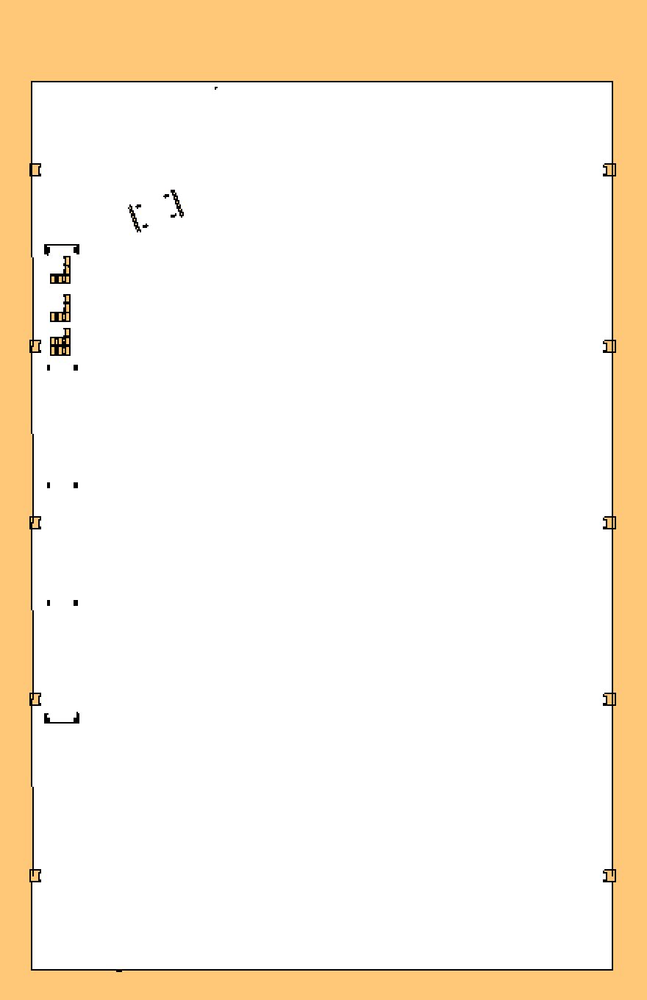
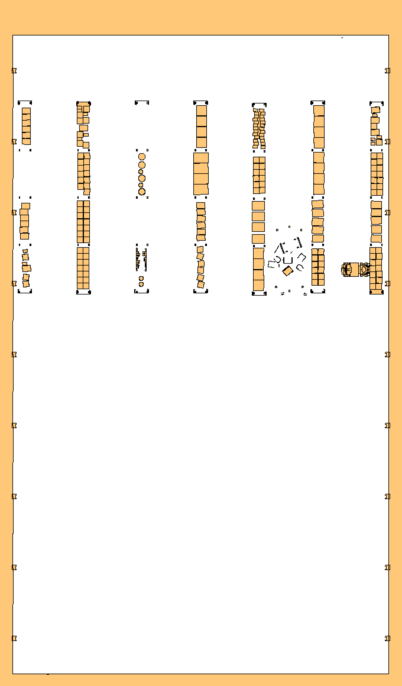
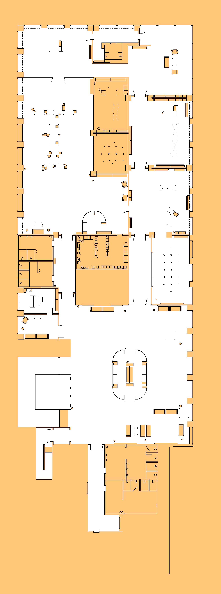
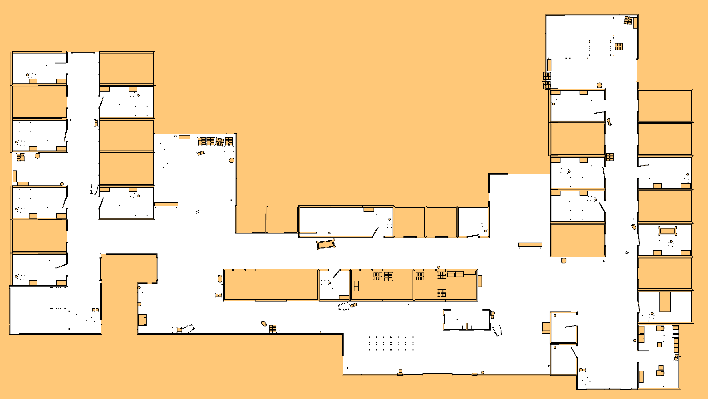
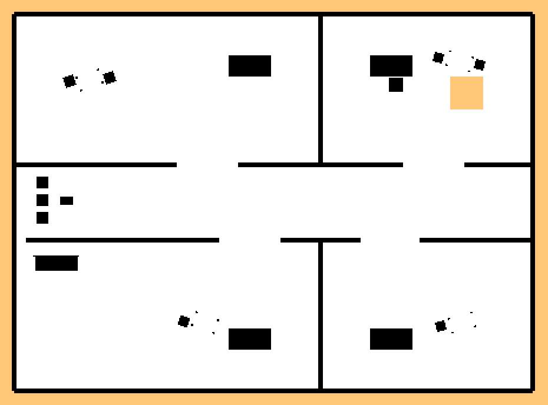
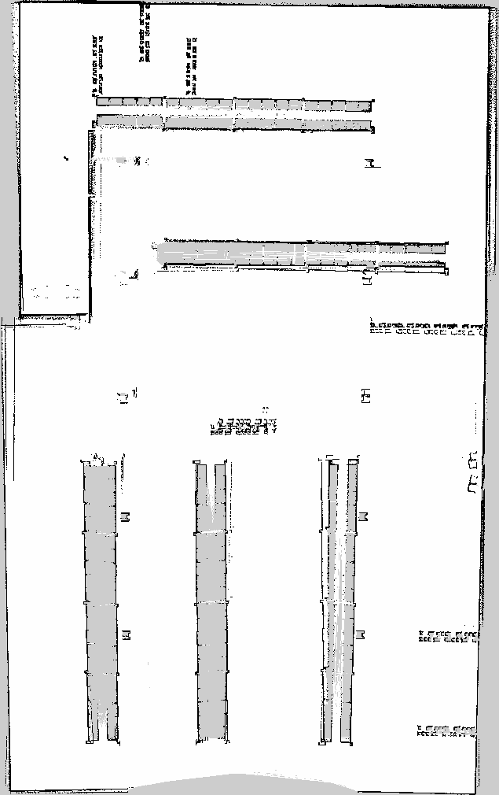
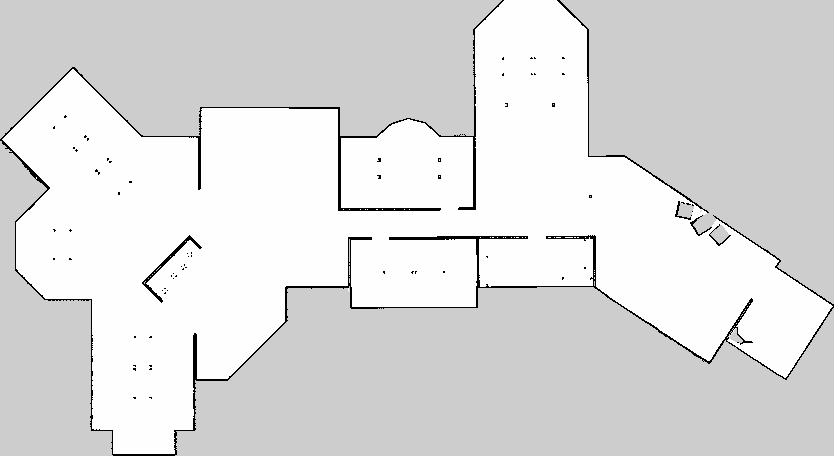

# Ground-Truth Maps

Ground-truth occupancy maps define the "true reachable area" used as the
coverage reference for exploration sweeps.

**Canonical maps are generated from or certified against their owning simulation
geometry.** For the Isaac stock worlds (`warehouse`, `office`, `hospital`)
`tools/isaac/generate_gt_map.py` slices the world USD at the 2D lidar plane; for
repository SDF worlds `tools/isaac/gt_occupancy.py` rasterizes the declared
boxes and spheres. The earlier Gazebo captures formerly named warehouse and office moved to
the non-colliding identities `depot` and `coworking_space`; their geometry differs
from the Isaac stock environments. They are certified against the pinned
Clearpath revision and exact external asset bundles recorded in their provenance
sidecars. The manual capture workflow (Part 1) remains as the replacement path
when those inputs change.

- **This folder** is the common package maps dir
  (`src/ridgeback_autonomy/sim/ground_truth_maps/`). Gazebo source worlds now
  live under `src/ridgeback_autonomy_gz/sim/worlds/`, while Isaac USD worlds
  live under `src/ridgeback_autonomy_isaac/sim/isaac/usd/worlds/`. The maps are
  installed to `share/ridgeback_autonomy/sim/ground_truth_maps/`, so common
  diagnostic nodes resolve them through `get_package_share_directory` on any
  machine. It holds the `.pgm`/`.yaml` maps, their `.png` previews, and the dev
  tools that make them.
- **Live coverage during exploration is built in** — `coverage_overlay_node`
  publishes the `COVERAGE` panel in the RViz HUD automatically (see Part 2). No
  separate monitor script is needed.

> **All commands below assume:** working directory is the repo root
> (`DyNAMO-Ridgeback/`), ROS is sourced (`source /opt/ros/jazzy/setup.bash`),
> and the workspace is built (`source install/setup.bash`).

---

## Maps

Certified Gazebo map sets:

| Public world | Clearpath 3D source | Current evidence state |
|---|---|---|
| `initial_test_world` | repository `initial_test_world.sdf` | Analytical SDF slice at 0.30257 m |
| `depot` | dependency `warehouse.sdf` | Driven capture recertified against Clearpath `590a4511` and pinned Fuel bundles |
| `coworking_space` | dependency `office.sdf` | Driven capture recertified against Clearpath `590a4511` and repository meshes |

Each has `.pgm`, `.yaml`, `.png`, `.npz`, and `.provenance.json`. The provenance
records public and source identities, allowed backends, source revision and
asset hashes. The coverage diagnostic checks that contract and displays the
`backend/world` pair. `depot` and `coworking_space` remain driven grids; their
NPZ files are lossless derivatives, not independent evidence.

Canonical maps (analytic, from the Isaac stock world USDs):

| World | Size | Resolution | Origin | Source |
|-------|------|------------|--------|--------|
| warehouse | 440×680 px (22×34 m) | 0.05 m/px | [-11.430, -13.200, 0] | `generate_gt_map.py --origin=0.2,6.12` |
| warehouse_full | 680×1160 px (34×58 m) | 0.05 m/px | [-27.430, -24.400, 0] | `generate_gt_map.py --origin=-10,5` |
| office | 760×2040 px (38×102 m) | 0.05 m/px | [-27.075, -37.673, 0] | `generate_gt_map.py` |
| hospital | 1560×880 px (78×44 m) | 0.05 m/px | [-49.440, -5.450, 0] | `generate_gt_map.py` |

**Slice height.** `src/ridgeback_autonomy_isaac/sim/isaac/worlds.py` is the
single owner of floor, base-link clearance, and lidar offset. Both analytic
generators derive their plane as `floor_z + 0.02617 + 0.2264`. The stock-world
maps are therefore sliced at **0.25257 m**; raised repo worlds such as
`initial_test_world` use **0.30257 m**. All four stock maps and previews were
regenerated at 0.25257 m on 2026-09-17. Regenerate after a floor registration,
wheel clearance, or lidar mounting change.

Not every `robot.yaml` edit qualifies: the 2026-09-11 reparent of the lidars
from `base_link` to `chassis_link` changed the parent only, and the two links
are coincident, so the plane did not move.

`warehouse` and `warehouse_full` both need an explicit `--origin` on open
floor: their geometry is dense enough that the auto-seed centroid lands *on* a
shelf and the free-space flood never fills. Note the `=` — argparse eats a bare
`-10,5` as a flag.

Each ships a `.npz` alongside the `.pgm`/`.yaml`/`.png` (grid + unknown mask +
origin/resolution) for `tools/isaac/coverage_ceiling.py`. Standard ROS
occupancy-grid format: `occupied_thresh: 0.65`, `free_thresh: 0.196`,
`negate: 0`, `mode: trinary`. Rooms behind doors closed at the lidar plane read
as unknown — correct, since those doors block the robot in-sim identically.

Gazebo's `depot` and `coworking_space` names are translated by the adapter to
Clearpath's dependency-owned `warehouse.sdf` and `office.sdf`. The source package
keeps its vendor filenames; public commands, maps, diagnostics, and artifacts use
only the non-colliding names.

### Previews

PNG previews live next to each `.pgm` (regenerate with `render_previews.py`):

| warehouse | warehouse_full | office | hospital |
|---|---|---|---|
|  |  |  |  |

| initial_test_world | depot | coworking_space |
|---|---|---|
|  |  |  |

The `initial_test_world` preview is the rasterized SDF itself. The other two
were visually compared with the matching world renders stored in the pinned
Clearpath checkout (`docs/warehouse/warehouse_world.png` and
`docs/office/office_world.png`). Both source worlds also completed 100 live
Gazebo Sim 8.15 iterations on 2026-09-23 with all referenced meshes present.
The warehouse emitted only its known SDF/material migration warnings; neither
world reported a missing asset.

## Tools (this folder)

| Script | Purpose |
|--------|---------|
| `capture_ground_truth.sh` | Shell guide for the full manual capture workflow |
| `render_previews.py` | Re-render the committed `<world>.png` previews from the `.pgm` maps |

The cell-by-cell coverage math (`pgm_to_grid`, `align_grids`, `compute_stats`)
now lives in the package at
`ridgeback_autonomy/common/coverage_utils.py` and is used by `coverage_overlay_node`.

---

## Regenerating maps (analytic — canonical)

No sim drive, no SLAM — the world geometry is the source of truth.

**Isaac stock worlds** (`warehouse`, `office`, `hospital`) — slice the world USD
at the lidar plane (needs `isaac_venv` + the NVIDIA asset root; streams the
stock USD from S3):

```bash
OMNI_KIT_ACCEPT_EULA=YES isaac_venv/bin/python3 \
  tools/isaac/generate_gt_map.py <world> \
  --out src/ridgeback_autonomy/sim/ground_truth_maps
```

It flood-fills free space from the dominant building cluster (auto-cropping the
far skybox/backdrop geometry stock envs ship) and writes `<world>.{pgm,yaml,png,npz}`.
Pass `--origin x,y` if a world's building is not where the auto-seed lands.

**SDF-sourced worlds** — `tools/isaac/gt_occupancy.py <world>.sdf` rasterizes the
declared boxes/spheres analytically. Regenerate the complete shared-world set
with:

```bash
python3 tools/isaac/gt_occupancy.py \
  src/ridgeback_autonomy_gz/sim/worlds/initial_test_world.sdf \
  src/ridgeback_autonomy/sim/ground_truth_maps/initial_test_world.npz \
  --map-set --seed 0,0
```

Rebuild after regenerating so the maps install to `share/`:
`colcon build --packages-select ridgeback_autonomy`.

---

## Part 1 — Generating ground-truth maps (manual teleop) — HISTORICAL

> Superseded by the analytic generators above. Kept for reference; the driven
> capture is no longer the canonical path.

Maps are made by manually teleoperating the Ridgeback through every reachable
area with SLAM running, then saving the occupancy grid.

### Terminal 1 — launch simulation + SLAM

```bash
source install/setup.bash
ros2 launch ridgeback_autonomy manual_mapping.launch.py world:=<world>
```

Supported Gazebo worlds: `initial_test_world`, `depot`, and `coworking_space`.

Brings up Gazebo, SLAM (slam_toolbox), RViz, and twist_mux. It activates the
inactive `platform_velocity_controller` as soon as the controller-manager
service is ready.

### Terminal 2 — keyboard teleop

```bash
source install/setup.bash
ros2 run teleop_twist_keyboard teleop_twist_keyboard \
  --ros-args --remap cmd_vel:=/r100_0001/cmd_vel -p stamped:=true
```

Controls: `i` forward · `,` backward · `j` rotate left · `l` rotate right · `k` stop · `q`/`z` speed up/down

Drive through every room, corridor and doorway — at least two passes.

### Terminal 3 — save the map (into the package so it is tracked)

```bash
ros2 run nav2_map_server map_saver_cli \
  -f src/ridgeback_autonomy/sim/ground_truth_maps/<world> \
  --ros-args --remap map:=/r100_0001/map -p map_subscribe_transient_local:=true
```

Replace `<world>` with `initial_test_world`, `depot`, or `coworking_space`. Rebuild
(`colcon build`) so the new map installs to `share/`.

`capture_ground_truth.sh <world>` prints this workflow and can finalize a map
saved in `$HOME` by copying it into the package maps dir.

---

## Part 2 — Autonomous exploration + live coverage

```bash
source install/setup.bash
ros2 launch ridgeback_autonomy ridgeback_exploration.launch.py \
  world:=initial_test_world
```

The supported Gazebo worlds are `initial_test_world`, `depot`, and
`coworking_space`. This launches Gazebo, full Nav2, and the sole in-repo
`frontier_explorer_node`.

`coverage_overlay_node` compares the live SLAM map against the ground-truth map
for `world` and publishes the **COVERAGE** panel in the RViz HUD (alongside
VELOCITY), updating as the robot explores. A world without a ground-truth map
shows `n/a`. Disable with `coverage_overlay_enabled:=false`.

### Coverage numbers — completeness vs accuracy

Both grids are normalised to `{-1=unknown, 0=free, 1=occupied}` and spatially
aligned via their `.yaml` origin/resolution. Two distinct numbers come out —
don't conflate them:

- **complete** = `slam found free` / **total** gt-free cells — how much of all
  reachable free space has been discovered. Climbs as exploration progresses.
- **accuracy** = `slam=free AND gt=free` / gt-free cells SLAM has *explored*
  (denominator **excludes** still-unknown cells) — reads high (~98%) even early.

### Expected behaviour

- **Frozen then moving**: Nav2 recovery clearing the local costmap / replanning.
- **Moving slowly**: Gazebo RTF below 1.0 under combined Gazebo + SLAM + Nav2 + RViz load.
- **Clipping walls**: SLAM latency at low RTF — the costmap sees walls slightly late. Expected on a single machine.

---

## Known quirks

- **`platform_velocity_controller` starts inactive in simulation.**
  `manual_mapping.launch.py` activates it when the controller-manager service
  becomes ready. If the robot still does not respond, inspect the
  `gate_controller` output before activating it manually:
  ```bash
  ros2 service call /r100_0001/controller_manager/switch_controller \
    controller_manager_msgs/srv/SwitchController \
    "{activate_controllers: ['platform_velocity_controller'], \
      deactivate_controllers: [], strictness: 2}"
  ```

- **`twist_mux` requires `TwistStamped`** (`use_stamped: True` in
  `~/clearpath/platform/config/twist_mux.yaml`), so teleop must include
  `-p stamped:=true`.

- **`map_saver_cli` QoS mismatch** — slam_toolbox publishes with `transient_local`
  QoS. Always add `-p map_subscribe_transient_local:=true` or the saver times out.

- **World identity** — manual mapping and exploration default to
  `initial_test_world`. The adapter translates `depot`/`coworking_space` to the
  Clearpath source filenames; never pass the reserved Isaac identities
  `warehouse`/`office` to the Gazebo backend.
