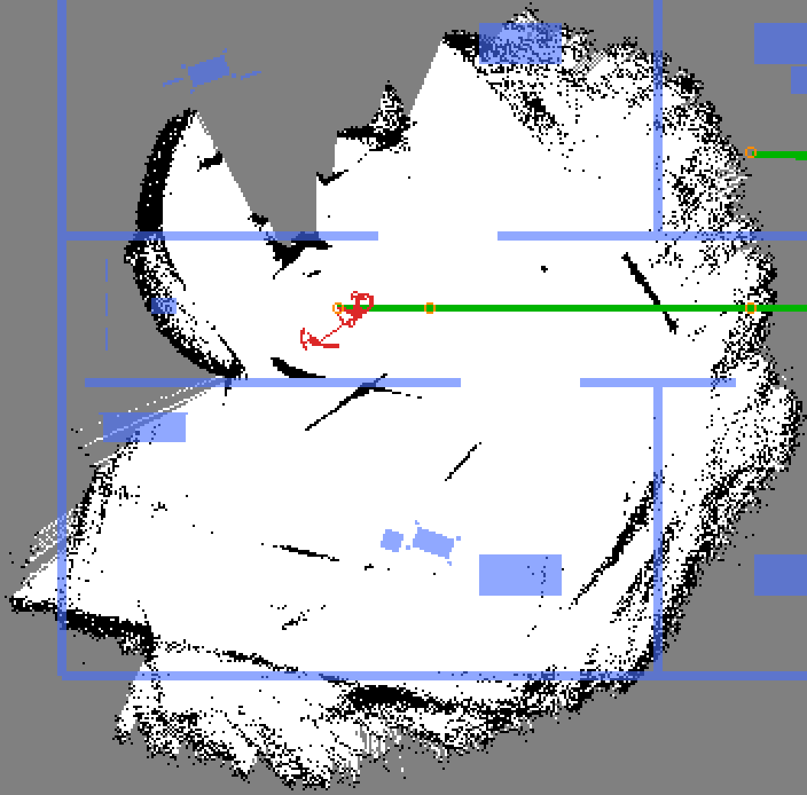
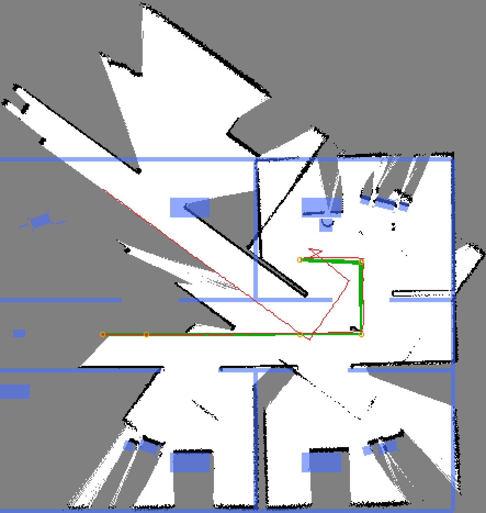
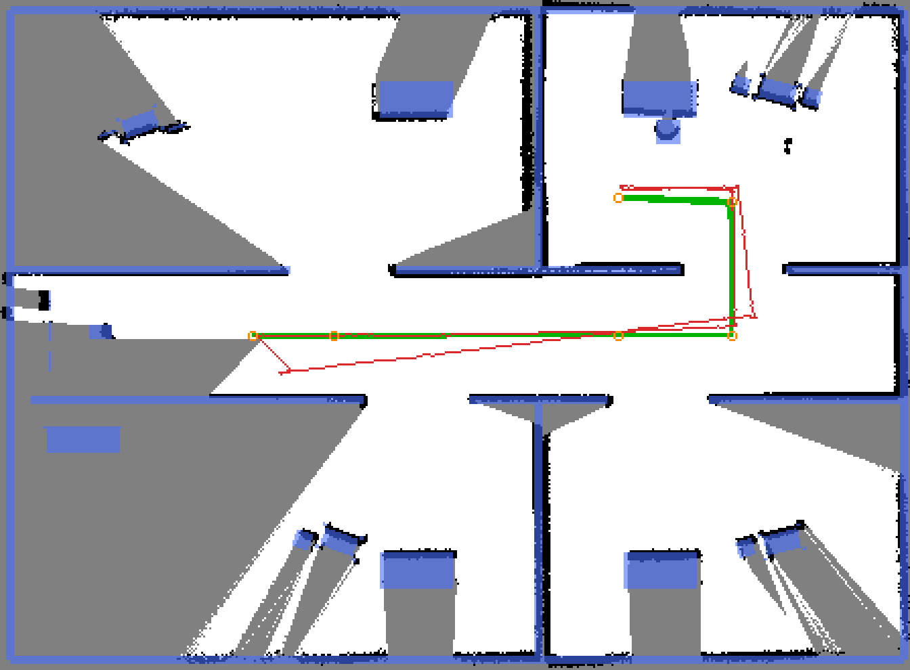

# SLAM Quality Investigation — Isaac 6.0 Port (2026-07-12)

Handoff dossier for the "rotation cooks the SLAM map" investigation on
`feat/isaac-sim-6-port`. Three distinct sensor-pipeline bugs were found and
fixed; the originally-suspected `slam_toolbox` params were largely exonerated
by measurement. Commits: `66493670` (scan-from-cloud + harness),
`e1862498` (left-half FOV restore). Artifacts referenced below live in
[`slam_quality_report/`](slam_quality_report/).

## TL;DR

| | before | after |
|---|---|---|
| symptom | any rotation destroyed the map; loop closure never worked | 35.8 m closed loop maps clean |
| pose RMSE vs GT | 8.36 m | 0.19–0.23 m |
| end-at-start loop error | 1.15 m | 0.07–0.09 m |
| map IoU vs analytic GT | 0.10 | 0.54–0.55 |
| lidar FOV actually published | 135° (right half only) | true 270° |

The fix is **not** in `slam_toolbox_params.yaml` (only
`link_match_minimum_response_fine 0.1 → 0.8` survived measurement there).
It is in how the RTX lidar gets from Isaac 6.0.1 into the ROS `LaserScan`.

## Bug 1 — bridge laser_scan writer hardcodes 360° for ROTARY lidars

`OgnROS2RtxLidarHelper._read_laser_scan_metadata()` (readable at
`isaac_venv/lib/python3.12/site-packages/isaacsim/exts/isaacsim.ros2.nodes/
isaacsim/ros2/nodes/nodes/OgnROS2RtxLidarHelper.py`):

```python
else:   # ROTARY
    h_res = 360.0 * rotation_rate / firing_rate
    az_start = -180.0
    az_end = 180.0
    h_fov = 360.0
```

`validStart/EndAzimuthDeg` is ignored for ROTARY sensors — only SOLID_STATE
reads real emitter azimuths. Our UST-10LX's 270° arc of returns was packed
into bin labels spanning 360°:

- scan content rotated **4/3× the robot yaw** (spin cross-correlation test),
  with the label window sliding with heading;
- self-consistent under straight driving → crisp maps;
- poison under any rotation → the observed smear/starburst (baseline
  probe run below: slam estimate collapsed near the origin while the
  robot drove the loop; GT walls blue, GT trajectory green, slam red).



**Exoneration matrix** (broken sensor): baseline (A), travel-gated params
(B), zero odometry noise (C) all failed identically — RMSE 7–8 m, IoU ~0.1.
Neither the slam params nor odom noise was the cause.


**Fix (`66493670`)**: the bridge publishes the lidar's `point_cloud` output
(Cartesian returns, verified sensor-frame correct to ~2.6 cm against the
analytic grid), and `ros_io.LidarScanAssembler` bins the clouds into the
contract `LaserScan` (1081 bins, −135°..+135°, 0.25°). SOLID_STATE authoring
was tried and rejected — a 1081-emitter pattern returns nothing.

## Bug 2 — rotary model fires only a 180° drum transit per tick

Caught by the user eyeballing rviz: *the robot never saw anything on its
left*. The published scan covered azimuths [−135°, 0°] only — the drawing
below shows the configured 270° arc (green) vs the measured rays (red):
522 right, 0 left.


Measured mechanism (offset experiments, all on fresh single-sim boots):

| `startAzimuthOffsetDeg` | fired window |
|---|---|
| 0 | [−135°, 0°] |
| −135 | [0°, +135°] |

The generic rotary model fires the emitter pattern over a single **180°
drum transit per tick** starting at `startAzimuthOffsetDeg`; the published
points are the valid-window subset of that. `tickRate` 80 does not extend it
(phase resets per tick), multi-emitter patterns interleave raggedly, and a
1081-emitter SOLID_STATE pattern produces empty returns.

**Why not just rotate the lidar prim?** The fired window is defined in the
sensor's own frame — rotating the prim rotates the window *and* the frame
together, so coverage stays ≤180° wide (and only 135° of it survives the
±135° valid window); rotation only repositions the blind wedge. No single
prim can produce 270°.

**Fix (`e1862498`)**: bake TWO OmniLidar prims per laser frame —
`rtx_lidar` (offset 0 → right half) and `rtx_lidar_l` (offset −135 → left
half). Both fire on the same tick and stamp identically;
`LidarScanAssembler` merges both clouds and publishes **once per completed
stamp pair**, so a scan never mixes two capture instants (mixed-freshness
halves measurably warped the map: IoU 0.48 vs 0.54, loop error 0.33 m vs
0.07 m):


## Bug 3 — runner processed one ROS callback per render frame

`ros_io.spin_once()` called `rclpy.spin_once()` once per render frame
(~35/s) while four ~28 Hz cloud streams plus cmd/clock callbacks were
inbound — the queue backlogged, the assembler's stamp pairing compared
stale halves, and the published scan collapsed to ~3 Hz. Fixed by draining
up to 32 ready callbacks per frame. Scan verified at 40 Hz sim-time,
1001/1081 finite bins, all six 45° sectors populated.

## slam_toolbox params — what measurement actually said

Same seeded closed-loop drive, fixed sensor, one variable at a time:

| run | config | RMSE | loop err | IoU | verdict |
|---|---|---|---|---|---|
| A2 | gz-era (0.0/0.0 travel, link 0.1) | 0.52 | 0.012 | 0.70 | jerky graph (204 corrections, 1.2 m max jump) |
| B2 | 0.2 m/10° gating, link 0.8 | 0.25 | 0.31 | 0.37 | map thins, at-rest estimate goes stale |
| B3 | 0.1 m/5° gating, link 0.8 | 3.10 | 6.59 | 0.24 | one bad closure snapped the graph 7.4 m (below) |
| B4 | 0.0/0.0, link 0.8 | 0.50 | 0.010 | 0.74 | best of the half-blind era (below) |

Conclusions: **every-scan ingestion wins** (node density keeps the graph
rigid and re-localizes at rest); travel gating is strictly worse here;
`link_match_minimum_response_fine: 0.8` (stock) gives small consistent
gains. Shipped config = gz-era gating + link 0.8 only.





Note B4's IoU (0.74) exceeding B6's (0.54) is an artifact: the half-blind
sensor observed a much smaller region, concentrated where geometry was
crisp. B6 is the honest sensor.

## Final state (B6 / windowed demo)

| metric | B6 (headless) | WINDOWED3 (GUI load) |
|---|---|---|
| pose RMSE | 0.226 m | **0.195 m** (< 0.20 plan gate) |
| pose max | 0.376 m | — |
| loop error | 0.072 m | 0.090 m |
| map IoU | 0.54 | 0.55 |
| wall recall | 0.82 | 0.87 |
| max map→odom jump | 0.25 m | — |

Final windowed full-loop overlay (map black, GT walls blue, GT trajectory
green, slam estimate red, waypoints orange):


The analytic ground-truth grid the metrics score against (rasterized from
the SDF at the lidar plane z=0.418 (**stale: the plane is 0.3024 since the 2026-09-10 mount correction — figure not regenerated**); orange = G1 ignore mask):


A live-scan world-frame debug plot from the bug-1 era (points landing on
walls that should be occluded — the angular warp made wrong geometry look
locally plausible):


All runs' metrics JSONs sit beside the images in
[`slam_quality_report/`](slam_quality_report/).

Known residuals (accepted, documented):
- transient pose error ~0.2 m during long corridor legs — longitudinal
  ambiguity of a 10 m-range lidar in a 20 m corridor; converges at rest;
- small (~0.1 m) constant map-anchor offset from early-drive drift;
- karto's "Closing loop"/"REJECTED!" log strings never reach the console in
  this slam_toolbox build — the probe's map→odom jump counter is the
  closure-activity proxy.

## Tooling (committed, reusable for the P5 gate)

- `tools/isaac/gt_occupancy.py` — analytic GT occupancy grid straight from
  the SDF (visual geoms crossing the lidar plane z=0.418 — **stale, now 0.3024**); waypoint
  clearance checker; ignore-mask for opaque includes (G1).
- `tools/isaac/slam_quality_probe.py` — GT-feedback closed-loop drive
  (35.8 m, returns to start, wz ≤ 0.4) + metrics JSON + GT-overlay PNG.
- `tools/isaac/scan_geometry_check.py` — sensor regression check: static
  raycast fit (PASS ≤ 0.08 m) + spin shift ratio (PASS ≈ +1.0; −1.33 was
  bug 1's signature). **Lesson: fit checks validate only where data exists —
  always also assert per-sector coverage** (bug 2 hid behind passing fits).

Run recipe (headless, from the worktree root):

```bash
source install/setup.bash
export RMW_IMPLEMENTATION=rmw_cyclonedds_cpp CYCLONEDDS_URI=file://$PWD/cyclonedds.xml
ros2 launch install/.../includes/simulation_isaac.launch.py world:=mock_hospital
ros2 launch install/.../includes/slam.launch.py use_sim_time:=true setup_path:=$PWD/clearpath/
python3 tools/isaac/gt_occupancy.py src/ridgeback_autonomy/sim/worlds/mock_hospital.sdf /tmp/gt.npz
python3 tools/isaac/slam_quality_probe.py --tag X --gt-grid /tmp/gt.npz \
    --slam-log <slam launch log> --out <dir>
```

## Operational gotchas hit during this investigation

- `pgrep -f` / `pkill -f` in a wait loop matches its own bash wrapper →
  fake "process down" → two sims overlapped and poisoned several
  intermediate diagnostics. Use `ps aux | grep X | grep -v grep` in loops;
  kill by explicit PID.
- The user's VNC display number rotates per session (`:0` → `:3` today).
  Detect via a session process's env (`DISPLAY` + `XAUTHORITY`), never
  assume.
- One kit boot crashed spontaneously (breakpad, ~15th boot of the day);
  relaunch succeeded — treat single boot crashes as flaky before digging.

## Noise + hygiene follow-up (2026-07-13)

Revisiting the P5 blocker: is odom noise the coverage cap, and does the prior
"~40% plateau" hold? No on both.

- **The ~40% plateau does not reproduce.** Every clean `mock_hospital` run
  landed 51–83%. Prime suspect for the historical stall = the old aggressive
  explorer timeouts (30 s / blacklist-2, since reverted to 60 s/3), not SLAM.
- **odom_noise is a partial lever.** Clean paired A/B (camera-off, domain-43
  isolated): noise=0 → 61.9% / 16 aborts; noise=1.0 → 51.3% / 35 aborts.
- **Yaw decomposition (`--repro --wz-max 1.5`, noise off):** total yaw rms
  2.11° / max 7.94°; `theta_mo` (scan-match) rms 1.47° / max 4.0° dominates
  `phi_ekf` (EKF) rms 0.71° / max 4.3°. Residual is scan-match rotation on FULL
  healthy scans (min 916/1081 bins, 0 flaps) — H1 geometry, not the assembler.
- **Sensor pipeline exonerated (H2/H3):** `flap_events=0` across ~110k scans
  over all runs; drift climbed on steady RTF and recurred after contention
  cleared. New read-only tool `scan_pipeline_probe.py` (finite-bin / flap /
  stamp-pair telemetry vs RTF) carries this signal.
- **Benchmark hygiene (was wrong; now enforced):** `isaac_runner` rendered the
  D455 unconditionally → RTF 0.33–0.45. Added `--camera false` (commit
  b9c46c77) → RTF 0.55–0.65. Also `g1_perception_enabled:=false` and an
  isolated `ROS_DOMAIN_ID` — co-tenant `stefi`'s domain-42 `/r100_0001` stack
  publishes the same `hud/coverage` topic the probe reads. Canonical benchmark
  invocation: `camera:=false g1_perception_enabled:=false
  ROS_DOMAIN_ID=<isolated> setup_path:=/tmp/bench-clearpath/`.
- **Caveat:** coverage variance is large (62–83% noise-off; loc-err 0.9–9.4 m);
  stochastic scan-match excursions + intermittent co-tenant GPU bursts dominate.
  Firm numbers need multi-seed on a single-tenant box. Raw artifacts live in the
  session scratchpad (`clean_n0/clean_n1`, `REPRO_noiseoff`, `noiseoff_hosp_A`).
